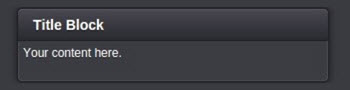
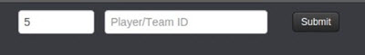
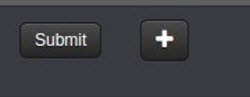
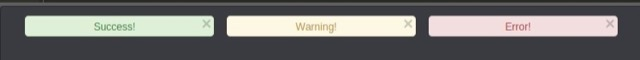
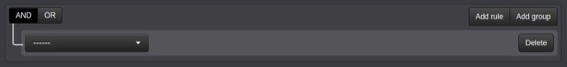
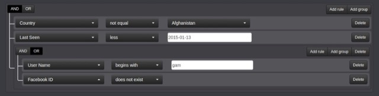

# Dynamic Forms API

In addition to regular HTML you can use Game Sparks Markup Language (GSML), which is based on HTML and was created for the purposes of Dynamic Forms. GSML allows ease of use and rapid Dynamic Form development - what would otherwise require complex HTML structures is essentially shrunk down to a few lines of code.


## gs-row

gs-row is a HTML row container, by default it's set to width of 12.

**Note:** gs-rows and gs-cols can be nested to create your preferred layout.

*Options*

gs-row takes no additional options.

*Example*

```    
    <gs-row>
        Your content here.
    </gs-row>
```


## gs-col

gs-col is a HTML column.

**Note:** gs-rows and gs-cols can be nested to create your preferred layout.

*Options*

* *width* \- is the width of the column. This can be between 1 and 12. If not defined, the width will be 12.
* *align* \- is the alignment of the content within the column (left, right). If not defined, the content will be centered.

*Example*

```    
    <gs-col width="6" align="left">
        Your content here.
    </gs-col>
```


## gs-title-block

gs-title-block is a title block styled to match the rest of Gamesparks portal styling.

*Options*

* *padding* - is the padding of the title block. If not defined, the padding will be 0.
* *margin* - is the margin of the title block. If not defined, the margin will be 0.
* *title* - the title of the title block.
* *height* - height of the title block. When defined, any content outside of the bounds will make the title block scrollable.
* *width* - the width of the title block. This can be between 1 and 12. If not defined, the width will be 12.

*Example*

```    
    <gs-title-block padding="5" margin="1" title="Title Block" height="40" width="6">
        Your content here.
    </gs-title-block>

```

*Output*




## gs-placeholder

gs-placeholder is a placeholder within a form. This placeholder can be dynamically updated on the fly by targeting it with links, forms, and snippets.

*Options*

* *id* - id should be a unique identifier. This identifier allows links, forms, and snippets to locate and overwrite the placeholder.

*Example*

```    
    <gs-placeholder id="unique__placeholder">
        Your initial content here.
    </gs-placeholder>

```


## gs-form

gs-form is a HTML form that can be submitted to a snippet, passing in some input data.

*Options*

* *snippet* - a snippet shortcode to call with the input values. Additionally, you can also append values directly here.
* *target* - this is the id of a placeholder, where the output of the snippet will be placed.

*Example*

```
    <gs-form snippet="snippet_shortcode?update=true&upsert=false" target="unique__placeholder">
        <gs-row>
            <gs-col width="2">
                <input type="number" min="1" max="10" name="rank" value="5"/>
            </gs-col>
            <gs-col width="4">
                <input type="text" placeholder="Player/Team ID" name="playerId" value=""/>
            </gs-col>
            <gs-col width="2">
                <gs-submit>Submit</gs-submit>
            </gs-col>
        </gs-row>    
    </gs-form>

```

*Output*



Clicking *Submit* in this form will:

  * Call a snippet with shortcode: *snippet_shortcode*
  * Pass in parameters: *update* = true, *upsert* = false, *rank* = (your number), *playerId* = (your text)
  * And render the snippets output at a placeholder with Id: *unique__placeholder*


## gs-submit

gs-submit is a custom form submit button. The functionality behind gs-submit allows you to override where the form is going to be submitted to or where the output will be rendered at.

*Options*

* *snippet* - this is an optional snippet shortcode, which allows the submit button override the snippet where the form is supposed to be submitted to.
* *target* - this is an optional placeholder id, which allows the submit button override the placeholder where the output is supposed to be rendered at.

*Example*

```
    <gs-form snippet="snippet_shortcode" target="unique__placeholder">
        <gs-row>
            <gs-col width="2">
                <gs-submit>Submit</gs-submit>
            </gs-col>
            <gs-col width="1">
                <gs-submit snippet="another_shortcode?plus=true" target="another__placeholder">
                    <i class="icon-plus"></i>
                </gs-submit>
            </gs-col>
        </gs-row>
    </gs-form>
```

*Output*



* When you click *Submit*, you'll submit the form to the snippet with shortcode: *snippet_shortcode* and render the output at the placeholder Id: *unique__placeholder*.
* When you click the *Plus*  icon, you'll submit the form to the snippet with shortcode: *another_shortcode* and render the output at the placeholder Id: *another__placeholder*. Additionally, you'll submit a parameter to the snippet *plus* = true.


## gs-link

gs-link is a HTML link that can execute a snippet upon clicking it.

*Options*

* *snippet* - a snippet shortcode to execute. You can append parameters directly here.
* *target* - this is the id of a placeholder where the output of the snippet will be placed.

*Example*

```

    <gs-link snippet="snippet_shortcode?fromLink=true" target="unique__placeholder">Click me!</gs-link>

```

Clicking this link will execute a snippet with shortcode: *snippet_shortcode* passing in a parameter *fromLink* = true and render the output at the placeholder with the Id: *unique__placeholder*. [/su_tab] [su_tab title="gs-alert"].

## gs-alert

gs-alert is useful for displaying simple alerts.

*Options*

* *type* \- type of the message to display, these can be success, warn and error.
* *message* \- message to display.

*Example*

```
    <gs-row>
        <gs-col width="4">
            <gs-alert type="success" message="Success!"></gs-alert>
        </gs-col>
        <gs-col width="4">
            <gs-alert type="warn" message="Warning!"></gs-alert>
        </gs-col>
        <gs-col width="4">
            <gs-alert type="error" message="Error!"></gs-alert>
        </gs-col>
    </gs-row>

```

*Output*




## gs-snippet

gs-snippet is a way for you to automatically execute a snippet without any trigger. They are primarily used to initialize the base Dynamic Form.

*Options*

* *snippet* \- a snippet shortcode to execute, you can append parameters directly here.
* *target* \- a placeholder Id, where to render the output of the snippet. If not defined, the snippets output will be rendered at the location it's been executed from.

*Example*

```
<pre class="lang:xhtml decode:true" title="gs-snippet"><gs-snippet snippet="snippet_shortcode?fromSnippet=true" target="unique__placeholder"></gs-snippet></pre>

```
This code will automatically execute a snippet with shortcode: *snippet_shortcode* passing in a parameter *fromSnippet* = true and render the output at the placeholder with the Id: *unique__placeholder*.


## gs-query

gs-query is an elaborate way of building dynamic mongodb queries. gs-query contains gs-query-fields that define the query criteria. These queries can have multiple groupings and rules.

*Options*

* *name* - the name of the query, this will act as an identifier.
* *rules* - the raw rules can be passed into the query builder to pre-populate it.

*gs-query-field Options*

* *id* - id of the field to query.
* *type* - type of the query field, these are:
  * *oid* - is the \_id field and can only be a varchar of length 24.
  * *country* \- automatically gives you a select box containing all the countries.
  * *date* \- automatically gives you a date picker.
  * *integer* \- is a number field.
  * *string* \- is a string field.
* *label* \- label that will be visible to the user.
* *group* \- query grouping.
* *values* \- predefined values of the query.
* *operators* \- operators by which to determine queries results, these are: *equal*, *not_equal*, *exists*, *not_exits*, *begins_with*, *not_begins_with*, *between*, *less*, *less_or_equal*, *greater*, and *greater_or_equal*.

*Example*

```
<gs-query name="gsUserQuery" rules="">

    <gs-query-field id="_id"
                    label="ID"
                    type="oid"/>

    <gs-query-field id="userName"
                    label="User Name"
                    type='string'
                    operators="equal,begins_with,not_equal,not_begins_with"/>

    <gs-query-field id="location.country"
                    label="Country"
                    type="country"/>

    <gs-query-field id='lastSeen'
                    label='Last Seen'
                    type='date'
                    operators="equal,begins_with,not_equal,not_begins_with,equal,exists,not_equal,not_exists"/>

    <gs-query-field id="pushRegistrations.deviceOS"
                    label="Push Registration Type"
                    type='string'
                    values='{"IOS" : "IOS", "ANDROID" : "Android", "KINDLE" : "Kindle", "WP8" : "Windows Phone 8", "W8" : "Windows 8"}'/>

    <gs-query-field id="externalIds.FB"
                    label="Facebook ID"
                    type='string'
                    group="External IDs"
                    operators="equal,exists,not_equal,not_exists"/>
</gs-query>

```

*Output*



*Usability*



The above query would read:

Return results where (Country is not "Afghanistan" *AND* Last Seen is before "2015/01/13") *AND *(User Name begins with "gam" *OR* Facebook ID doesn't exist)

*Submitting and Pre-Populating*

When you submit a form that contains gs-query, you will receive two json objects:

```
// mongoDb readable
"gsUserQuery":{"displayName":"tester"}

// queryBuilder readable
"gsUserQuery-raw":{"condition":"AND","rules":[{"id":"displayName","field":"displayName","type":"string","input":"text","operator":"equal","value":"tester"}]}

```

*gsUserQuery* - this value can be used to directly query your database.

*gsUserQuery-raw* - this value can be used to pre-populate the query builder by passing the value into the rules, however, you will need to JSON.stringify() the value first, so it can be read.


## gs-chart

gs-chart displays the charts that you can define in Charts area

*Options*

**Note:** The majority of the options will be displayed in the charts builder after pressing "Test". This will then display the full query to use in GSML in order to display that chart. For this reason you will rarely need to manually type these in.

* *chartType* \- determines the chart type to display.
* *group* \- determines if the chart should be grouped by a specific attribute such as type.
* *calc* \- determines the calculation type for the display.
* *annotate* \- determines what kind of annotation to apply to the chart.
* *chartPeriod* - used for histogram charts to display the time frame.
* *pageSize* \- used for data charts to note how many results should be shown per page.
* *query* \- this is the chart shortCode to use. Custom values can be passed into the chart as such: *gs_playerid="myPlayerId"* and accessed in the chart builder as *${playerid}*

*Example*

```
<gs-chart gs_playerid="{{playerId}}" chartType='data' pageSize='50' query='total_requests'></gs-chart>

```

This will pass a custom *playerId* into the *total_requests* chart and ask to display a *data* chart with *50* items per page.


## handlebars

With the introduction of Handlebars, we can create dynamic GSML structures within minutes. Although we've introduced some additional functionality to Handlebars, which will be discussed below, you can read the full Handlebars documentation [here](http://handlebarsjs.com/ "Handlebars"). Having Script Data set in our Snippet Builder we can access and manipulate this data using Handlebars Helpers in our Handlebars editor.

*   *if/else* - an if statement that only checks if a particular Script Data object is set.
*   *unless* - a reverse of an if statement.
*   *each* - iterates through values set in particular Script Data object.
*   *get* - Allows accessing specific JSON object values by name.
*   *math* - mathematical equations within HTML.
*   *compare* - an extended version of the if statement that allows comparison of the values set within Script Data object.

*Sending and accessing Data*

Given that we've sent or set some variables to a Snippet using a Form, Link, or any other method:

```
<gs-link snippet="snippet_shortcode?fromLink=true" target="unique__placeholder">Click me!</gs-link>
```

Within Snippet, we can access this data and set it for later use in Handlebars using Java Script:

```
var fromLink = Spark.data.scriptData.fromLink;
Spark.setScriptData("fromLink", fromLink);

```

We can then access the data in Handlebars as follows:

```
{{fromLink}}

```

Our rendered HTML would be:

*true*

### if/else Example

Given that we have set our JavaScript Script Data in Snippet Builder as:

```
Spark.setScriptData("someData", "someData");

```

And set our Handlebars as follows:

```
{{#if someData}}
    You have some data.
{{else}}
    You don't have any data.
{{/if}}
```

Our rendered HTML would be:

*You have some data.*

### unless Example

Given that we've sent or set some variables to a Snippet using a Form, Link, or any other method:

```
<gs-link snippet="snippet_shortcode?fromLink=true" target="unique__placeholder">Click me!</gs-link>

```

And set our Handlebars as follows:

```
{{#unless someData}}
    You don't have any data.
{{else}}
    You have some data.
{{/unless}}

```

Our rendered HTML would be:

*You have some data.*

### each Example

Given that we've sent or set some variables to a Snippet using a Form, Link, or any other method:

```
var myData = [];

myData.push({myTest: "test1"});
myData.push({myTest: "test2"});
myData.push({myTest: "test3"});

Spark.setScriptData("myData", myData);

```
And set our Handlebars as follows:

```
{{#each myData}}
    This is {{myTest}}<br/>
{{/each}}

```

Our rendered HTML would be:

*This is test1*

*This is test2*

*This is test3*

### get Example

Given that we've sent or set some variables to a Snippet using a Form, Link, or any other method:

```
Spark.setScriptData("id", "myId");
Spark.setScriptData("entry", {myId : "value1", myId2 : "value2"});
```

And set our Handlebars as follows:

```
{{get id entry}}
```
Our rendered HTML would be:

*value1*

### math Example

Available operators: *+*, *-*, * \** , */*, *%*

Given we've set our Handlebars as follows:

```
{{#math 2 "+" 2}}
{{/math}}

```

Our rendered HTML would be:

*4*

### compare Example

Available operators: *==*, *===*, *!=*, *!==*, *<*, *>*, *<=*, *>=*, *typeof*

Given we've set our Handlebars as follows:

```
{{#compare 2 ">" 1}}
    2 was greater than 1.
{{/compare}}

```
Our rendered HTML would be:

*2 was greater than 1.*

You can also use compare with an *{{else}}*:

```
{{#compare 2 "!=" 2}}
    2 was not equal to 2.
{{else}}
    2 was equal to 2.
{{/compare}}

```

Our rendered HTML would be:

*2 was equal to 2.*
