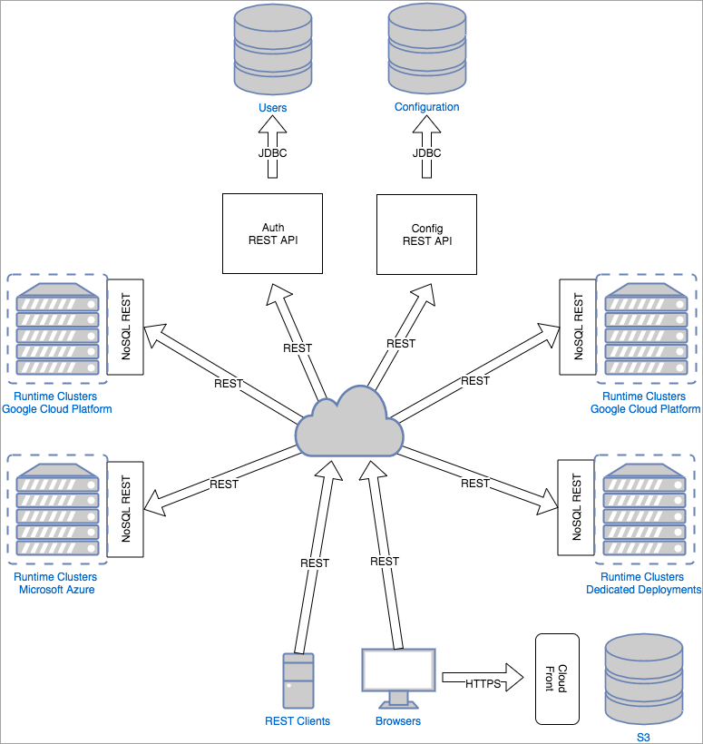

# REST APIs Overview

## Overview
The GameSparks REST API is split into 4 components which can be used to configure all aspects of your game, as well as giving you access to your runtime data.

**[Authentication](/API Documentation/REST APIs/Authentication.md)**
* Acts as an identity provider.
* Provides a JWT-based single sign-on solution.
* Manages groups, collaborators and permissions for all resources.
* The base URL is: https:<nolink>//auth.gamesparks.net

**[Game Configuration](/API Documentation/REST APIs/Game Configuration.md)**
* Provides all endpoints required to manage the game configuration that will be pushed to the runtime servers.
* The base URL is: https:<nolink>//config-beta.gamesparks.net

**[Game Administration](/API Documentation/REST APIs/Game Admin.md)**
* Provides REST endpoints to perform actions on a Game that are not part of the game configuration itself.
* Examples of this sort of action are: managing snapshots, managing admin screens, testing push notifications.
* The base URL is: https:<nolink>//config-beta.gamesparks.net

**[Runtime Data](/API Documenconfig-betatation/REST APIs/Runtime Data.md)**
* An instance of this application is deployed in each runtime cluster.
* Provides an interface into the game’s data stored in Mongo and Redis.
* The base URL is not fixed but is dependent on the specific runtime cluster that your game is assigned to and game stage. The structure of the base URL will always conform to this schema: https:<nolink>//[apiKey].cluster.[stage].gamesparks.net

## Architecture

The following high-level architecture diagram of the platform shows how these REST endpoints interact with other components:



There are 3 REST API server types:
* Auth REST API server - handles the **Authentication** REST calls
* Config REST API server - handles both the **Game Configuration** and the **Game Administration** REST calls.
* NoSQL REST API server - handles the **Runtime Data** REST calls. An instance of this application is deployed on each runtime cluster.

## Authorization Process

The **Authentication Server** determines whether or not a user is allowed to perform an action. Each time a REST request is made, the Authorization Process validates a user's credentials with the **Authentication Server**.

GameSparks supports 3 types of authentication:

### Basic Authentication

You can use your portal credentials and provide an Authorization header:
* This type of authentication works for the **Authentication**, **Game Configuration** and **Game Administration** endpoints.

### GameSparks Access Token

This is a JSON web token that is generated by the **Authentication** server:
* Use the **X-GSAccessToken** header to pass this token in.
* A JSON web token is always be validated against the **Authentication** server.
* Unless otherwise specified, it has an expiry time of 1 hour.
* In order to get this token you can do a GET https:<nolink>//auth.gamesparks.net/restv2/auth/user with basic authentication. Try it out [here](/API Documentation/REST APIs/Authentication.md).
* This type of authentication works for the **Authentication**, **Game Configuration** and **Game Administration** endpoints.


### GameSparks JSON Web token

The JSON web token also contains information about the user's permissions to a game:
* Use the **X-GS-JWT** header to pass this token in.
* This is a JSON Web Token that also contains information about the user's permissions to a resource. That is why this token *does not need* to be validated against the **Authentication** server because it contains enough information to decide whether a user is allowed access to a resource or not.
* Unless otherwise specified, it has an expiry time of 1 hour.
* In order to get this token you can do a GET https:<nolink>//auth.gamesparks.net/restv2/auth/game/{apiKey}/jwt with basic authentication. Try it out [here](/API Documentation/REST APIs/Authentication.md).
* This token was designed for the **Runtime Data** REST API, because the NoSQL REST server and the Auth REST API can be geographically far apart. However, it works with all 4 components of the GameSparks REST API.

You can find more details about the specification for JSON Web Tokens [here](https://jwt.io/).

#### Managing JWT Scope

Because a X-GS-JWT token contains all the permissions to a game, it can become quite large. If you know you are going to use the token for a single functionality, such as noSql, you can get a token the scope of which is smaller:
* You can use this endpoint to get a scoped X-GS-JWT:
https:<nolink>//auth.gamesparks.net/restv2/auth/game/{apiKey}/jwt/{filter}


## Schema

* All API access is over HTTPS.
* All data is sent and received as JSON.
* All dates and timestamps are returned in ISO 8601 format:

```

YYYY-MM-DD and YYYY-MM-DDTHH:MM:SSZ

```

## HTTP Verbs

Verbs  | Description
-----  | -----------
GET    | Used for retrieving resources.
POST   | Used for creating resources.
PUT    | Used for updating resources.
DELETE | Used for deleting resources.

## Status Code

Code | Description
-- | --
200 | OK
201 | Created
400 | Bad Request
401 | Token expired
403 | Not allowed
404 | Not found
500 | Internal server error
