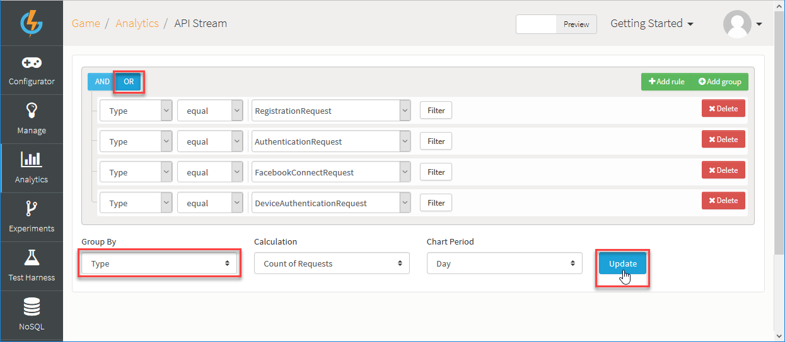
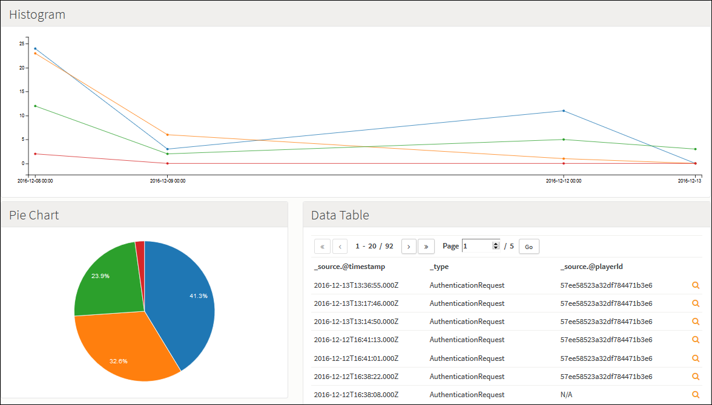
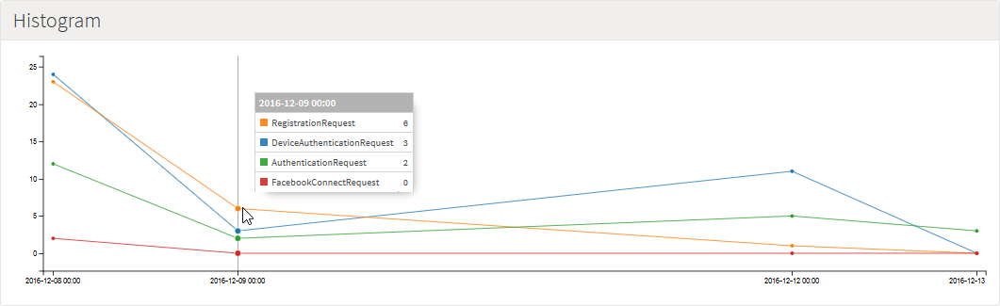
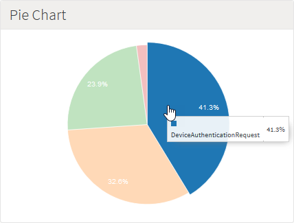
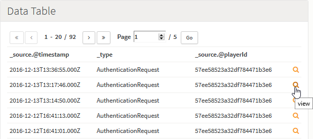
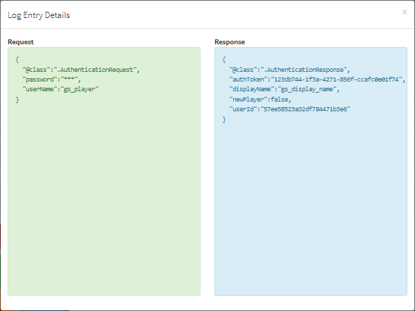

# API Stream Analytics

You can use the *API Stream* Analytics page to build custom queries against the API calls that have been made into the platform:
* A *Query Builder* gives you virtually limitless scope to quickly add and refine query rules to obtain the specific data you want to review and analyze.
* The data returned for your query is displayed in three chart formats: a histogram, pie-chart, and data table, where each format gives you further tools for analyzing the data.
* You can control how your query data are organized within these charts.

There are some constraints for this Analytics tool:
* You can only query against requests and messages.
* The data you can query against are purged regularly:
  * In PREVIEW - Your query will return results for up to 7 days previously.
  * In LIVE - Your query will return results for up to 5 days previously.

In this topic, we'll work through an example of building an API Stream query and reviewing and analyzing the data returned.

## Example - Connection Requests Analytics

In this example, we pull API Stream analytics data for connection request calls into the platform:

*1.* Open the *Analytics > API Stream* page.

*2.* Build a query for each of the different types of connection request API calls into the platform your game has made:

* In this example, we have four kinds of connection request in the API Stream we can query for.
* For displaying the returned data, we've selected to group by *Type*, calculate for *Count of Request*, and use a daily period for charts.

*3.* Click *Update*. The current API Stream is queried and the data are returned and displayed:

*4.* You can read-off data from the charts:
* On the Histogram, hover your cursor over a data point to read-off individual measures at that point:

* On the Pie Chart, hover your cursor over a portion to read-off individual percentages:

* On the Data Table, click the view  icon:

* A *Log Entry Details* panel appears, which shows the individual *Request* and *Response* details:

<q>**Data Delay!** When you query the API Stream, the data used to build the charts and display the query results will not be right up to date. This is because there is a slight delay of approximately ten minutes before the data for the request or message activity being queried becomes available to build the charts.</q>
