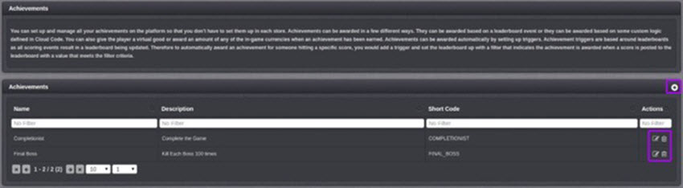
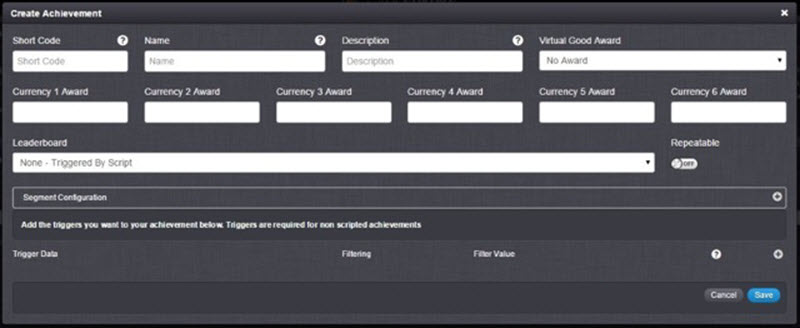
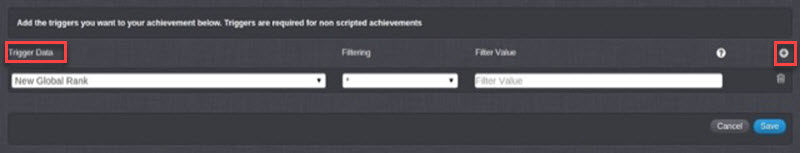
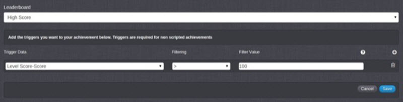
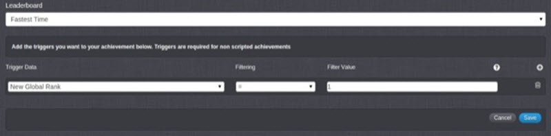

# Achievements

GameSparks Achievements support the rewarding of players for accomplishments within the game. An Achievement is highly configurable with respect to both the reward and the criteria for when it is delivered:
* **Task-based.** Traditional Achievements systems are supported where Virtual Goods (for example, badges or items) are won for completion of particular tasks or won for completion of a combination of tasks.
* **Extended.** Extended Achievement systems are supported, such as level completion or XP progress bonuses, basic 'crafting', and rewards for breaking into the top [x] of a Leaderboard, and so on.
* **Cross-platform.** Achievements are cross-platform, which affords significant benefits:
  * You don't have to set up separate Achievements in each store, which supports cross-platform play.
  * Game-progress can be tracked and the reward can be used across multiple platforms.

* **Achievements and Rewards.**

  Achievements can be awarded based on:
  * A Leaderboard event.
  * Some custom logic defined in Cloud Code.

  The reward delivered when an Achievement is reached can be:
  * A Virtual Good.
  * An amount of any of the in-game currencies set up in the Virtual Goods section.

* **Achievement Triggers.**

  Achievements can be awarded automatically by setting up triggers:
  * Achievement triggers are implemented through Leaderboards because all scoring events result in a Leaderboard being updated.
  * For example, to automatically award an Achievement for someone hitting a specific score, you can add a trigger and define a filter for a Leaderboard that indicates the Achievement is awarded when a score is posted to the Leaderboard with a value that meets the filter criteria.

## Managing Achievements

The *Configurator > Achievements* page displays the list of Achievements. You can create new Achievements and edit or delete existing ones:

The icons (highlighted above) give you the following capabilities:

*  Add a new Achievement.
*  Edit this Achievement.
*  Delete this Achievement.

## Creating a New Achievement

*1.* Click the  icon to create a new Achievement. The *Create Achievement* dialog appears:

*2.* Enter your Achievement details:

* *Short Code* \- A mandatory field used to give the Achievement a unique identifier for use elsewhere in the Portal and in Cloud Code.
* *Name* \- A mandatory field used as an identifier to help the user find the challenge in the Portal.
* *Description* \- A mandatory field which should be used to describe the challenge.
* *Virtual Good Award*- The Virtual Good to award a player as a reward for gaining the Achievement.
* *Currency Awards* \- The amount of each of the Currencies to award a player as a reward for gaining the Achievement.
* *Leaderboard* \- Achievements can be triggered from a Leaderboard or by a Cloud Code script, if no Leaderboard was selected. Select the required Trigger here - either the Leaderboard trigger or select *None - Triggered by Script* if triggered by a Cloud Code script.
* *Repeatable*  \- Enabling this means the Achievement can be earned multiple times.

## Creating Achievement Triggers

*1.* On the *Trigger Data* section, click the  icon to add triggers for *non-scripted Achievements*:

*2.* Enter the Trigger details:

* *Trigger Data* \- If a Leaderboard is selected, the Attributes of the Leaderboard would be available for you to choose. You can also trigger a Leaderboard based on the users global or social position:

  * *New Global Rank* \-  A new position in the global Leaderboard.
  * *Old Global Rank* \- An old position in the global Leaderboard.
  * *Global Rank Change* - The number of places a player has moved in the global Leaderboard.
  * *New Global % Rank* \- The new percentage change in the player's global Leaderboard position.
  * *Old Global % Rank* \- The old percentage change in the player's global Leaderboard position.
  * *Global Rank % Change* \- The percentage change in the player's global Leaderboard position.
  * *New Social Rank* \- A new position in the social Leaderboard.
  * *Old Social Rank* \- An old position in the social Leaderboard.
  * *Social Rank Change* \- The number of places a player has moved in the social Leaderboard.
  * *New Social % Rank* \- The new percentage change in the player's social Leaderboard position.
  * *Old Social % Rank* \- The old percentage change in the player's social Leaderboard position.
  * *Social % Rank Change* \- The percentage change in the player's social Leaderboard position.

* *Filtering* \- Operators which allow you to filter the trigger:

| Operator | Filtering               
| ------| ---------
|  *  | Any Value
|  =   | Value equal to
|  !=   | Value not equal to
|  <  | Value greater than
|  >   | Value less than
|  <=   | Value greater than or equal to
|  >=  | Value less than or equal to
|  %   | Value is divisible by

* *Filter Value* - The value of the Filter.

## Example Triggers

**Example 1:** If you want to award the user for getting a score over 100 on a Leaderboard, you would have a set up similar to this:

**Example 2:** If you want to award an Achievement for being top of the global Leaderboard, you would have the following configuration:

