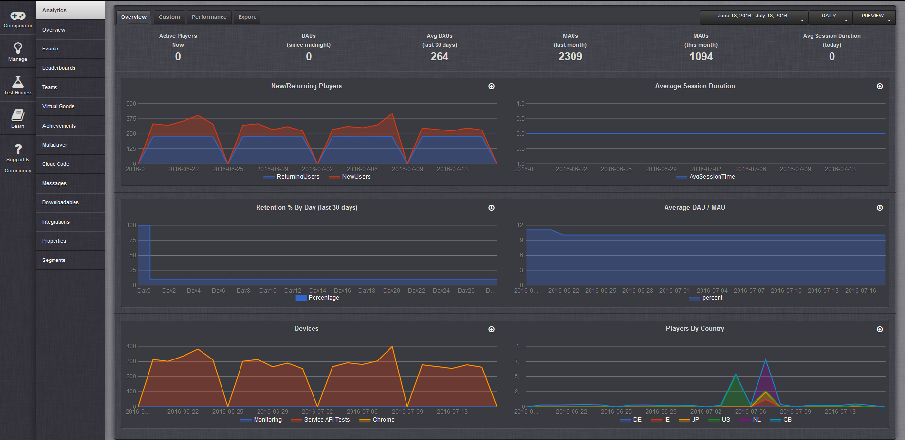
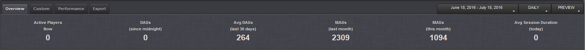
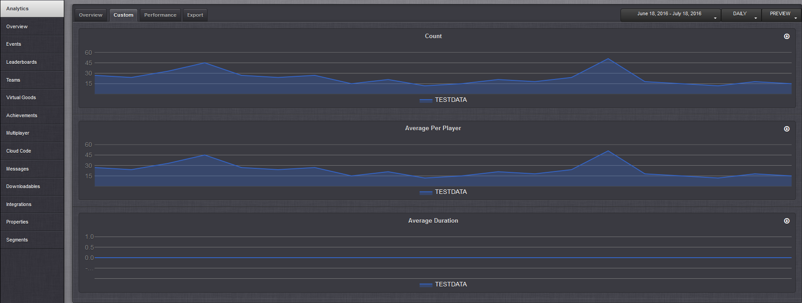
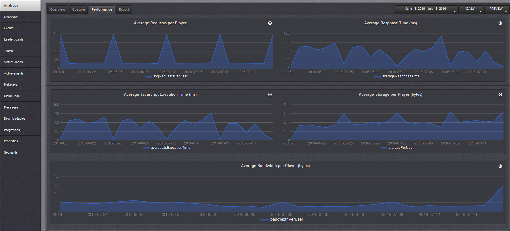
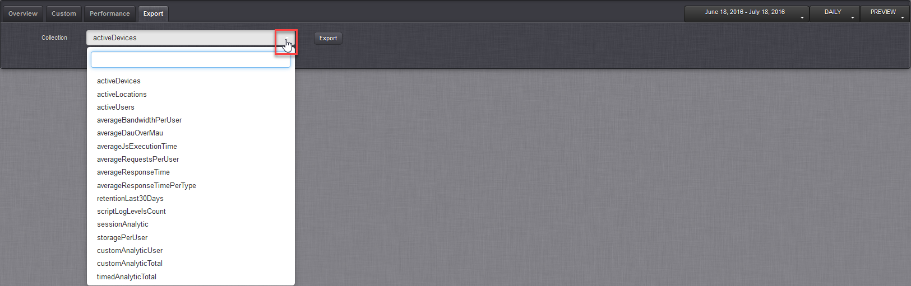
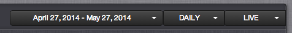
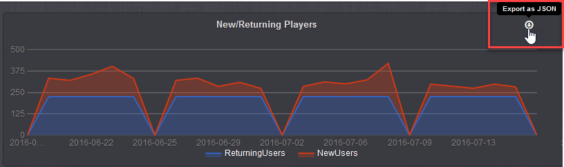

# Analytics

## Introduction

The GameSparks platform aggregates a wide range of analytics data and provides you with key performance trends and metrics that track player interaction with your game:
* Most common reporting requirements for monitoring player interaction and engagement are covered.
* If you have any special needs for analytics reporting, you can build custom screens through the *Manage* section of the portal - see below *Customizing Analytics Reporting*.

The Configurator *Analytics* page contains four tabs:
* **Overview**
  * Shows "Big Numbers" listing your game's key performance metrics.
  * Contains graphs tracking player engagement with your game.
* **Custom** - Contains graphs for data gathered on usage of the *AnalyticsRequest* against the GameSparks platform.
* **Performance** - Contains performance-related graphs.
* **Export** - Export analytics data collections as JSON.

<q>**UTC Time Zone.** All of the analytics graphs are set to Coordinated Universal Time (UTC).</q>

## Overview Tab

There are several graphs on the *Overview* tab:

  * *New / Returning players* - Shows the number of new (in red) and returning players (in blue).
  * *Retention % by day* - Shows the number of returning players as a percentage of the total players for a each day over the last 30 days.
  * *Average Session Duration* - Shows the average session duration in seconds.
  * *Average DAU / MAU* - Shows the average daily active player count over the monthly active player count. This is a measure of 'engagement'.
  * *Devices* - Shows the different devices that your players are using to play your game.
  * *Players by Country* - Shows the different countries where your game is being played.

<q>**Exporting Graph Data.** You can export the JSON data collections on which the graphs are based directly from each graph. See below *Exporting Analytics Data from Graphs*.</Q>

### Checking the Big Numbers

The *Big Numbers* are shown across the top of the Overview tab.

These numbers provide key aggregated analytics data metrics about how well your game is performing and indicates levels of engagement within the game’s current player base:

  * *Active Players Now* - The total number of players that are currently connected to your game.
  * *Daily Active Users (DAUs)* - The total number of unique daily active players since midnight.
  * *Average Daily Active Players (Avg DAUs)* - A rolling average over the last 30 days for the DAU Big Number.
  * *Monthly Active Users (MAUs)* - Two metrics showing the total number of active players for last month and the current month.
  * *Average Session Duration* - The average player session duration for today.

<q>**Live Data!** The Big Numbers show live data and are updated every minute or so.</q>

## Custom Tab

 The *Custom* tab contains graphs which show the data gathered as a result of your game sending an [AnalyticsRequest](/API Documentation/Request API/Analytics/AnalyticsRequest.md) to the GameSparks platform:

  * *Count* - Shows the number of times a given custom key has been sent via the *AnalyticsRequest*.
  * *Average per Player* - Shows the average number of times per player that a given custom key has been sent via the *AnalyticsRequest*.
  * *Average Duration* - Shows the average duration for each timed request sent via the *AnalyticsRequest*.

## Performance Tab

The *Performance* tab displays a number of performance-related graphs:

  * *Average Requests per Player* - Shows the average number of request generated per player within you game.
  * *Average Response Time (ms)* - Shows the average response time (in milliseconds) that the GameSparks platform has taken to respond to API request calls.
  * *Average Javascript Execution Time (ms)* - Shows the average time (in milliseconds) that the GameSparks platform has spent executing your Cloud Code.
  * *Average Storage per Player (bytes)* - Shows the average amount of cloud data per player that your game is using.
  * *Average Bandwidth per Player (bytes)* - Shows the average amount of bandwidth per player that your game is using.

<q>**Per Player Spikes!** On the per player graphs, the average is calculated against the number of active players in that time period. This means that if your are using an hourly sampling frequency, these graphs can look skewed if a particular hour has only a relatively small number of active players compared to the number of active players in other hours.</q>

## Export Tab

You can export any of the JSON analytics data collections from the *Export* tab:

*1.* Select the arrow on the *Collection* field to show the data collections menu:

*2.* Select the data collection you want and then click *Export*. A Save/Open file dialog appears and you can save or view the JSON text file.

<q>**Note:** You can export analytics data collections directly from graphs on the other tabs - see below *Exporting Analytics Data from Graphs*.</q>

## Working with Analytics Graphs

When you are viewing analytics graphs, you can use several options to adjust the data graph display and you can export data directly from graphs.

### Using Display Control Menus

Use the three drop-down menus at top-right to control the data displayed in the analytics graphs.

  * *Date range* - Select the start and end date for the data set displayed.
  * *Sample frequency* - Select between hourly, daily, and monthly frequencies.
  * *Stage* - Select which stage - Preview or Live - analytics data are displayed for.

### Exporting Analytics Data from Graphs

You can export the analytics data collection on which any of the analytics graphs are based as a JSON file:
* Click the *Export as JSON* button at the top-right of the graph canvas

 

 A Save/Open file dialog appears and you can save or view the JSON text file.

## Customizing Analytics Reporting

If you have any special needs for analytics reporting, you can build custom screens for querying the NoSQL database through the [Manage](/Documentation/Manage/README.md) section of the portal. From here, you can build ad hoc queries for analysis against raw request and response data.
