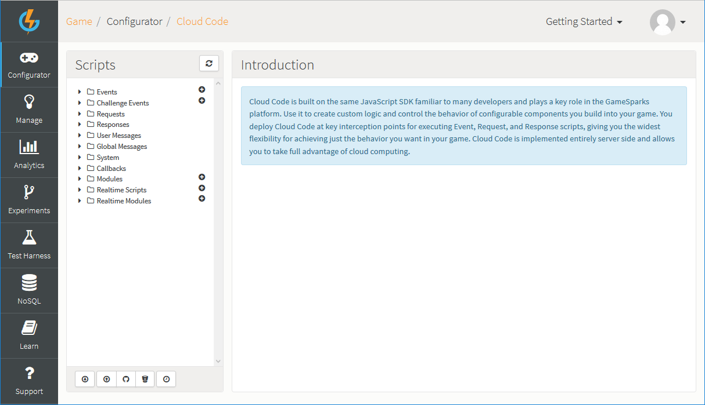
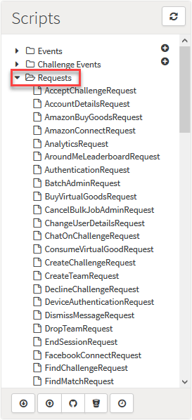
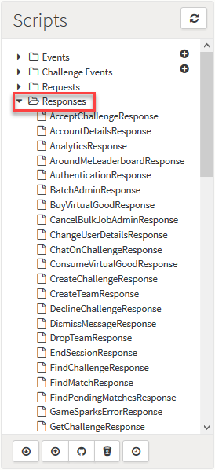
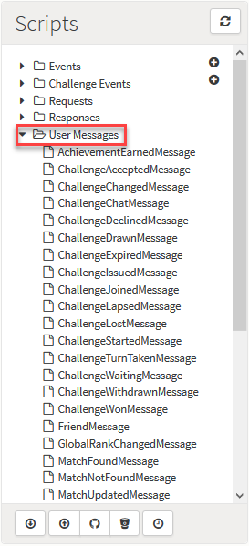
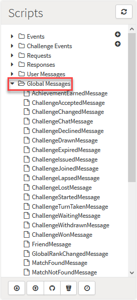
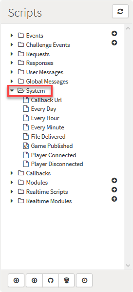
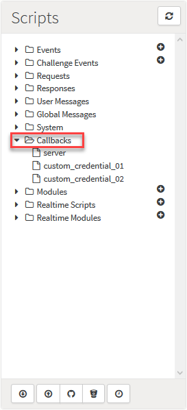
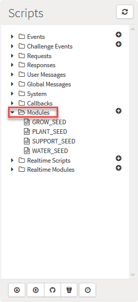

# Cloud Code

## Introduction

The *Configurator > Cloud Code* page lists all the potential interception points that Cloud Code can be bound to in the *Scripts* panel and has a JavaScript editor where you can write your interception code.

### Scripts

The *Scripts* section is split into separate categories, which are [further explained](#Scripts Categories) below. You can expand a category to select an individual item to which you want to attach your Cloud Code script, such as an Event or Request.



There are five main option buttons at the bottom of the *Scripts* panel:
*  - Export Cloud Code.
*  - Import Cloud Code.
*  - Import Cloud Code from GitHub.
*  - Import Cloud Code from BitBucket.
*  - View Cloud Code history and compare the Cloud Code contained in two game Snapshots.

### Accessing Cloud Code

To access the Cloud Code JavaScript editor, select the name of the script from one of the ten categories in the *Scripts* section.  Use the *Save*, *Close*, and *Delete* buttons at the bottom of the editor to manage your scripts:


<q>**Keyboard Shortcuts to Save!** You can also save your scripts using standard key press combinations, **CMD+S** on OSX and **CTRL+S** on Windows and Linux.</q>

<q>**Keyboard Shortcuts List!** For a list of keyboard shortcuts that you can use in the Cloud Code Editor see [below](#Cloud Code Editor Keyboard Shortcuts)</q>

### Refreshing the Scripts Panel

For some Scripts categories, you can use the plus  icon to quickly add a new item, such as adding a new Event. This saves you having to navigate away from the Cloud Code page and then come back to the page to add your Cloud Code script.

However, you might be working on your game in several tabs at once or you might be developing your game along with several Collaborators. If you've added a new Event using the plus icon in one tab and switch to another, you must click the refresh  icon button to see the added Event in the Script list. Similarly, if one of your Collaborators has added an Event, you must refresh the Scripts panel to see that Event.

## Scripts Categories

Click to expand any of the Scripts categories and select the interception point to which you want to attach your Cloud Code.

### Events


The *Events* list contains an entry for each Event you have created within the GameSparks platform:
* When a [LogEventRequest](/API Documentation/Request API/Player/LogEventRequest.md) is received, the corresponding script is executed allowing you to run custom code on the platform. For more details, see [Events](/Documentation/Configurator/Events.md).
* You can access the current player making the request using *Spark.getPlayer()*.
* To create a new Event, click the plus  icon. Then, on the *Add Event* dialog, enter the details of the new Event and click to *Save and Close*.

### Challenge Events


The *Challenge Events* list contains an entry for each Event you have created within the GameSparks platform:
* When a [LogChallengeEventRequest](/API Documentation/Request API/Multiplayer/LogChallengeEventRequest.md) is received, the corresponding script is executed allowing you to run custom code on the platform.
* *LogChallengeEventRequest* contains an attribute "challengeId". It's useful to get this value for keying your own data and to access the value you can call *Spark.data.challengeId*. To get the challenge object stored within GameSparks the following call should be executed:

```    
    var myChallenge = Spark.getChallenge(Spark.data.challengeId);

```

* You can also access the current player making the request using *Spark.getPlayer()*.
* To create a new Event, click the plus  icon. Then, on the *Add Event* dialog, enter the details of the new Event and click to *Save and Close*.

### Requests



The *Requests* list contains an entry for each Request you can call within the GameSparks platform:
* When a Request is received, the corresponding script is executed allowing you to run custom code on the platform.
* You can access the current player making the request using *Spark.getPlayer()*.

<q>**Adding Common Functionaltiy!** [LogEventRequest](/API Documentation/Request API/Player/LogEventRequest.md) and [LogChallengeEventRequest](/API Documentation/Request API/Multiplayer/LogChallengeEventRequest.md) are global scripts that will be executed for these request types before a specific script is called for each Event. This allows you to add a common functionality to all Events.</q>

### Responses



The *Responses* list contains an entry for each Response that can be returned from the GameSparks platform:
* When a Response is created, the corresponding script is executed before sending it to the player allowing you to run custom code on the platform.
* You can access the current player who has generated the response using *Spark.getPlayer()*.

### User Messages



The *User Messages* list contains an entry for each Message that can be returned from the GameSparks platform:
* Before a Message is sent out to each player within a Challenge, the corresponding script is executed allowing you to run custom code on the platform.
* You can access the current player who received the message using *Spark.getPlayer()*.

### Global Messages



The *Global Messages* list contains an entry for each Message that can be returned from the GameSparks platform:
* When a Message is created, the corresponding script is executed allowing you to run custom code on the platform.
* You **cannot access** the current player in a global message Cloud Code script.

### System



The *System* tab contains a number of System Events that are able to trigger some JavaScript Cloud Code:

  * *Callback Url* - This script is executed whenever something hits the [Callback Url](/Tutorials/Cloud Code and the Test Harness/Implementing External HTTP Callbacks.md).
  * *Every Day* - This script is executed at 12:00am UTC each day.
  * *Every Hour* - This script is executed on the hour, every hour.
  * *Every Minute* - This script is executed on the minute, every minute.
  * *File Delivered* - This script is executed when a file is delivered via SFTP to the GameSparks platform. SFTP access to the GameSparks platform is available on request. Please raise a support ticket to request this.
  * *Game Published* - This script is executed when your game configuration changes:
    * On the Preview stage this script will be executed each time you save your game within the portal, you should track your own internal version number in Preview if this script is performing potentially dangerous operation.
    * On the Live stage, this script is executed once each time you publish your game.
  * *Player Connected* - This script is executed each time a player connects and is identified. *Spark.getPlayer()* is set to be the player who connected so you can query or manipulate the data related to the player.
  * *Player Disconnected* - This script is executed each time a player disconnects. *Spark.getPlayer()* is set to be the player who disconnected so you can query or manipulate the data related to the player.

### Callbacks




* *Callbacks* contains an item for each custom *Credential* created.
* The *server* credential is a default callback.
* Separate [Callback URLs](/Tutorials/Cloud Code and the Test Harness/Using Custom Callback Urls.md) allow users to assign different Cloud Code scripts to different callbacks for the same game.

### Modules



Modules allow you to create your own libraries of JavaScript that can be included within other scripts. This allows you to separate common functionality that needs to be shared between scripts into a single module that can be included.

* To include a module within your script use the *require* method as follow :

```
    require("MODULE_SHORT_CODE");
```

* Using *require*, you can load a module into the current execution context. This is not common.js require, but a more basic inclusion pattern, where the loaded module is inlined within the current script.
* If you have circular reference between modules, the *require* method will only load a single module once per *require* invocation. This is to protect from infinite loops and stack overflows.
* You can conditionally *require* modules based on input parameters and the like, to have a single script that can perform multiple tasks without having a large script:

```    
    if(something) {
        require("MODULE_SHORT_CODE_1");
    } else {
        require("MODULE_SHORT_CODE_2");
    }

```

* To create a new module, click the plus  icon. Then, on the *Create New Module* dialog, enter a *Short Code* to uniquely identify the new module script and click *Add*.


### Realtime Scripts


*Realtime Scripts* are listed here:
* You can link Realtime scripts to a Match configuration in the Multiplayer Section so that when a Match is found, the arbitrary Cloud Code script that communicates with the Real-Time client is triggered.
* To create a new Realtime script, click the plus  icon.
* For more details on Realtime Services, see [here](/Tutorials/Real-Time Services/README.md).

### Realtime Modules


Realtime Modules allow you to create your own libraries of JavaScript that can be included within other Realtime scripts. This allows you to separate common functionality that needs to be shared between scripts into a single Realtime module that can be included.

Realtime modules use CommonJS module loading. A primer for CommonJS can be found [here](https://darrenderidder.github.io/talks/ModulePatterns/#/).

To author a Realtime module, you must define the objects you want to export. This is done using "module.exports". You can export multiple items from a single module:

```
module.exports.fiz = function () {
    console.log('fiz!');
}

module.exports.buzz = function () {
    console.log('buzz!');
}
```

To include the Realtime Module in a Realtime Script, the require function should be used as follows:

```
var theModule = require("MODULE_NAME");
var fizResult = theModule.fiz();
var buzzResult = theModule.buzz();
```

At this point, *theModule* represents the exports from the Realtime Module

* To create a new Realtime Module, click the plus  icon. Then, on the *Create New Realtime Module* dialog, enter a *Short Code* to uniquely identify the new Realtime Module and click *Add*.


## Cloud Code Editor Keyboard Shortcuts

This section lists keyboard shortcuts you can use when working in the Cloud Code Editor.

### Selection

| Windows/Linux | Mac | Action              
| ------| --------- | ---------
|  Ctrl+A | Command+A | Select All
|  Shift+Left | Command+Left | Select Left
|  Shift+Right | Command+Right | Select Right
|  Ctrl+Shift+Left | Option+Shift+Left | Select Word Left
|  Ctrl+Shift+Right | Option+Shift+Right | Select Word Right
|  Shift+Home | Shift+Home | Select Line Start
|  Shift+End | Shift+End | Select Line End
|  Alt+Shift+Left | Command+Shift+Left | Select to Line Start
|  Alt+Shift+Right | Command+Shift+Right | Select to Line End
|  Shift+Up | Shift+Up | Select Up
|  Shift+Down | Shift+Down | Select Down
|  Ctrl+Shift+Home | Command+Shift+Up | Select to Start
|  Ctrl+Shift+End | Command+Shift+Down | Select to End
|  Ctrl+Shift+D | Command+Shift+D | Duplicate Selection

### Line Operation

| Windows/Linux | Mac | Action              
| ------| --------- | ---------
|  Ctrl+D | Command+D | Remove Line
|  Alt+Shift+Down | Command+Option+Down | Copy Lines Down
|  Alt+Shift+Up | Command+Option+Up | Copy Lines Up
|  Alt+Down | Option+Down | Move Lines Down
|  Alt+Up | Option+Up | Move Lines Up
|  Alt+Delete | Ctrl+K | Remove to Line End
|  Alt+Backspace | Command+Backspace | Remove to Line Start
|  Ctrl+Backspace | Option+Backspace, Ctrl+Option+Backspace | Remove Word Left
|  Ctrl+Delete | Option+Delete | Remove Word Right
|  --- | Ctrl+O | Split Line
|  Ctrl+M+/ | --- | Comment/Uncomment Line


### Go To

| Windows/Linux | Mac | Action              
| ------| --------- | ---------
|  Ctrl+L, Ctrl+M+L | Command+L, Command+M+L | Go to Line
|  Left | Left, Ctrl+B | Go to Left
|  Right | Right, Ctrl+F | Go to Right
|  Ctrl+Left | Option+Left | Go to Word Left
|  Ctrl+Right | Option+Right | Go to Word Right
|  Up | Up, Ctrl+P | Go to Line Up
|  Down | Down, Ctrl+N | Go to Line Down
|  Alt+Left, Home | Command+Left, Home, Ctrl+A | Go to Line Start
|  Alt+Right, End | Command+Right, End, Ctrl+E | Go to Line End
|  Ctrl+Home | Command+Home, Command+Up | Go to Start
|  Ctrl+End | Command+End, Command+Down | Go to End
|  Ctrl+Down | Command+Down | Scroll Line Down
|  Ctrl+Up | --- | Scroll Line Up


### Find/Replace

| Windows/Linux | Mac | Action              
| ------| --------- | ---------
|  Ctrl+F, Ctrl+M+F | Command+F | Find
|  Ctrl+H | Command+Option+F | Replace
|  Ctrl+K,| Command+G | Find Next
|  Ctrl+Shift+K | Command+Shift+G | Find Previous
