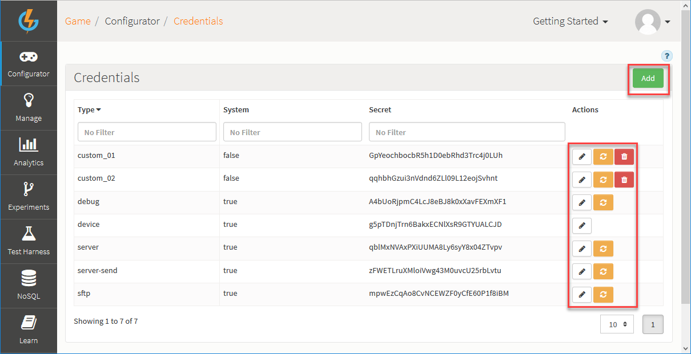
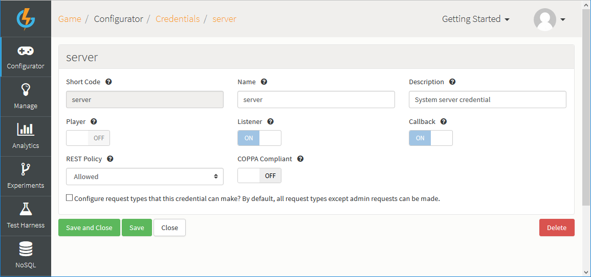
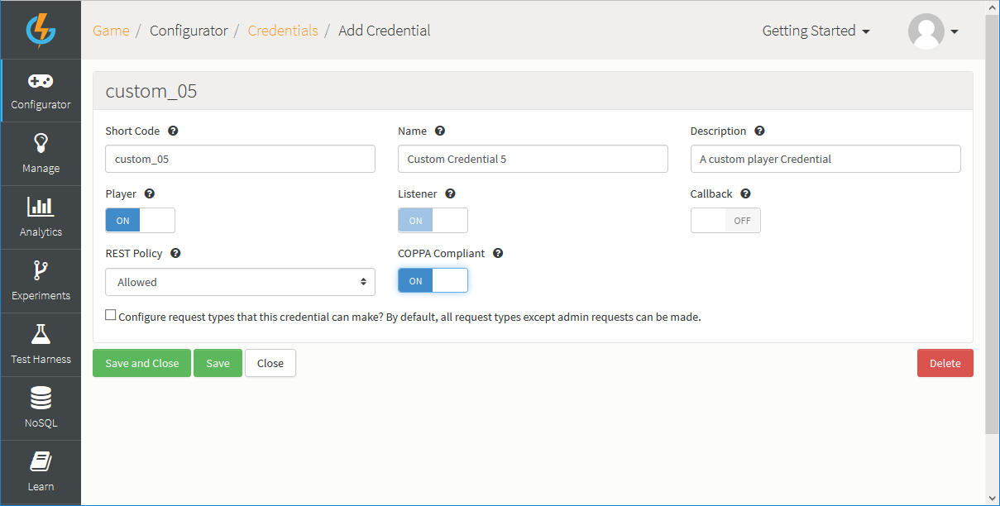
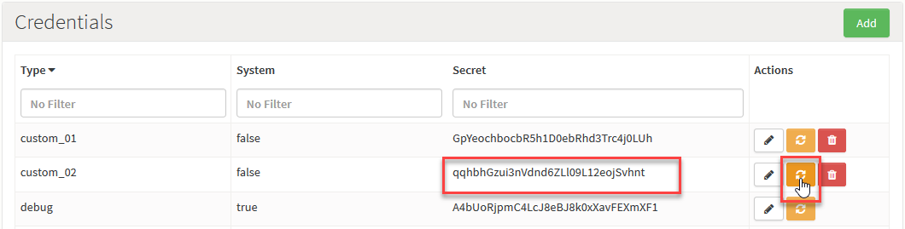
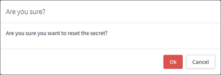
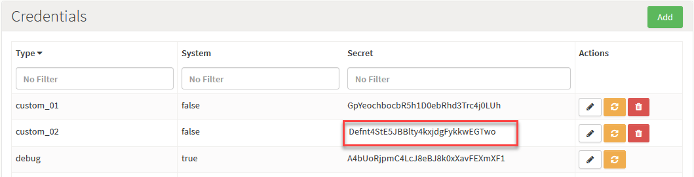

# Security Credentials

Credentials allow you to configure permissive role types for Players within the game.  You can configure each Credential to control which requests and responses are authorized for use when connecting to the GameSparks API platform:
* Credentials are passed-in when a connection is made to the platform.
* If you've created a Credential and set it as a Player type, when any player with this Credential connects to the platform the request/response permissions you've configured for the Credential are applied to the player's requests:
  * For example, you might want to set up a Credential which you can use against players to block their access to finding pending Matches (*FindPendingMatchesRequest*) or allow them only the ability to change their details (*ChangeUserDetailsRequest*).

## Managing Credentials

To create and edit Credentials, go to *Configurator > Credentials*. Existing Credentials are listed:

You can use the following options (highlighted above):

 * *Add* - Add a new Credential.
 *  - Edit Credential.
 *  - Delete Credential.
 *  - [Reset](#Resetting Credential Secret) Credential's secret.

## Understanding Credential Settings

There are two main ways in which you can configure Credentials for your game:
* [Select Credential Type](#Selecting Credential Types)
* [Enable Credential Requests](#Enabling Credential Requests)

You can also configure Credentials for:
* [COPPA Compliance](#Enabling COPPA Compliance)
* [REST Policy](#Selecting REST Policy)

### Selecting Credential Types

When you create or edit a custom Credential there are three key settings you can use to determine the type of Credential and ensure the Credential suits your purposes:
* *Player* - If you select this, it means that the Credential will be used against players. For example, you could use a Player Credential to deny a player access to the matchmaking requests without affecting their permissions to other requests available within the API platform
* *Listener* - If you select this, it means that messages can be passed through to the user.
* *CB* - If you select this, it means that the Credential will be used exclusively for Callback scripts.

There are certain rules applied to the combination of Credential types:
* A Player Credential *MUST* also be a Listener type.
* However, a Listener Credential *does not necessarily* need to also be a Player Credential.

<q>**Important!** You cannot alter the type settings for a System Credential!</q>

### Enabling Credential Requests

When you create or edit a Credential, there are four tabs for different requests categories, which you can use to control the requests allowed for the Credential:
* *Requests* - Generic game requests.
* *LogEventRequests* - All Log Event requests including any custom Log Event requests.
* *LogChallengeRequests* - All Challenge Event requests including any custom Challenge Event requests.
* *AdminRequests* - All requests considered to be Administration tasks.

### Enabling COPPA Compliance

If you enable a Credential as COPPA compliant:
* Certain data defined by the Children's Online Privacy Protection Act of 1998 will not be stored on the GameSparks platform. Any player with this Credential connecting to the platform will not be allowed to authenticate through a 3rd-party social account. Blocking social account authentication for COPPA Credentials in this way ensures no Personally Identifiable Information (PII) will be stored on the platform.
* Secondly, the latitude/longitude information will not be stored on the platform for players connecting with a COPPA Credential.

### Selecting REST Policy

Select to allow or forbid the Credential to accept REST requests:
* If you allow REST requests for a Credential, you can specify that an authorization token is required for added security when REST requests.

## System Credentials

On all games there are five default *System* credentials:
* *Server* - An example Credential for server-to-server communication. By default, this allows a playerId to be sent with the request, and the request would be processed as if it was sent by that player. This Credential is also set up to receive any asynchronous messages sent to any players while connected to the platform.
* *Debug* - This Credential adds JavaScript debugging capabilities to the connection to the platform.
* *Server-send* - Same as the *Server* Credential, except that this Credential doesn't receive asynchronous messages.
* *SFTP* - This Credential gives access to the sftp endpoint, allowing remote systems to deliver files for processing by the platform.
* *Device* - The default Credential you should use in your game. This Credential requires player authentication before requests can be sent.

There are a few important things to note about System credentials:
* You *cannot delete* them.
* You can edit them to configure which requests are allowed.
* You cannot edit for the type of Credential - *Player*, *Listener*, or *CB(Callback)*. These settings are pre-set and locked.
* You can reset the secret for system Credentials, *except* for the *Device* Credential.

### Editing System Credentials

To edit a System Credential:

*1.* Click the edit  icon. The *Edit Credential* page appears:

*2.* Use the *REST Policy* drop-down to select whether or not you want this Credential to allow [REST requests](#Selecting REST Policy):
* *Allowed*
* *Require Auth Token* - REST requests are allowed but Auth Token is required.
* *Forbidden*

*3.* Switch *COPPA Compliant* to *ON*, if you want the Credential to impose [COPPA compliance](#Enabling COPPA Compliance).

*4.* Select any of the four request tabs and check the individual requests under each one for the Credentials you want to allow/disallow. In this example, the first Requests tab is selected and all requests on this tab are checked and therefore allowed.

*5.* Click to *Save and Close* your editing changes.

## Creating and Editing Custom Credentials

To create and edit a custom Credential:

*1.* Click *Add*. The *Add Credential* page appears:

*2.* Complete the mandatory fields for the Credential:
* *Short Code* - Enter a unique identifier for the custom Credential.
* *Name* - Enter a name which can be used to help identify the custom Credential in the portal.
* *Description* - Enter a description for the custom Credential that explains its purpose.

*3.* Use the toggle buttons to enable the type of Credential you want - *Player*, *Listener*, or *CB*. In this example, we have selected for a *Player* Credential. When you select *Player*:
* *Listener* is automatically selected.
* You cannot select *CB*, because *Player* and *CB* are mutually exclusive Credential types.

In this example, we've selected for a *Player/Listener* custom Credential.

*4.* Use the *REST Policy* drop-down to select whether or not you want your custom Credential to allow REST requests:
* *Allowed*
* *Require Auth Token* - REST requests are allowed but Auth Token is required.
* *Forbidden*

*5.* Switch *COPPA Compliant* to *ON*, if you want the Credential to impose COPPA compliance.

*6.* Under the *Requests*, *LogEventRequests*, and *LogChallengeRequests* tabs, check for the requests you want to allow for the Credential.

<q>**AdminRequests.** Remember, *AdminRequests* cannot be selected for a Player Credential!</q>

*7.* Click to *Save and Close* your new Credential.

## Resetting Credential Secret

To reset a Credential's secret:

*1.* Under *Credentials*, click the reset  icon for the Credential whose secret you want to reset:

A *Reset Secret* confirmation dialog appears:

*2.* Click *OK* to continue with the Credential secret reset. The confirmation dialog closes and you'll see that the Credential's secret has been updated:

 
<q>**Callback Example!** For an example of when you might want to create a CB Credential and use it, see the [How to Use Custom Callback Urls](/Tutorials/Cloud Code and the Test Harness/Using Custom Callback Urls.md) tutorial.</q>
