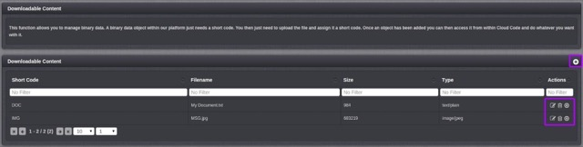

# Downloadables

This section of the Configurator allows you to upload and manage binary data (e.g. content, such as new levels).  You just need to upload the file and assign it a short code.  Once an object has been added you can then access it from within Cloud Code and do whatever you want with it (e.g. distribute it to certain players under certain conditions).

<q>**Note:** The platform also supports the upload of binary content directly from your game using the API which allows player-created content, such as photos or custom levels, to be uploaded and stored.</q>

*  Amend the Downloadable.
*  Delete the Downloadable.
*  Download the Downloadable

To create a new piece of Downloadable content click on the  icon as highlighted above. Next fill in a meaningful short code and then select the downloadable file.

### API Request

The GetDownloadableRequest returns a secure, time sensitive URL to allow the game to download a piece of downloadable content stored in the GameSparks platform. An example can be found [here](/API Documentation/Request API/Misc/GetDownloadableRequest.md).

### Accessing the Downloadable from Cloud Code

Both XML and JSON Downloadables can be accessed via Cloud Code via the [SparkFiles](/API Documentation/Cloud Code API/Cloud Data/SparkFiles.md) object;
