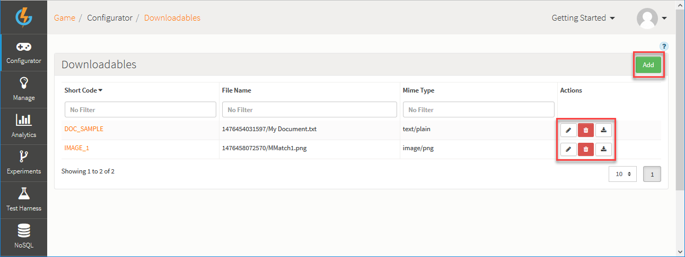
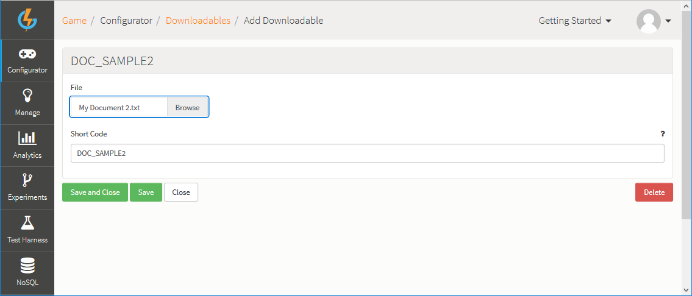
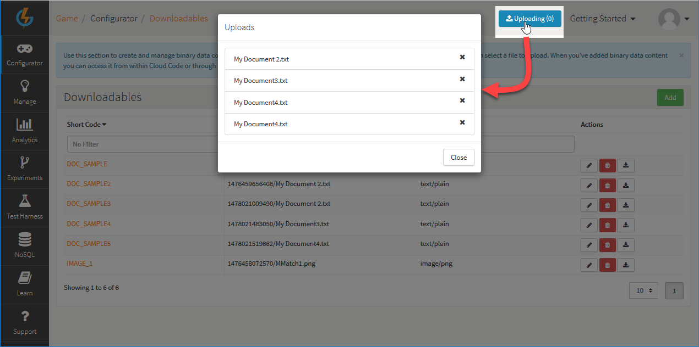

# Downloadables

This section of the Configurator allows you to upload and manage binary data - for example, content such as new levels. You just need to upload the file and assign it a Short Code.  When you've added a binary object in this way, you can then access it from within Cloud Code and do whatever you want with it - for example distribute it to certain players under certain conditions.

<q>**Note:** The platform also supports the upload of binary content directly from your game using the API, which allows player-created content, such as photos or custom levels, to be uploaded and stored.</q>

## Managing Downloadables

The *Configurator > Downloadables* page displays the list of Downloadables:

You can use the following options (highlighted above):

 * *Add* - Add a new Achievement.
 *  - Amend Downloadable.
 *  - Delete Downloadable.
 *  - Download Downloadable.

## Creating New Downloadable Content

*1.* Click *Add* to create a new piece of Downloadable content:

*2.* Next enter a *Short Code* and then click *Browse* to select the downloadable file.

*3.* Click to *Save and Close*:
* When the upload completes, you are taken back to the *Downloadables* page and the new Downloadable is listed.
* An *Upload* button appears at the top of the page and you can click this to view upload progress.

*4.* When you have created several *Downloadables*, you can click the *Uploading* button and review and remove your completed *Uploads*:

## API Request

The [GetDownloadableRequest](/API Documentation/Request API/Misc/GetDownloadableRequest.md) returns a secure, time sensitive URL to allow the game to download a piece of downloadable content stored in the GameSparks platform.

## Accessing the Downloadable from Cloud Code

Both XML and JSON Downloadables can be accessed via Cloud Code via the [SparkFiles](/API Documentation/Cloud Code API/Cloud Data/SparkFiles.md) object;
