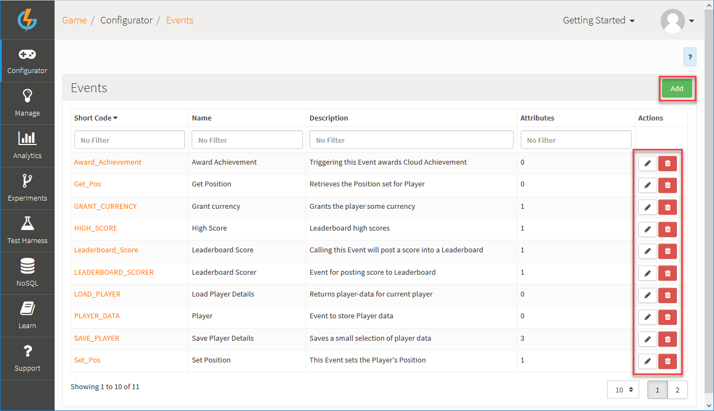
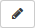
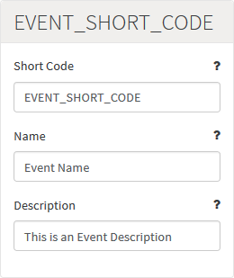
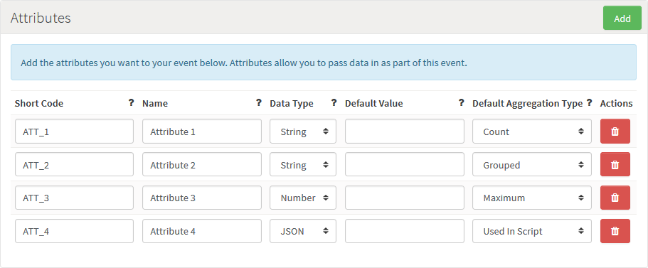

# Events

You can use Events to define custom data structures that you want to pass into the platform via the [LogEventRequest](/API Documentation/Request API/Player/LogEventRequest.md) and [LogChallengeEventRequest](/API Documentation/Request API/Multiplayer/LogChallengeEventRequest.md) API calls.

## Managing Event Configurations

The Configurator *Events* page lists Events and allows you to create new Events and edit or delete existing ones.

You can use the following options (highlighted above):

  * *Add* - Add a new Event.
  *  - Edit Event.
  *  - Delete Event.

## Creating a new Event Configuration

The Create/Edit screen contains the following fields:

  * *Short Code* - Short Code of the Event, which is used by the API to allow you to identify which Event you want to call. Short Codes are always unique.
  * *Name* \- Name of the Event, which you can use to identify the game in the portal, if you have a number of Events.
  * *Description* \- Description for the Event.

### Creating Event Attributes

Each Event can have a number of attributes associated with it.

Add an Attribute by clicking *Add*.  Each Attribute has a number of different configuration options:

  * *Short Code* \- Short Code of the Attribute, which is used by the API to allow you to identify which Attribute you are trying to set.
  * *Name* \- Name of the Attribute, which you can use to identify the Attribute if there are several associated with an Event.
  * *Data Type* \- Each Attribute needs to be defined as either *String*, *Number*, or *JSON*.
  * *Default Value* \- Allows a specific value to be used if the user request does not contain this attribute.
  * *Default Calculation* \- Select the calculation you want to use for when the Event/Attribute is used as a running total a Leaderboard. Select *Used In Script* if you do not want to make the Event/Attribute available for a Leaderboard running total:
    * *Maximum* \- A running total will be created to track the maximum value posted.
    * *Minimum* \- A running total will be created to track the minimum value posted.
    * *Sum* \- A running total will be created to add all the values posted together.
    * *Count* \- A running total will be created to count the number of times the player has called the event.
    * *Last* \- A running total will be created using the last value posted.
    * *Used In Script* \- The Event will not be used in a running total.
    * *Grouped* \- The running total will use this attribute to group other attributes. This will lead to a running total with an entry per attribute/user combination.
    * *Supplemental* \- A running total will be created with no value calculated. You can use this when you want to store some extra information within the game context but do not want this to affect on the Leaderboard ranking. (For example, in a racing game you can keep note of weather conditions on the track as well as player lap times but changing weather conditions do not affect the player's Leaderboard ranking.)

<q>**Attributes for Leaderboard Running Totals!** Any Event that you create with at least one Attribute where you select any *Default Calc* for the Attribute *except Used in Script* means that the Event will be available for selection as a running total when you create and configure Leaderboards for your game. [Running Totals](/Documentation/Configurator/Running Totals.md) is further explained in the next page.</q>
