# Integrations

The Integrations page allows you to integrate with 3rd-party external providers and configure a multitude of external, social authentications within the GameSparks platform. The set up process for most Integrations is straightforward - you simply enter the *App Id* and the *App Secret* supplied by the external provider for your game.

<q>**3rd-Party Authentication Tutorials!** You'll find detailed tutorials on how to set up authentication with GameSparks through many of the supported 3rd-party external providers [here](/Tutorials/Social Authentication and Player Profile/README.md).

## Managing External Integrations

*1.* In the portal, go to *Configurator > Integrations*.

*2.* Click the external provider you want to integrate with your game in GameSparks. For example, Facebook:

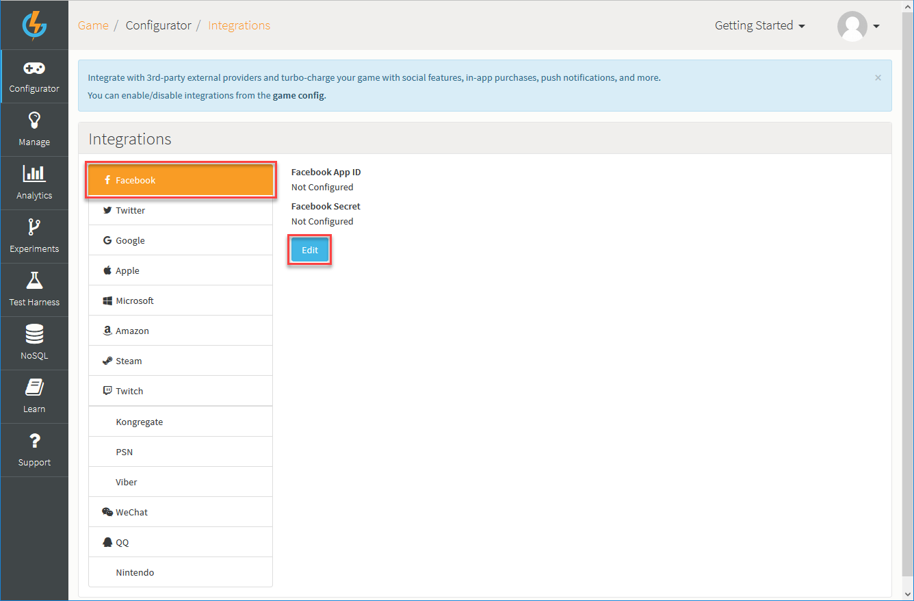

*3.* Click *Edit* to change the configuration settings for the external provider.

<q>**Don't See the 3rd-Party Provider?** If you don't see the 3rd-party provider you want to set up in the *Integrations* page, go your [Game Overview](/Documentation/Game overview/README.md) page and click to *Edit* your game. You can select the 3rd-party providers you want in your game on the *Features & Intergrations* tab.</q>

## Facebook Integration

*Integrations>Facebook* allows you to set up [Facebook Authentication](/API Documentation/Request API/Authentication/FacebookConnectRequest.md) for your game, an in-depth tutorial can be found [here](/Tutorials/Social Authentication and Player Profile/Facebook Authentication.md).

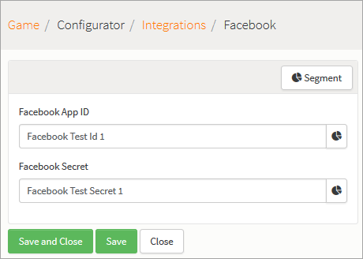

## Twitter Integration

*Integrations>Twitter* allows you to set up [Twitter Authentication](/API Documentation/Request API/Authentication/TwitterConnectRequest.md) for your game, an in-depth tutorial can be found [here](/Tutorials/Social Authentication and Player Profile/Twitter Authentication.md).

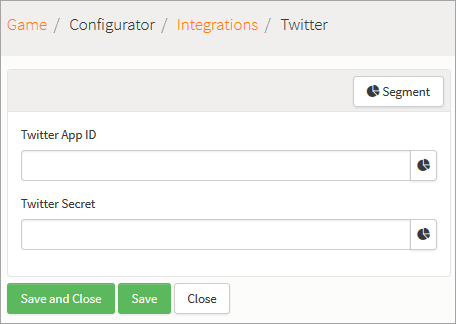

## Google Plus Integration

*Integrations>Google* allows you to set up [Google Plus Authentication](/API Documentation/Request API/Authentication/GooglePlusConnectRequest.md) for your game, an in-depth tutorial can be found [here](/Tutorials/Social Authentication and Player Profile/Google+ Authentication.md).

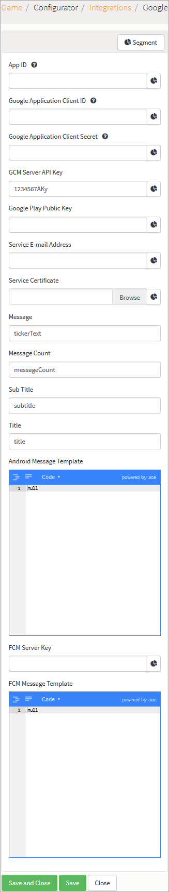

## Apple Integration

*Integrations>Apple* allows configuring [IOS Push Notifications](/Tutorials/Social Features/Configuring iOS Push Notifications.md) as well as [IOS IAPs](/Tutorials/Currencies, Virtual Goods and Achievements/Managing In App purchases.md) for your game.

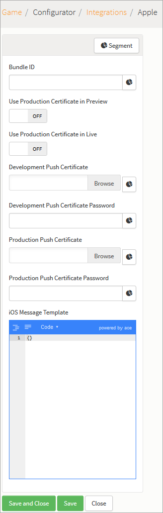

## Microsoft Integration

*Integrations>Microsoft* allows configuring [Windows Push Notifications](/Tutorials/Social Features/Configuring Windows Phone Push Notifications.md) as well as [Windows IAPs](/API Documentation/Request API/Store/WindowsBuyGoodsRequest.md) for your game.

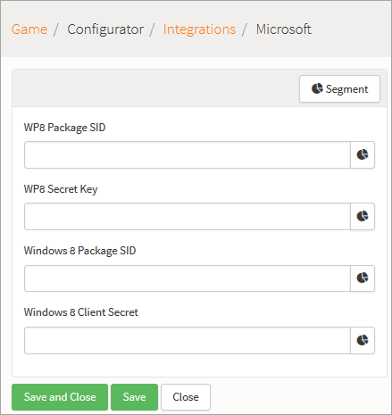

## Amazon Integration

*Integrations>Amazon* allows you to set up [Amazon Authentication](/API Documentation/Request API/Authentication/AmazonConnectRequest.md) as well as [Amazon IAPs](/API Documentation/Request API/Store/AmazonBuyGoodsRequest.md) for your game.

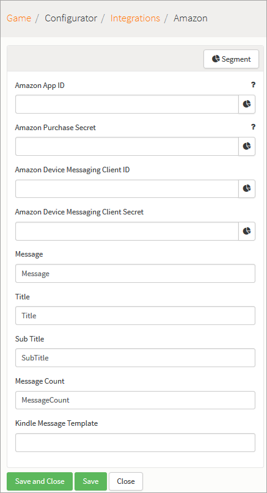

## Steam Integration

*Integrations>Steam* allows you to set up [Steam Authentication](/API Documentation/Request API/Authentication/SteamConnectRequest.md).

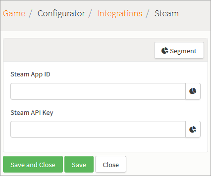

## Twitch Integration

*Integrations>Twitch* allows you to set up [Twitch Authentication](/API Documentation/Request API/Authentication/TwitchConnectRequest.md), for your game, an in-depth tutorial can be found [here](/Tutorials/Social Authentication and Player Profile/Twitch Authentication.md).

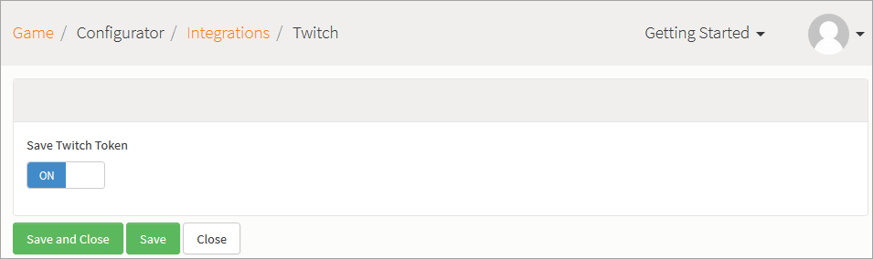

## Kongregate Integration

*Integrations>Kongregate* allows you to set up [Kongregate Authentication](/API Documentation/Request API/Authentication/KongregateConnectRequest.md) for your game, an in-depth tutorial can be found [here](/Tutorials/Social Authentication and Player Profile/Kongregate Authentication.md).

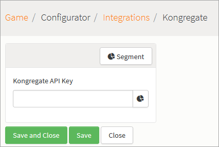

## PSN Integration

*Integrations>PSN* allows you set up [PSN Authentication](/API Documentation/Request API/Authentication/PSNConnectRequest.md) for your game.

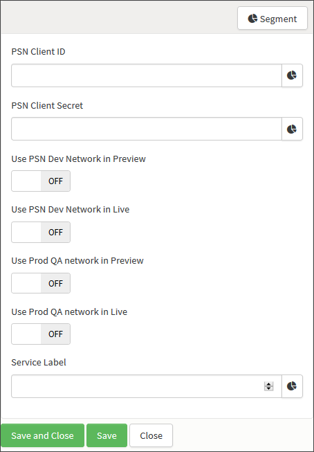

## Viber Integration

Integration with *Viber* is dealt with on a by-request basis. Please contact [Customer Support](https://support.gamesparks.net/support/home) if you are interested in integrating with this 3rd-party provider.

## WeChat Integration

You don't need to perform any set up in the portal for *WeChat* authentication, because all of the required information is contained in your [WeChat Connect Requests](/API Documentation/Request API/Authentication/WeChatConnectRequest.md).

## QQ Integration

*Integrations>QQ* allows you set up [QQ Authentication](/API Documentation/Request API/Authentication/QQConnectRequest.md) for your game.

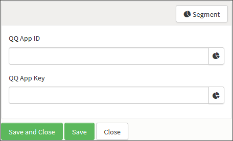

## Nintendo Integration

*Integrations>Nintendo* allows you set up [Nintendo Authentication](/API Documentation/Request API/Authentication/NXConnectRequest.md) for your game.

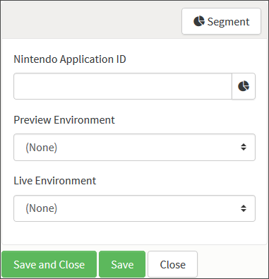
