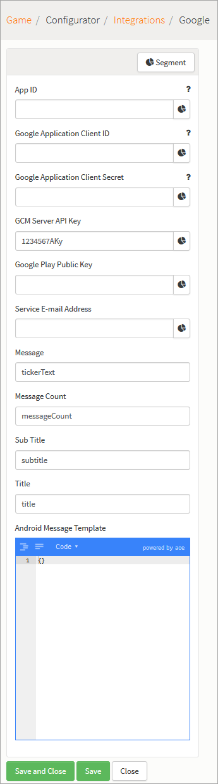

# Integrations

The Integrations page allows you to integrate with 3rd-party external providers and configure a multitude of external, social authentications within GameSparks platform. The set up process for most Integrations is straightforward - you simply need to enter the *App Id* and the *App Secret* supplied by the external provider for your game.

## Managing External Integrations

*1.* In the portal, go to *Configurator > Integrations*.

*2.* Click the external provider you want to integrate with your game in GameSparks. For example, Facebook:

*3.* Click *Edit* to change the configuration settings for the external provider.

### Facebook Integration

Facebook Integrations tab allows you to set up [Facebook Authentication](/API Documentation/Request API/Authentication/FacebookConnectRequest.md) for your game, an in-depth tutorial can be found [here](/Tutorials/Social Authentication and Player Profile/Facebook Authentication.md).

### Twitter Integration

Twitter Integrations tab allows you to set up [Twitter Authentication](/API Documentation/Request API/Authentication/TwitterConnectRequest.md) for your game, an in-depth tutorial can be found [here](/Tutorials/Social Authentication and Player Profile/Twitter Authentication.md).

### Google Plus Integration

Google Integrations tab allows you to set up [Google Plus Authentication](/API Documentation/Request API/Authentication/GooglePlusConnectRequest.md) for your game, an in-depth tutorial can be found [here](/Tutorials/Social Authentication and Player Profile/Google+ Authentication.md).

### Apple Integration

Apple Integrations tab allows configuring [IOS Push Notifications](/Tutorials/Social Features/Configuring iOS Push Notifications.md) as well as [IOS IAPs](/Tutorials/Currencies, Virtual Goods and Achievements/Managing In App purchases.md) for your game.

### Microsoft Integration

Microsoft Integrations tab allows configuring [Windows Push Notifications](/Tutorials/Social Features/Configuring Windows Phone Push Notifications.md) as well as [Windows IAPs](/API Documentation/Request API/Store/WindowsBuyGoodsRequest.md) for your game.

### Amazon Integration

Amazon Integrations tab allows you to set up [Amazon Authentication](/API Documentation/Request API/Authentication/AmazonConnectRequest.md) as well as Amazon IAPs for your game.

### Steam Integration

Steam Integrations tab allows you to set up [Steam Authentication](/API Documentation/Request API/Authentication/SteamConnectRequest.md).

### Twitch Integration

Twitch Integrations tab allows you to set up [Twitch Authentication](/API Documentation/Request API/Authentication/TwitchConnectRequest.md), for your game, an in-depth tutorial can be found [here](/Tutorials/Social Authentication and Player Profile/Twitch Authentication.md).

### Kongregate Integration

Kongregate Integrations tab allows you to set up [Kongregate Authentication](/API Documentation/Request API/Authentication/KongregateConnectRequest.md) for your game, an in-depth tutorial can be found [here](/Tutorials/Social Authentication and Player Profile/Kongregate Authentication.md).

## Other 3rd Party Integrations

The GameSparks platform can be integrated with four other 3rd-party external providers:
* PSN
* Viber
* WeChat
* QQ

However, integration with these providers is dealt with on a by-request basis. Please contact [Customer Support](https://support.gamesparks.net/support/home) if you are interested in integrating with any of these providers.
