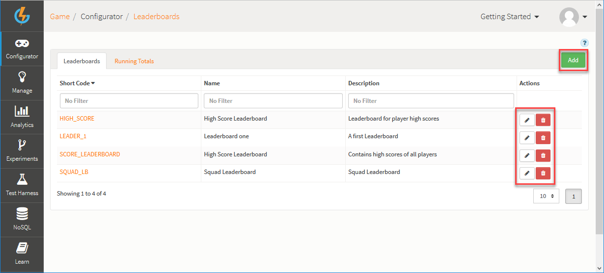
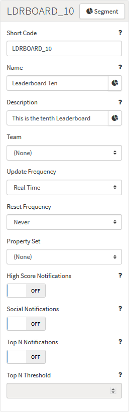
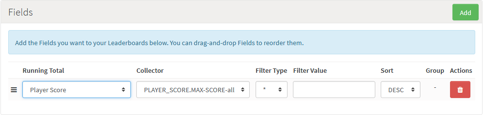

# Leaderboards

Leaderboards are typically restricted to tracking and reporting the leading players in a game. GameSparks Leaderboards offer you a much wider and flexible scope, both for tracking comparisons within your player pool and for controlling how comparisons are displayed in-game to the players:
* **Highly Configurable** - Keep track of any comparisons of player performance and then support artifacts in-game that flexibly display this information in a meaningful way to players. This supports complex, contextual displays of information about other players and also provides the framework for many social and competitive features.
* **Highly Performant** - Our internal ranking and sorting algorithms allow new scores to be added to Leaderboards with 10m+ entries and have a new rank calculated within milliseconds.
* **Driven by Running Totals** - Leaderboards consume data from Running Totals and can also perform calculations on grouped Running Totals, allowing you to further transform the data from the Running Total into a list of scores of the values that you want. A single Leaderboard can consume data from multiple Running Totals (and in turn, from multiple Events). This allows for some complex Leaderboards, such as a Leaderboard with a halfway score and a final score in the same list. You can achieve this without having to worry about recording the halfway score during the game. Simply send the Events when they happen and the platform does the rest!
* **Partition** - You can partition Leaderboards, which allows you to set up a single Leaderboard configuration and have it automatically create new Leaderboards when a particular value changes. A good example here is a level Leaderboard, where the rules are the same for the Leaderboard at each level. You tell the Leaderboard to partition by level and the rest is done for you. Far better than creating 100 separate Leaderboard configurations to represent each level!
* **Social Ranking** - Not only can Leaderboards provide instant rankings, but we can filter these based on your connection to a wide range of available social networks, such as ranking you against your socially networked friends.

## Managing Leaderboard Configurations

The Configurator Leaderboard page displays the list of Leaderboards and allows you to create new Leaderboards and edit or delete existing ones.

You can use the following options (highlighted above):

  * *Add* - Add a new Leaderboard.
  *  - Edit Leaderboard.
  *  - Delete Leaderboard.

## Creating a Leaderboard Configuration

Click *Add* to create a new Leaderboard.

  * *Short Code* \-The Short Code is a mandatory field used to give the Leaderboard a unique identifier for use elsewhere in the Portal and in Cloud Code.
  * *Name* \-The Name field is a mandatory field used as an identifier to help you find the Leaderboard in the Portal.
  * *Description* \-The Description is a mandatory field, which you can use to describe the purpose of the Leaderboard.
  * *Team* \- The type of Leaderboard to be created. Leaderboards can be Team or Player based - if a Team is not selected, then the Leaderboard is a Player Leaderboard.
  * *Update Frequency* \- Select the rate at which the GameSparks platform will update the Leaderboard data:
    * *Real-time* \- Updated in real-time (default).
    * *Daily* \- Updated every day.
    * *Weekly* \- Updated every week.
    * *Monthly* \- Updated every month.
  * *Reset Frequency* \- Select how often you want to reset the Leaderboard:
    * *Never* \- Never Reset (default).
    * *Daily* \- Reset each day.
    * *Weekly* \- Reset each week.
    * *Monthly* \- Reset each month.
  * *High Score Notifications* \- A flag to indicate whether a [NewHighScoreMessage](/API Documentation/Message API/Leaderboards/NewHighScoreMessage.md) should be sent to the user when they submit a new high score.
  * *Social Notifications* \- A flag to indicate whether a [SocialRankChangedMessage](/API Documentation/Message API/Leaderboards/SocialRankChangedMessage.md) should be sent to friends when their scores are beaten.
  * *Top N Notifications* \- Whether a [GlobalRankChangedMessage](/API Documentation/Message API/Leaderboards/GlobalRankChangedMessage.md) should be sent to players when their scores are beaten (if they are within the Top N Threshold).
  * *Top N Threshold* \- Which global positions in the Leaderboard should be notified when they are beaten.

### Creating Leaderboard Fields

Each Leaderboard configuration has a list of *Fields*. Each Field refers to an Event Attribute/Running Total Collector.

In the *Fields* panel, you can click to *Add* fields to a Leaderboard:

  * *Running Total* \- Select from your list of Running Totals.
  * *Collector* \- Select from a list of Running Total Collectors that are related to the chosen Running Total.
  * *Filter Type* \- Select a filter which incoming Event Attribute values will be checked against before being entered into the Leaderboard.
  * *Filter Value* \- Specify a value for the given filter type.
  * *Sort* \- Select how this field affects the ordering of the Leaderboard if at all.
  * *Group* \- If the chosen Running Total Collector has a default calculation value of *Grouped*, this field allows you to select how the Leaderboard data should be grouped. Available values are:
    * *Minimum* - Lowest entry
    * *Maximum* - Highest entry
    * *Sum* - Sum of the entries
    * *Count* - Number of entries
    * *Range* - Difference between Minimum and Maximum
    * *ID* - Lists each Entry on a single Leaderboard.
    * *Partition* - Partitions the Leaderboard on this Entry, more on that [here](/Tutorials/Social Features/Partitioning Leaderboards.md).

### Deleting Leaderboard Fields

You can click the delete  icon to remove a *Field* from your Leaderboard.
