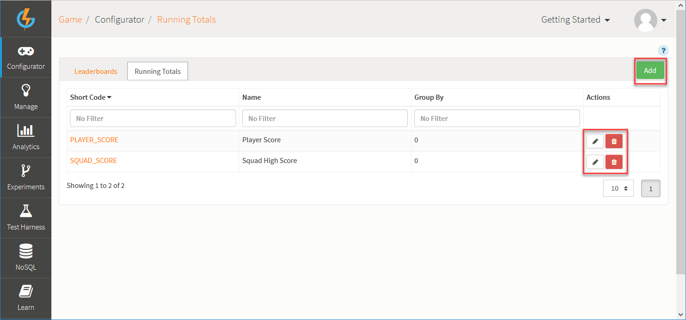
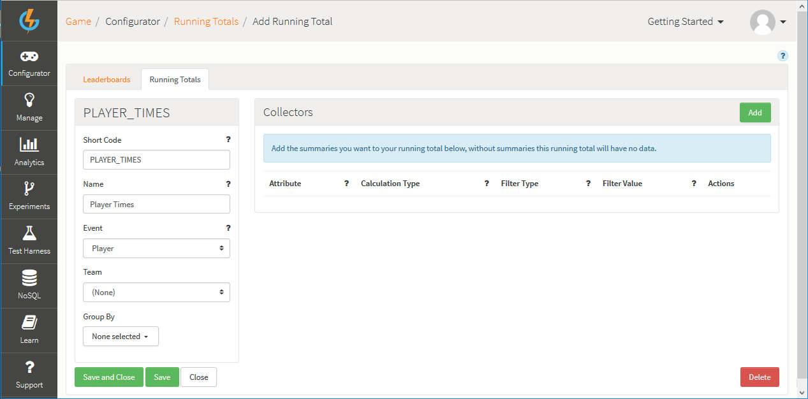
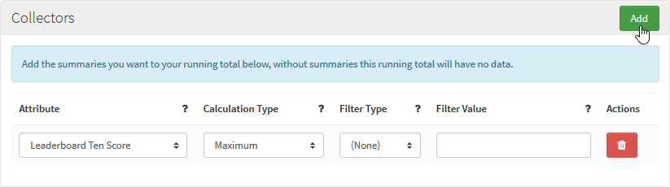
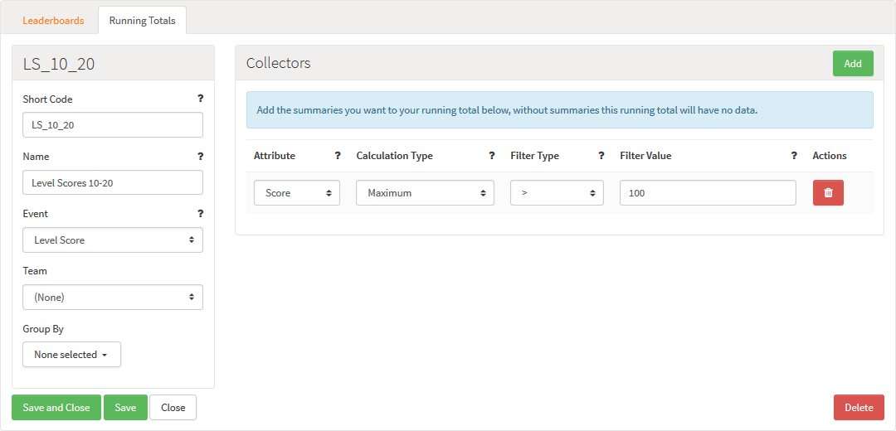
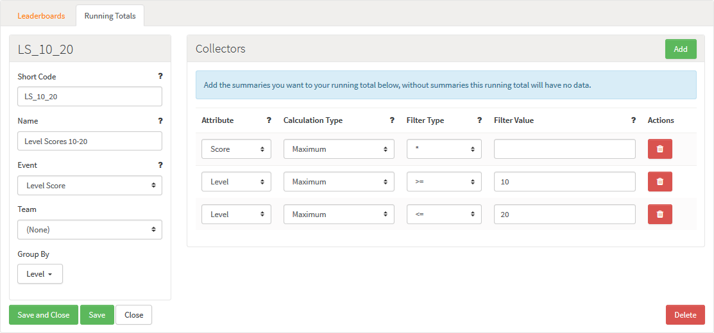

# Running Totals

You can use *Running Totals* to process events using the GameSparks scoring and ranking systems:
* **Simple Leaderboards.** You *don't need* to configure a specific Running Total when you are creating simple Leaderboards, because the *Default Aggregation Type* on the Event Attribute screen will have auto-created your Running Total.
* **Advanced Leaderboards.** For more advanced scenarios - such as a Leaderboard for "Most Improved Player in Last [x] Weeks" - you'll need to add and set up a new custom Running Totals configuration.

<q>**Event Attributes not used as Running Totals!** If you select *Used in Script* as the *Default Aggregation Type* for an Event Attribute, then the Event/Attribute *will not be available as a Running Total* for your Leaderboards.</q>

## Managing Running Total Configurations

The Running Totals tab on the Configurator Leaderboards page displays the list of Running Totals and allows you to create new Running Totals and edit or delete (non-system type) existing ones.

You can use the following options (highlighted above):

  * *Add* - Add a new Running Total.
  *  - Edit Running Total.
  *  - Delete Running Total.

When a player posts an Event to the platform, all Running Totals associated with the Event are processed. An important concept is that of a *Group* Attribute.

  * Running Totals *without* a Group Attribute maintain a *single record* for each player that has submitted an Event that matches the criteria specified. This record can then be used within a Leaderboard to create various types of Leaderboards.
  * When a Running Total *has* a Group Attribute(s) set, there is a record maintained for a group of Attributes by user.

## Creating a Running Total Configuration

Click to *Add* a new Running Total. The page adjusts:

The Add/Edit panel has the following fields.

  * *Short Code* - Enter a Short Code of the Running Total, which is used by the API to allow you to identify which Running Total you want to call.
  * *Name* - Enter the name of the Running Total, which is used to allow you to identify it in the portal if you have more than one Running Total.
  * *Event* - Select the Event this Running Total will process.
  * *Team* - Select the Type of Running Total (Player or Team). If a Team is not selected, then it is a Player Running Total
  * *Group* - Select which Attributes from the Event should be used for grouping. The running total will use this Attribute to group other Attributes. This will lead to a running total with an entry per Attribute/user combination. A typical use case would be where you want to track each player's highest score relative to each level of your game, not simply each player's highest score across all game levels.

### Adding Collectors for Running Totals

To add *Collectors* to your Running Total, click *Add*:

Each Running Total Collector has the following fields:
  * *Attribute* - Select the Event Attribute that the Running Total will capture and process.
  * *Calculation Type*:
    * *Maximum* - The Running Total will be created to track the maximum value posted.
    * *Minimum* - The Running Total will be created to track the minimum value posted.
    * *Sum* - The Running Total will be created to add all the values posted together.
    * *Count* - The Running Total will be created to count the number of times the player has called the Event.
    * *Last* - The Running Total will be created to track the last value posted.
    * *Supplemental* \- A Running Total will be created with no value calculated. You can use this when you want to store some extra information within the game context but do not want this to affect on the Leaderboard ranking. (For example, in a racing game you can keep note of weather conditions on the track as well as player lap times but changing weather conditions do not affect the player's Leaderboard ranking.)
  * *Filter Type & Filter Value* - Allows you to define an optional filter for values tracked (<, >, * , and so on). Events posted that do not match the filter are ignored.

### Filter Examples

Here are some useful examples of using filters.

Example 1: *Only process scores over 100*

Example 2: *Only include scores from levels 10 - 20.*

