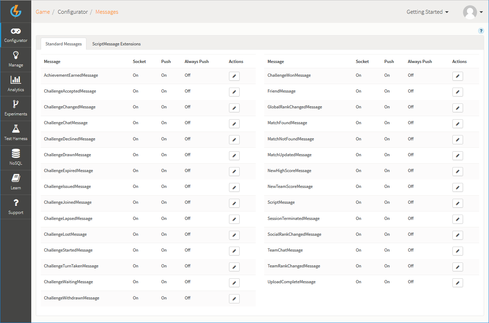
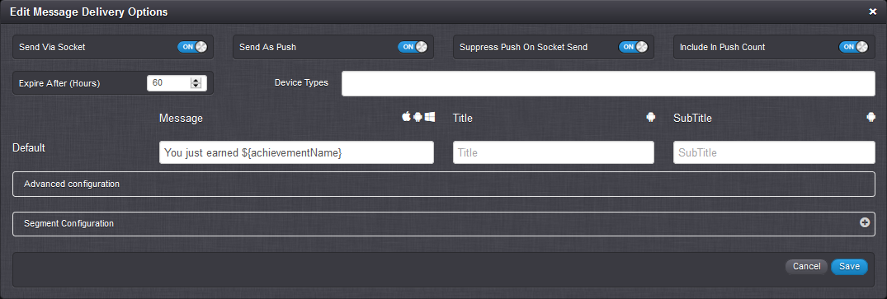
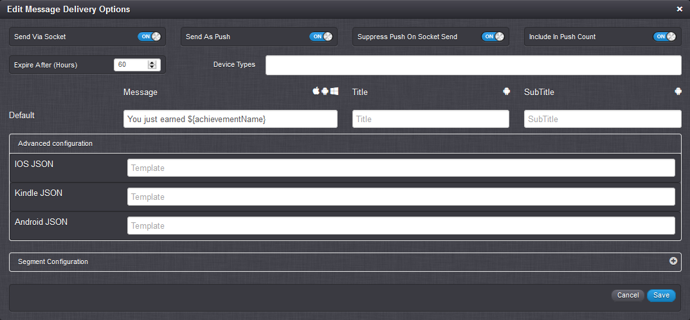
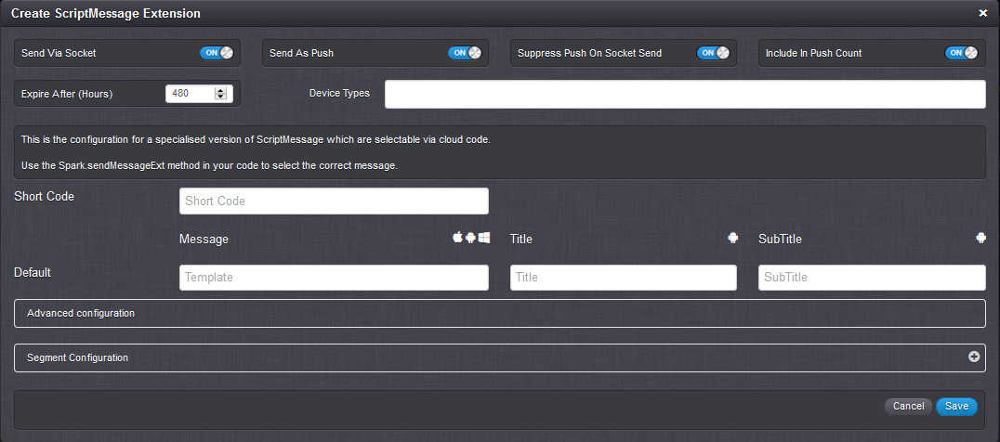
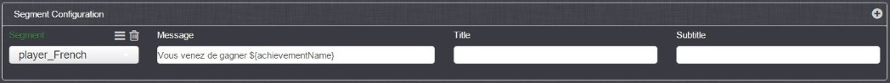
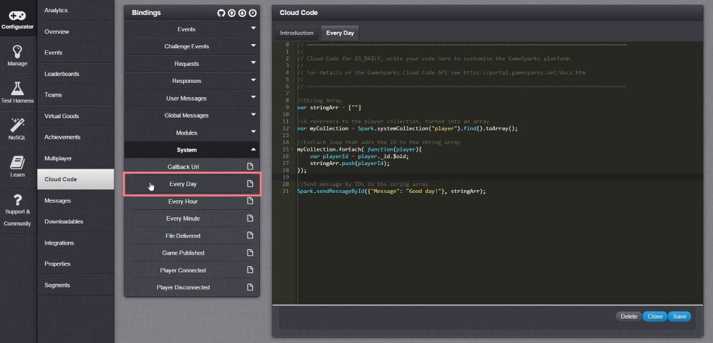

# Messages

The GameSparks platform allows you to send messages to your players.  These can be:
* In-game messages when a player is playing the game.
* Push notifications when they are not playing the game (including email if desired, via an integration with SendGrid).

This section explains how to set up and configure messages for your game.

## Message Configuration

*1.* Navigate to *Configurator > Messages*.



The *Message Configuration* panel contains two tabs:
* Under *Standard Messages*, you'll see all the message types available on the platform.  Many of these standard messages relate to Challenges but other categories of standard message are supported (uploads, achievements, p2p messaging).
* Under the *Script Message Extensions* tab, you can exploit full messaging flexibility by creating your own custom messages. (See the next [section](#Script Message Extensions)).


*2.* To configure a standard message type, click the edit  icon for the desired message. The *Edit Message Delivery Options* dialog appears:



In this example, the edit dialog for the *AchievementEarnedMessage* is shown.

*3.* Enter the details for the message on the edit dialog:

* *Send Via Socket* \- Sends the message via the Socket.
* *Send As Push* \- Send the message as a push notification.
* *Suppress Push On Socket Send* \- If message is sent via the Socket, don't send it as Push as well.
* *Include In Push Count* \- Should the message be included in Push Count.
* *Expire After (Hours)* \- Enter the expiry time in hours for the message. The system will attempt to send the message to recipients for this period. If a player is not connected when the message is issued and they re-connect within the expiry period, they will get the message when they re-connect. If a player does not re-connect within the expiry period, they will not get the message. (In either case, whether a player does or doesn't receive the message, this will be logged by the system.)
* *Device Types* - The supported device types are:
  * *WP8* - Windows Phone 8
  * *W8* - Windows 8
  * *IOS* - Apple
  * *ANDROID* - Google
  * *KINDLE* - Amazon
  * *Viber*

<q>**Viber Integration!** Viber integration is available only on request. Please contact Viber directly requesting GameSparks integration if you are interested.</q>
* *Message* \- The message to be sent.
* *Title* \- The title of the Message.
* *Subtitle* \- The subtitle of the Message.
* *Advanced configuration* \- See Step 4 below.
* *Segment configuration* \- Click the plus  icon to configure any segment configuration you want to apply to the message. (See [section](#Different Messages for Different Players) below)

*4.* If the standard configuration available for your push notification messages doesn't give you what you want, you can use *Advanced configuration* for the following 3 supported providers. Click in the *Advanced configuration* strip to expand it:



Here are some examples of the formats you can use for these providers:
* *iOS for Apple* \- {"aps":{"badge":1,"alert":"${summary}"}}
* *Kindle for Amazon* \- {"expiresAfter":86400,"data":{"Message":"${Summary}","Title":"${title}", "messageId":"57dbcf149f68b50583cf9ab5","SubTitle":"${subtitle}" ,"MessageCount":21}}
* *Android for Google* \- {"tickerText" : "${summary}" , "subtitle" : "${subtitle}" , "title" : "${title}" , "messageCount" : "1" , "messageId" : "57dbcfbb9f68b50583cf9ab7"}

<q>**Provider Documentation!** Please read the relevant provider-side documentation to ensure the message format you use is valid for the receiving device.</q>

## Script Message Extensions

GameSparks allows you to create custom messages, which you can send from your Cloud Code.

*1.* On the *Script Message Extensions* tab, click the plus  icon. The *Create ScriptMessage Extension* dialog appears:



* These Messages are uniquely identified using a *Short Code*.
* The configuration details for a custom message are similar to standard message configuration. (See previous [section](#Message Configuration) )  

## Different Messages for Different Players

You can use segmentation to send players different messages using *Segment Configuration*. For example, you can create a segment for French players and send these players French language versions of messages:



## Global Scheduled Messages

The platform allows you to execute code every day, hour, and minute, which means you can send scheduled global messages. Here's an example of how to set up the messages in Cloud Code in the *Every Day* Event under *System*.  

 

```
    //String Array
    var stringArr = [""]

    //A reference to the player collection, turned into an array
    var myCollection = Spark.systemCollection("player").find().toArray();

    //ForEach loop that adds the ID to the string array
    myCollection.forEach( function(player){
        var playerId = player._id.$oid;
        stringArr.push(playerId);
    });

    //Send message by IDs in the string array
    Spark.sendMessageById({"Message": "Good day!"}, stringArr);
```

## Sending Specific Messages to Specific Players

What if you want to send a global message to a specific type of player? You can change the *ForEach* loop of the example given in the previous [section](#Global Scheduled Messages) to take account of player segmentation.  

```
    //String Array
    var stringArr = [""]

    //A reference to the player collection, turned into an array
    var myCollection = Spark.systemCollection("player").find().toArray();

    //ForEach loop that adds the ID to the string array
    myCollection.forEach( function(player){
        var playerId = player._id.$oid;
        var playerSeg = Spark.loadPlayer(playerId).getSegments();
        //We want to send the global message to french players only through segmentation
        //We will only add players who's 'seg_Lang' value is 'seg_LangFrench'
        if(playerSeg.seg_Lang === "seg_LangFrench"){
          stringArr.push(playerId);  
        }

    });

    //Send message by IDs in the string array
    Spark.sendMessageById({"Message": "Good day!"}, stringArr);

```
