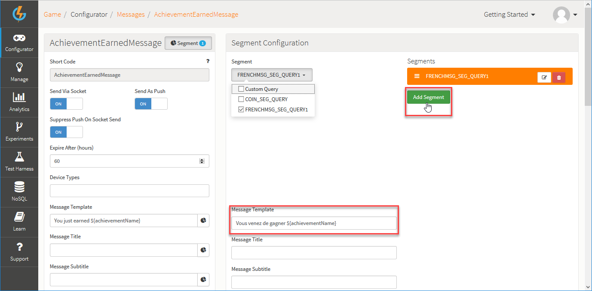

# Messages

The GameSparks platform allows you to send messages to your players.  These can be:
* In-game messages when a player is playing the game.
* Push notifications when they are not playing the game (including email if desired, via an integration with SendGrid).

This section explains how to set up and configure messages for your game.

## Message Configuration

*1.* Navigate to *Configurator > Messages*.

The *Message Configuration* panel contains two tabs:
* Under *Standard Messages*, you'll see all the message types available on the platform.  Many of these standard messages relate to Challenges but other categories of standard message are supported (uploads, achievements, p2p messaging).
  * For each of the Standard Messages, you can read-off the settings for sending the messages via socket, as push, and whether or not to always push.
* Under the *Script Message Extensions* tab, you can exploit full messaging flexibility by creating your own custom messages. (See the next [section](#Script Message Extensions)).

*2.* To configure a standard message type, click the edit  icon for a message. The page adjusts:

In this example, the edit dialog for the *AchievementEarnedMessage* is shown.

*3.* Enter the details for the message on the edit dialog:

* *Send Via Socket* \- Sends the message via the Socket.
* *Send As Push* \- Send the message as a push notification.
* *Suppress Push On Socket Send* \- If message is sent via the Socket, don't send it as Push as well.
  * Any changes you make for a message for these settings will be reflected on the *Standard Messages* tab when you save your changes - you don't have to open edit message again to review these settings.
* *Expire After (Hours)* \- Enter the expiry time in hours for the message. The system will attempt to send the message to recipients for this period. If a player is not connected when the message is issued and they re-connect within the expiry period, they will get the message when they re-connect. If a player does not re-connect within the expiry period, they will not get the message. (In either case, whether a player does or doesn't receive the message, this will be logged by the system.)
* *Device Types* - The supported device types are:
  * *WP8* - Windows Phone 8
  * *W8* - Windows 8
  * *IOS* - Apple
  * *ANDROID* - Google
  * *KINDLE* - Amazon
  * *Viber*

<q>**Viber Integration!** Viber integration is available only on request. Please contact Viber directly requesting GameSparks integration if you are interested.</q>
* *Message Template* \- The message to be sent.
* *Message Title* \- The title of the Message.
* *Message Subtitle* \- The subtitle of the Message.
* *Advanced configuration* \- See Step 4 below.
* *Segment configuration* \- Click the button at the top of the create panel to configure any *Segment* configuration you want to apply to the message. (See [section](#Different Messages for Different Players) below)

*4.* If the standard configuration available for your push notification messages doesn't give you what you want, you can use *Advanced configuration* for 4 supported providers. For each of these, a JSON template editor is provided, for example *iOS for Apple*:

Here are some examples of the formats you can use for these providers:
* *iOS for Apple* \- {"aps":{"badge":1,"alert":"${summary}"}}
* *Kindle for Amazon* \- {"expiresAfter":86400,"data":{"Message":"${Summary}","Title":"${title}", "messageId":"57dbcf149f68b50583cf9ab5","SubTitle":"${subtitle}" ,"MessageCount":21}}
* *Android for Google* \- {"tickerText" : "${summary}" , "subtitle" : "${subtitle}" , "title" : "${title}" , "messageCount" : "1" , "messageId" : "57dbcfbb9f68b50583cf9ab7"}
* *Firebase Cloud Messaging* \- {"notification": {{"Title":"${data.title}","body": "${data.body}"}}}

<q>**Provider Documentation!** Please read the relevant provider-side documentation to ensure the message format you use is valid for the receiving device.</q>

## Script Message Extensions

GameSparks allows you to create custom messages, which you can send from your Cloud Code.

*1.* Select the *Script Message Extensions* tab and click *Add*:

* These Messages are uniquely identified using a *Short Code*.
* The configuration details for a custom message are similar to standard message configuration. (See previous [section](#Message Configuration) )  

## Different Messages for Different Players

You can use segmentation to send players different messages:
* Click *Segment* to open the *Segment Configuration* panel and then click to *Add Segment*. For example, you can create a segment for French players and send these players French language versions of messages:

