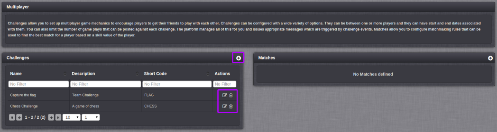
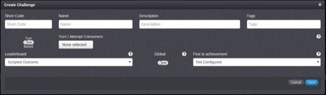

# Challenges

Challenges allow you to set up multiplayer game mechanics to encourage players to get their friends to play with each other. Challenges can be configured with a wide variety of options. They can be between one or more players and they can have start and end dates associated with them. You can also limit the number of game plays that can be posted against each Challenge. The platform manages all of this for you and issues appropriate messages which are triggered by Challenge Events.

## Managing Challenge configurations

The Configurator Multiplayer page displays the list of Challenges and allows you to create new Challenges and edit or delete existing ones.

The icons (highlighted above) give you the following capabilities:

  *  Add a new Challenge.
  *  Edit this Challenge.
  *  Delete this Challenge.

## Creating a new Challenge configuration

To create a new Challenge, click the  icon and you will be presented with the following overlay:

  * *Short Code* \- The Short Code is a mandatory field used to give the Challenge a unique identifier for use elsewhere in the Portal and in Cloud Code.
  * *Name* \- The Name field is a mandatory field used as an identifier to help the user find the challenge in the Portal.
  * *Description* \- The Description is a mandatory field which should be used to describe the challenge.
  * *Tags* \- Tags associated with the Challenge.
  * *Turn Based* \- Use this switch to enable turn based games, Tic-Tac-Toe for example.
  * *Turn/Attempt Consumers* \- If you have set the *Turn Based* switch to true (or create the challenge with a max attempt set), you can have turns/attempts consumed by any event selected in this list.
  * *Leaderboard* \- The outcome of a challenge can be determined by a specially configured Leaderboard or a custom Cloud Code Script. Use this drop down to pick the appropriate option.
  * *Global* \- If this is off, only [LogChallengeEventRequests](/API Documentation/Request API/Multiplayer/LogChallengeEventRequest.md) will affect this challenge.
  * *First to achievement* \- If this field is set, the winner of the Challenge will be the first to reach the selected Achievement. Note that the Achievements available for selection are those that are configured to be triggered by the Leaderboard you have selected for the Challenge.
