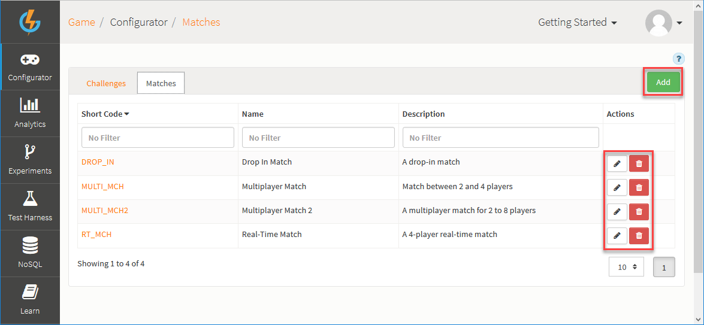
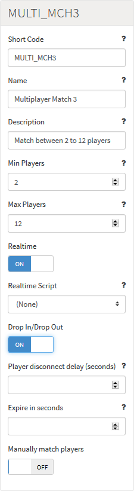
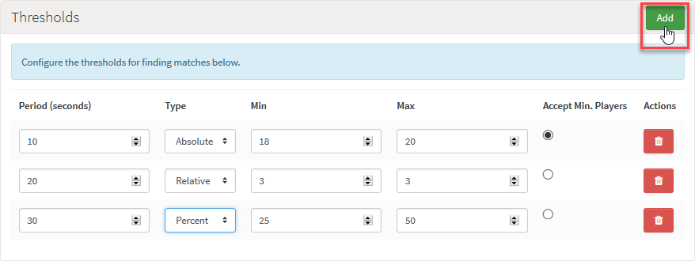

# Matches

Matchmaking allows players to be matched based on common attributes they share within a game. Using entirely customized threshold criteria and time-based rounds of matching, players can be strictly or loosely matched with an unlimited level of precision.

<q>**Tutorial!** You can find a detailed tutorial [here](/Tutorials/Multiplayer/Matching Players.md) where you can also follow examples of how to create match configurations and use them to match players in the Test Harness.</q>

## Managing Match Configurations

The Multiplayer page in the Configurator section of the Portal, displays the list of existing Match configurations and allows you to create new Match configurations and edit or delete existing ones.

  

You can use the following options (highlighted above):

 * *Add* - Add a new Match.
 *  - Edit Match.
 *  - Delete Match.

## Creating a Match Configuration

*1.* Click *Add* to add a new Match. The page adjusts:

    

  * *Short Code* \- The Short Code is a mandatory field used to give the Match a unique identifier for use elsewhere in the Portal, in Cloud Code, and the Test Harness.
  * *Name* \- The Name field is a mandatory field used as an identifier to help the user find the Match in the Portal.
  * *Description* \- The Description is a mandatory field which you can use to describe the Match and explain its purpose.
  * *Min Players* \- The minimum number of players required for a Match to be found. This number will be used to find a Match, only if a Threshold is selected to accept this minimum number of players. Typically, a Match will not be found unless the maximum number of players is found. You can use this option to ensure that a Match is found on the basis of one of the Match Thresholds but for only the minimum number.
  * *Max Players* \- The number of players required for a Match to be found if the minimum number of players is not accepted.
  * *Realtime* \- Select for a Real-Time Match.
  * *Realtime Script* \- For a Real-Time Match, you can select a Realtime script, which will be run on the Real-Time server when the Real-Time session starts. See the Realtime scripts section [here](/Documentation/Configurator/Cloud Code.md).
  * *Drop In/Drop Out* \- Select for a Drop in/Drop out Match. In this type of Match, the player list found for the Match doesn't remain fixed after the Match is made. Players that meet all of the matching criteria can enter or leave the Match. There are two important constraints:
    * The number of players can change but it cannot exceed the set maximum number of players for the Match.
    * If all players drop out, then the Match is deleted.
  <q>**Note:** For the initial step of the Match being made, the normal rules for minimum and maximum number of players are applied, together with any Accept Minimum Players applied to a Match Threshold. After the Match is made and during the Drop In/Drop Out period, although the maximum still cannot be exceeded, the minimum players is *no longer applied*. This allows for new drop ins to occur that will bring the player numbers back up to or above the minimum.</q>
  * For *Drop In/Drop Out* Matches:
    * *Player disconnect delay (seconds)* \- The number of seconds after a Match is found before a player in the Match who disconnects is removed from the Match. If you do not enter a value or enter zero, then a player in the Match who disconnects is removed instantly.
    * *Expire in seconds* \- The number of seconds after a Match is made that players can drop in or drop out. If you do not enter a value or enter zero, the drop in/drop out period for the Match doesn't expire.
  * *Manually match players* \- For custom completion of the matching process. Select this if you do not want the Match to complete automatically when all matching criteria have been met, but want to use your own custom mechanism to complete the Match. The platform will find players that meet the matching criteria for you, but you control the choice of which players are put in the Match.

*2.* Click to *Add* the *Thresholds* you want for your Match:

*3.* Enter details for each Threshold:
* *Period (seconds)* \- The period of time that a Threshold should look for a Match based on those criteria.
* *Type* \- The type of range calculation to use when looking for a Match.  This can be *Absolute*, *Relative*, or *Percent*.
* *Min/Max* \- The minimum and maximum values used for the type of range calculation used in the Threshold.
* *Accept Min. Players* \- Select this option for a Threshold, if you want a Match to be made on the basis of the Threshold for the minimum number of players and not have to wait until the maximum number of players are found that fall within the Threshold range.

  <q>**At Least One!** You must add at least one Threshold to a Match. If you do not have at least one Threshold in the Match, when you try to matchmake from the client you will get an error.</q>
