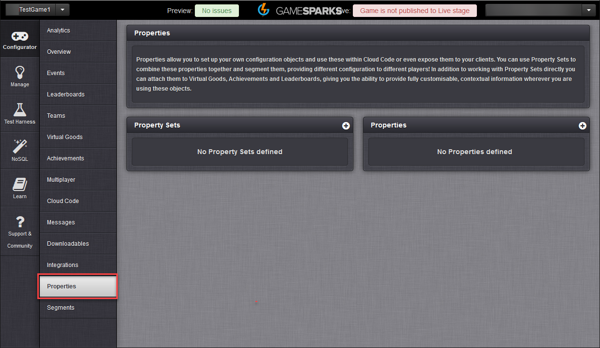
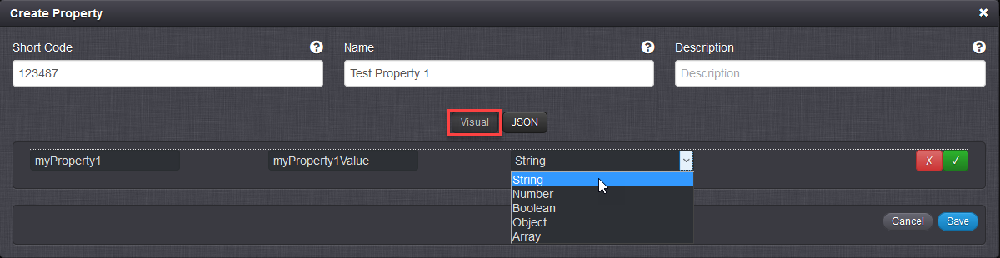
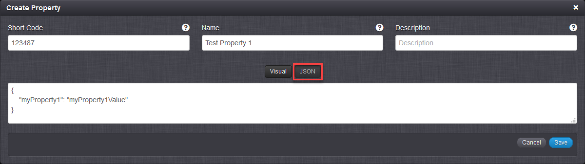
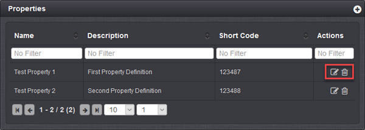
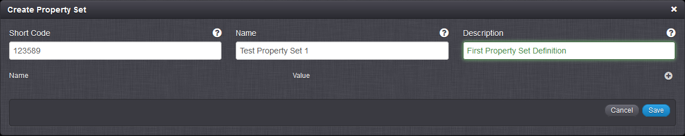
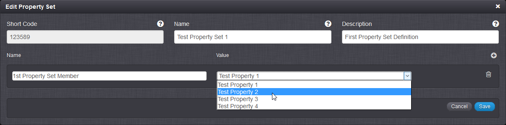

# Properties

## What are Properties?

GameSparks Properties give you a mechanism for customizing your player experience without being restricted to platform capabilities. Using Properties, you can store your own JSON configuration on the portal and attach this to GameSparks objects, such as Virtual Goods, Achievements, and Leaderboards. Secondly, you can access Properties directly through Cloud Code and assign Property Sets to players through Cloud Code.

When you create a Property, you create an arbitrary data set which you can then exploit for custom game configuration.

## What are Property Sets?

Property Sets allow you to group your Properties together. You can then segment your Property Sets and introduce an extra dimension to your Properties configuration. By segmenting Property Sets, you can ensure that different sets of Properties control game behavior for different player groups.

<q>**Tutorial!** Check out our [Segmented Properties](/Tutorials/Analytics, Segmentation and Game Management/Working with Segmented Properties.md) tutorial for details on how to create and work with Properties and Property Sets and how to add segmented values for Properties.</q>

## Creating and Managing Properties

Use the Properties page to create and manage your Properties and Property Sets:

Click the  icon to create a new Property. The default editing environment is *Visual*, where you can enter fields and select the required data-type:

Alternatively, you can switch to the *JSON* editor, where you can manually enter your JSON configuration structure with real-time validation on your input:

If you want to edit or delete a Property, click the  icon or  icon respectively:

## Creating and Managing Property Sets

Click the  icon for Property Sets to create a new Property Set:

In the Property Sets panel, you can click the  icon to add Properties to your Property Set. Give a name to the Property Set member and select from existing Properties for the value:

To delete a Property Set member, click the  icon to open Edit Property Set and click the  icon against the unwanted Property.
