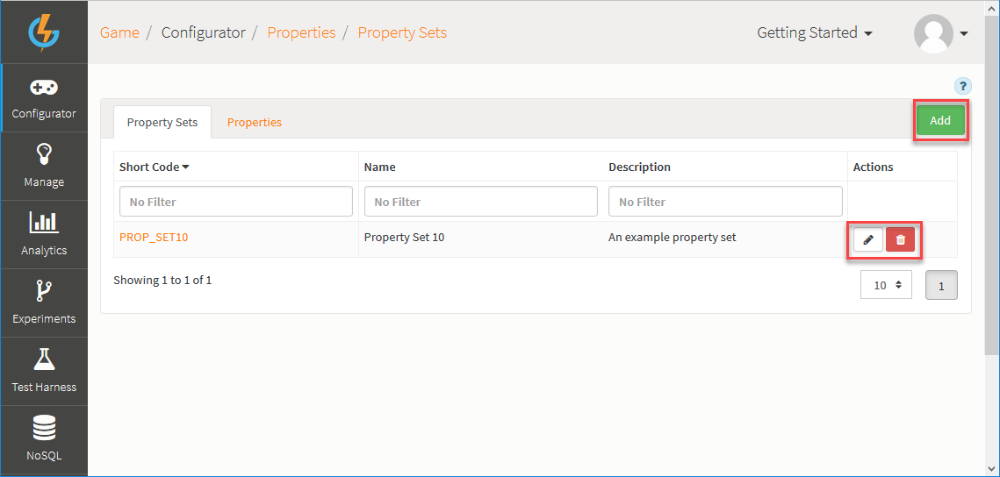
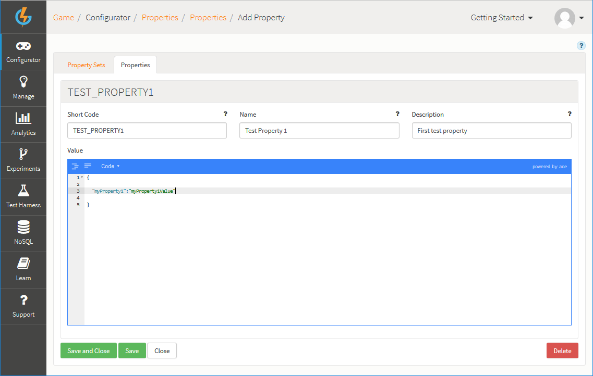
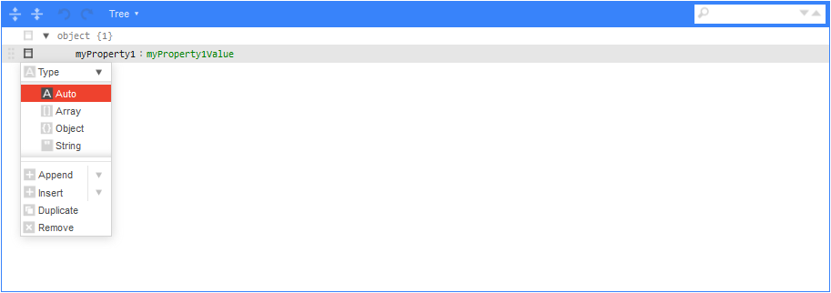
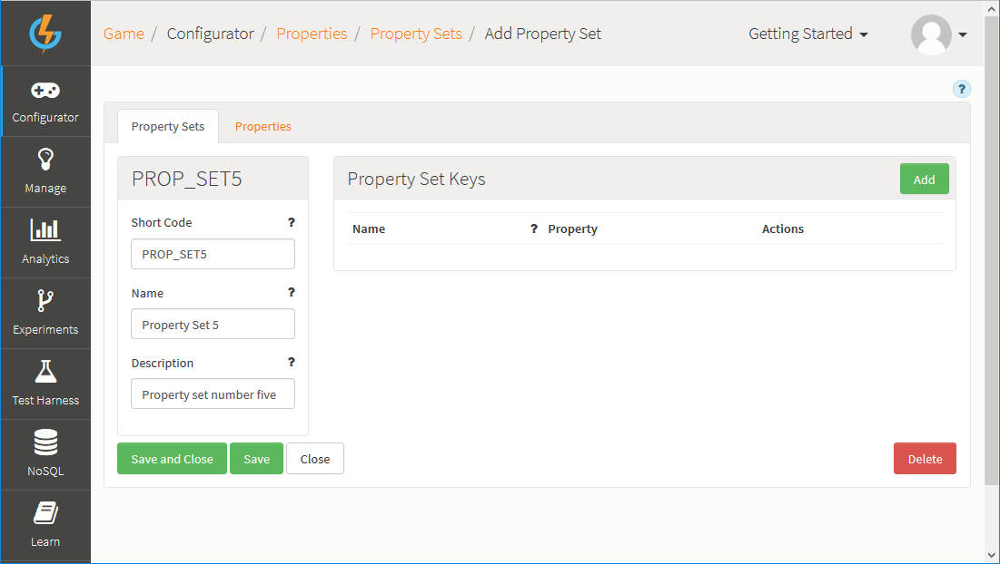
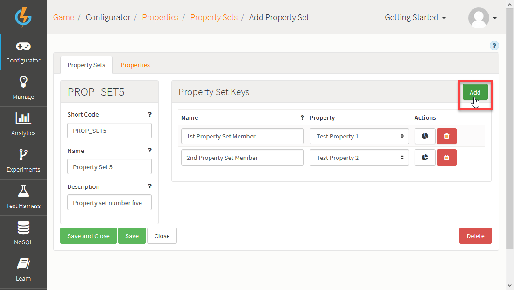

# Properties

## What are Properties?

GameSparks Properties give you a mechanism for customizing your player experience without being restricted to platform capabilities. Using Properties, you can store your own JSON configuration on the portal and attach this to GameSparks objects, such as Virtual Goods, Achievements, and Leaderboards. Secondly, you can access Properties directly through Cloud Code and assign Property Sets to players through Cloud Code.

When you create a Property, you create an arbitrary data set which you can then exploit for custom game configuration.

## What are Property Sets?

Property Sets allow you to group your Properties together. You can then segment your Property Sets and introduce an extra dimension to your Properties configuration. By segmenting Property Sets, you can ensure that different sets of Properties control game behavior for different player groups.

<q>**Tutorial!** Check out our [Segmented Properties](/Tutorials/Analytics, Segmentation and Game Management/Working with Segmented Properties.md) tutorial for details on how to create and work with Properties and Property Sets and how to add segmented values for Properties.</q>

## Managing Properties and Property Sets

Use the Properties page to create and manage your Properties and Property Sets:

The page opens with the *Property Sets* tab selected and you can use the following options (highlighted above):

 * *Add* - Add a new Property Set.
 *  - Edit Property Set.
 *  - Delete Property Set.

Select the *Properties* tab where you can use the same options to manage your Properties.

## Creating Properties

*1.* Select the *Properties* tab and click *Add*. The page adjusts:

*2.* Enter the details of the Property:
* *Short Code* - A mandatory field which is a unique identifier of the Property for use elsewhere in the Portal and in Cloud Code.
* *Name* - A mandatory field used to help identify the Property.
* *Description* - A mandatory field which should be used to describe the Property and explain its purpose.
* *Value* - Enter the value you want for your Property JSON configuration in the editor.
  * The default editing environment is *Code*, where you can manually enter your JSON configuration structure.
  * Alternatively, you can switch to the *Tree* editing environment, where you can enter fields and select the required data-type:

*3.* Click to *Save and Close* the new Property.

## Creating Property Sets and Adding Properties

*1.* Select the *Property Sets* tab and click *Add*. The page adjusts:

*2.* Enter the details of the Property Set:
* *Short Code* - A mandatory field which is a unique identifier of the Property Set for use elsewhere in the Portal and in Cloud Code.
* *Name* - A mandatory field used to help identify the Property Set.
* *Description* - A mandatory field which should be used to describe the Property Set and explain its purpose.

You can now add *Property Set Keys* to your Property Set and map these to Properties.

*3.* On the *Property Set Keys* panel, click *Add*:

In this example, two Keys have been added and mapped to Properties.

*4.* Click to *Save and Close* the new Property Set.
