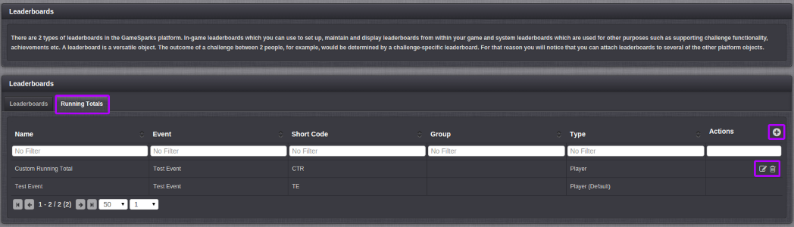
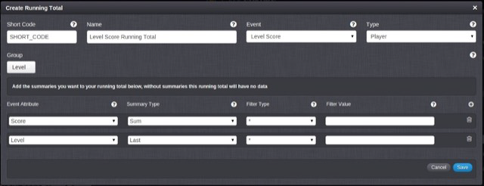
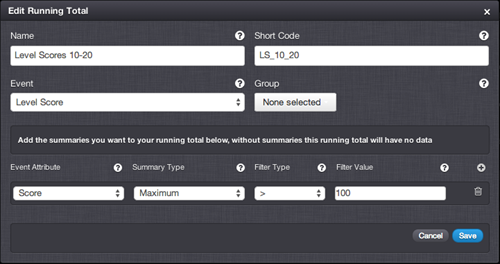
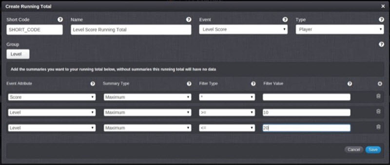

# Running Totals

You can use *Running Totals* to process events using the GameSparks scoring and ranking systems:
* **Simple Leaderboards.** You *don't need* to configure a specific Running Total when you are creating simple Leaderboards, because the Default Calc on the Event screen will have auto-created your Running Total.
* **Advanced Leaderboards.** For more advanced scenarios - such as a Leaderboard for "Most Improved Player in Last [x] Weeks" - you'll need to add and set up a new custom Running Totals configuration.

## Managing Running Total Configurations

The Running Totals tab on the Configurator Leaderboards page displays the list of Running Totals and allows you to create new Running Totals and edit or delete (non-system type) existing ones.

When a player posts an Event to the platform, all Running Totals associated with the Event are processed. An important concept is that of a *Group* attribute.

  * Running Totals without a Group attribute maintain a single record for each player that has submitted an Event that matches the criteria specified. This record can then be used within a Leaderboard to create various types of Leaderboards.
  * When a Running Total has a Group attribute(s) set there is a record maintained for a group of attributes by user.

## Creating a New Running Totals

Press the  icon to create a new Running Total. The Edit/Create screen has the following fields.

  * *Short Code* - Enter a Short Code of the Running Total, which is used by the API to allow you to identify which Running Total you want to call.
  * *Name* - Enter the name of the Running Total, which is used to allow you to identify it in the portal if you have more than one Running Total.
  * *Event* - Select the Event this Running Total will process.
  * *Type* - Select the Type of Running Total (Player, Team).
  * *Group* - Select which attributes from the Event should be used for grouping.

### Adding Summary fields

To add summary fields to your Running Total, click on the plus icon. Each running total summary has the following fields:
  * *Event Attribute* - Enter the name of the Summary, which is used to allow you to identify the item in the portal if you have a number of Summaries.
  * *Summary Type:*
    * *Maximum* - The Running Total will be created to track the maximum value posted.
    * *Minimum* - The Running Total will be created to track the minimum value posted.
    * *Sum* - The Running Total will be created to add all the values posted together.
    * *Count* - The Running Total will be created to count the number of times the player has called the Event.
    * *Last* - The Running Total will be created to track the last value posted.
    * *Supplemental* \- A running total will be created with no value calculated. You can use this when you want to store some extra information within the game context but do not want this to affect on the Leaderboard ranking. (For example, in a racing game you can keep note of weather conditions on the track as well as player lap times but changing weather conditions do not affect the player's Leaderboard ranking.)
  * *Filter Type & Filter Value* - Allows you to control an optional filter for values tracked (<, >, * , and so on). Events posted that do not match the filter are ignored.

### Filter Examples

Here are some useful examples of using filters.

Example 1: *Only process scores over 100*

Example 2: *Only include scores from levels 10 - 20.*

