# Segments

## What are Segments?

Segments allow you to create partitions for different users and apply various rules to different areas of the platform. Segments offer you an extra dimension of flexibility for customizing player experience and behavior.

## Segmentation Use Cases

Here's two use cases where Segmentation comes in very useful:

*1.* Let's suppose I have an international blockbuster game with players connecting from different parts of the World. In order to offer a more personalized experience for my players, I might want to segment players by region or country. I can create a Segment based on country, with Segment Values of the countries my players are situated in. When added to such a Segment, the players will receive a different experience. For example, each Segment Value (country in this case) could have its own values assigned for:
* Virtual Goods.
* The awards players receive upon obtaining an Achievement.
* The rates of 6 currencies that spread across their game.

*2.* What about language? A much simpler and customizable method than Geo Locations would be to introduce a language Segment. Based on the user's Segment Values for a language Segment, users could receive messages for new high scores, challenges, and team invitations all in their respective native languages, as well as customizing the name and descriptions of Leaderboards, Challenges, Achievements, and so on.

## Managing Segment Configurations

To create and edit Segments, go to *Configurator > Segments* and select the *Segments* tab. Existing Segments are listed:

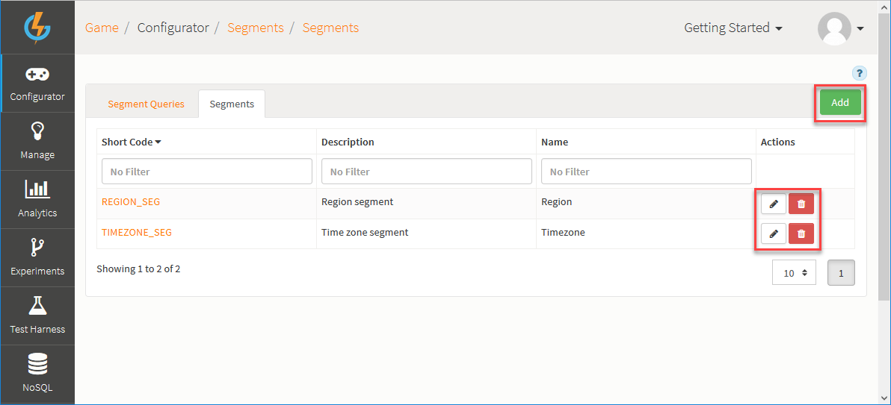

You can use the following options (highlighted above):

 * *Add* - Add a new Segment.
 *  - Edit Segment.
 *  - Delete Segment.

## Creating a Segment and Adding Segment Values

You can add multiple Segments and for each Segment you can define multiple values.

*1.* On the *Segments* tab, click *Add*. The page adjusts:

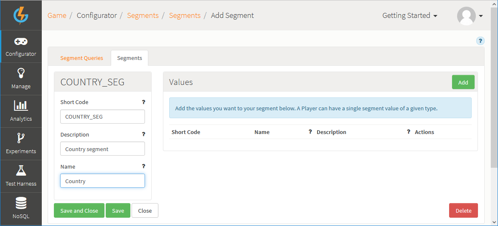

*2.* Enter the details of the new Segment:
* *Short Code* \- A mandatory field used to give the Segment a unique identifier for use elsewhere in the Portal and in Cloud Code.
* *Name* \- A mandatory field used as an identifier to help find the Segment in the Portal.
* *Description* \- A mandatory field which should be used to describe the Segment and explain its purpose.

*3.* To add values to the Segment, under *Values* click *Add*.

*4.* Enter a *Short Code*, *Name*, and *Description* for each Segment Value that you add:

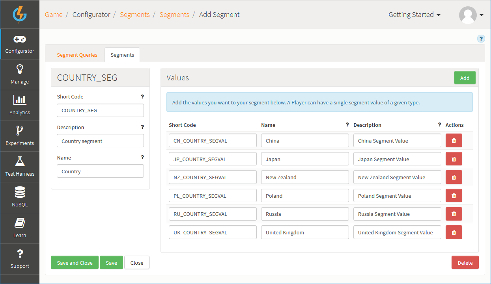

In this example, we've added 6 Values for our *Country* Segment:
* We can now assign different Segment/Value pairs to the players of our game and, on the basis of these assignments, differentiate player experience.

## Building Segment Queries

You can build *Segment Queries* to define rules which determine which player's are subjected to a specific segmentation of a configuration object in your game:
* For example, you might segment a Virtual Good into three segments and set different currency values for the Virtual Good for each segment. You can then use Segment Queries to determine which players experience which of the three alternative Virtual Good costs, depending on the Segment/Value pair a player has been assigned to.

### Setting Segment Query Filters

When you create the Segment Queries you want to use for segmenting your game's configuration objects, you can first select just those filters you want to use for building queries:

*1.* Go to *Configurator>Segments* and select the *Segments Queries* tab.

*2.* Click *Segment Query Filters*:

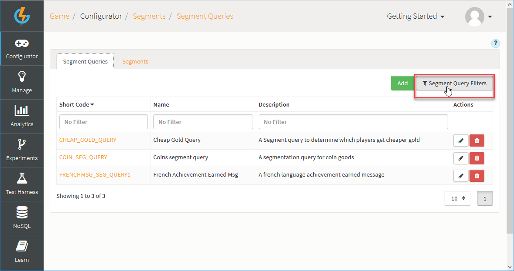

The *Segment Query Filters* panel appears:

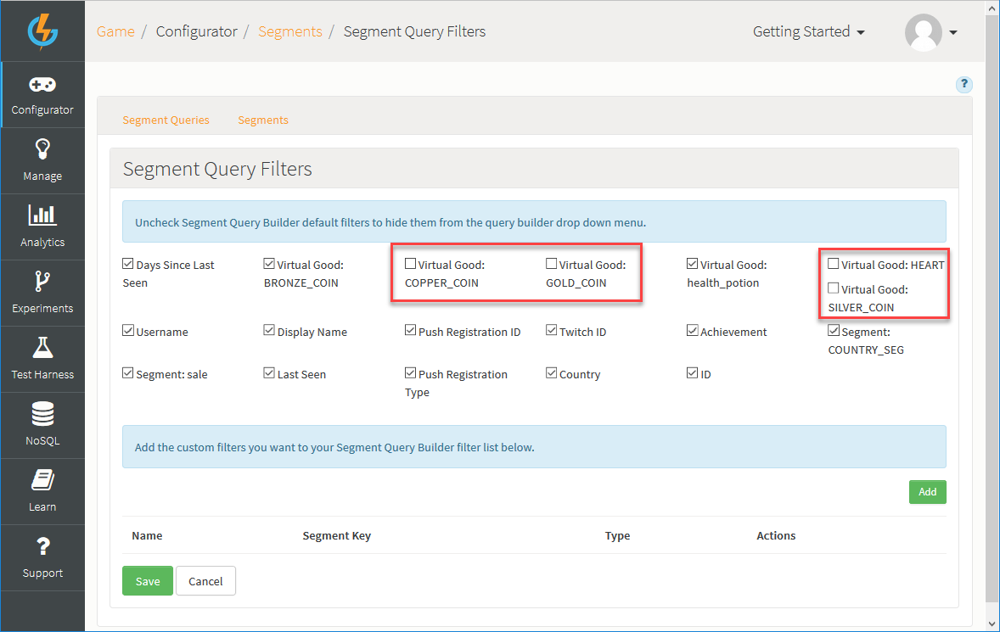

*3.* Select the *Segment Query Filters* you want to use when building your Segment Queries:
* The filters available will depend on your game's set up and the configuration objects created for your game. By default all are selected.
* Uncheck any filters you don't want to use when building your Segment Queries.
* In the current example, we've unchecked 4 Virtual Goods filters.

*4.* If you want to add custom filters for building your Segment Queries, click *Add*:
* Custom Query Filters allow you to build queries against custom data in your game. For example, if your game is a card game and each card has an *attack* variable with a strength (say 1 to 10) defined, you can add that variable as custom query filter:

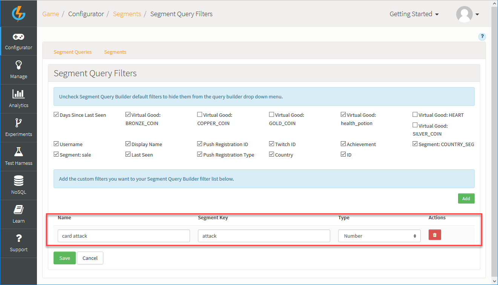

*5.* Click to *Save* your *Segment Query Filters* selection.

### Adding Segment Queries

When you've selected Segment Query Filters, you can start to build Segment Queries.

Here, we'll build two Segment Queries that we'll use [below](#Segmenting Configuration across the Portal) to segment an Achievement:

*1.* Go to *Configurator>Segments* and select the *Segment Queries* tab.

*2.* Click to *Add* a new query.

*3.* Enter the details of the new Segment Query:
* *Short Code* \- A mandatory field used to give the Segment Query a unique identifier for use elsewhere in the Portal and in Cloud Code.
* *Name* \- A mandatory field used as an identifier to help find the Segment Query in the Portal.
* *Description* \- A mandatory field which should be used to describe the Segment Query and explain its purpose.

*4.* Use the drop-downs to build the query you want:
* This can be a complex multi-group/multi-rule query using the *Add Group* and *Add Rule* buttons on the builder.
* For the current example, we've set up a single-rule query:

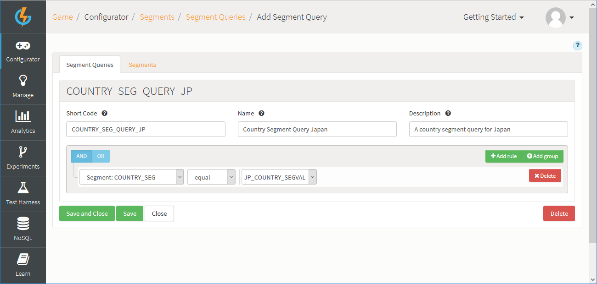
* Here we've used the *Country* Segment to create a Segment Query - only players assigned the Segment/Value pairing *COUNTRY_SEG/JP_COUNTRY_SEGVAL* will be subject to the alternative values of a configuration object that we segment using this query.

*5.* Click to *Save and Close* the new Segment Query.

*6.* Repeat the above steps to create a second Segment Query:


* Here we've used the *Country* segment to create a Segment Query - only those players assigned the Segment/Value pairing *COUNTRY_SEG/PL_COUNTRY_SEGVAL* will be subject to the alternative values of a configuration object that we segment using this query.

*7.* Click to *Save and Close* this second new Segment Query:

* We now have two Segment Queries we can use when we segment configuration objects in our game and impose different experiences on players assigned different Segment/Value pairs.
* Before we set about segmenting our game's configuration objects, we'll use Cloud Code to assign Segment/Value pairs to our players.

## Assigning Segments Values to Players Using Cloud Code

You can assign Segment Values to your players using [Cloud Code](/Documentation/Configurator/Cloud Code.md):
* For any Segment with multiple Values, you can assign a single Segment Value to a player as a Segment/Value pair.

Here's an example of how to do this by attaching Cloud Code to AuthenticationResponse. We assign a Country Segment/Value pair to each player when they Authenticate on the portal:

```
if(Spark.getPlayer() !== null){
   var request = new SparkRequests.AccountDetailsRequest().Send().location.country;
   switch (request){
       case "CN":
           Spark.getPlayer().setSegmentValue("COUNTRY_SEG", "CN_COUNTRY_SEGVAL")
        break;
        case "JP":
           Spark.getPlayer().setSegmentValue("COUNTRY_SEG", "JP_COUNTRY_SEGVAL")
        break;
        case "NZ":
           Spark.getPlayer().setSegmentValue("COUNTRY_SEG", "NZ_COUNTRY_SEGVAL")
        break;
        case "PL":
           Spark.getPlayer().setSegmentValue("COUNTRY_SEG", "PL_COUNTRY_SEGVAL")
        break;
        case "RU":
           Spark.getPlayer().setSegmentValue("COUNTRY_SEG", "RU_COUNTRY_SEGVAL")
        break;
        case "GB":
           Spark.getPlayer().setSegmentValue("COUNTRY_SEG", "UK_COUNTRY_SEGVAL")
        break;
   }

}

```

* Here's the same Cloud Code attached to the AuthenticationResponse in the Cloud Code editor:

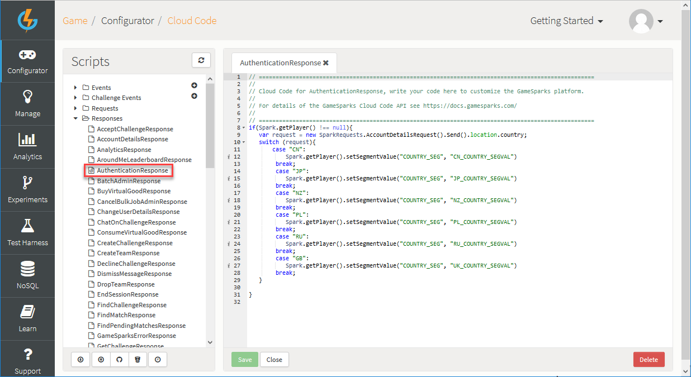

When users authenticate, this code will ensure that they are assigned the appropriate Segment/Value pair based on their geographical location.

### Checking Segment Assignment

You can quickly check that the Cloud Code you use to assign Segment/Value pairs to your players is working:

*1.* Go to the [Test Harness](/Documentation/Test Harness/README.md) and submit an [AuthenticationRequest](/API Documentation/Request API/Authentication/AuthenticationRequest.md).

*2.* Go to [NoSQL Explorer](/Documentation/NoSQL Explorer.md) and under *System* open the *player* Collection.

*3.* Submit a query to *Find* the player you've just authenticated on the platform in the Test Harness.

*4.* Open the player details in the *Output* panel. You'll see the Segment/Value pair under *segments*:

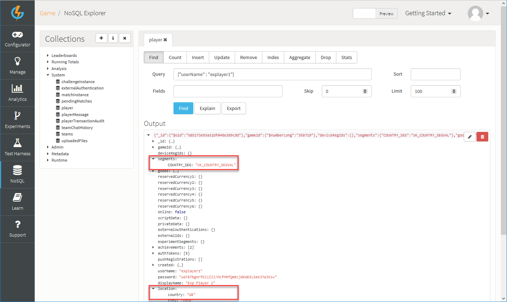

## Segmenting Configuration across the Portal

Within the portal, you can segment your configuration to set different parameters for different Segments. For example, you can have:
* A different price for a virtual good for a particular Segment.
* A different virtual good award and currency reward for an Achievement depending on the player's country Segment.

Here, we'll segment an Achievement using the two Segment Queries we built [above](#Adding Segment Queries).

*1.* Go to *Configurator>Achievement*.

*2.* Click to edit an Achievement you want to segment.

*3.* Click *Segment*. The *Segment Configuration* panel opens:

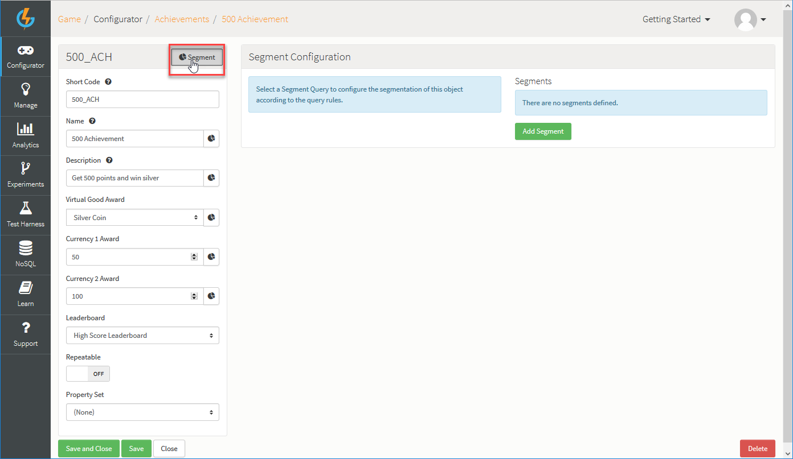

*4.* Click *Add Segment*.

*5.* Enter the alternative values you want to use for the segmentable Achievement fields and which will be applied to players put into this Segment.

*7.* Use the drop-down to select the *Segment Query* you want to use to determine which players are put into this segment of the Achievement:

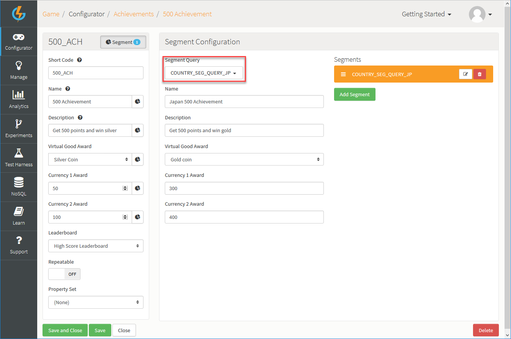
* Here we've selected the *COUNTRY_SEG_QUERY_JP*. This means that any players assigned the Segment/Value pair: *COUNTRY_SEG/JP_COUNTRY_SEGVAL*, will be subject to the alternative values for this Achievement segment.  

*8.* Click *Add Segment* again and add a second segment for the Achievement:  

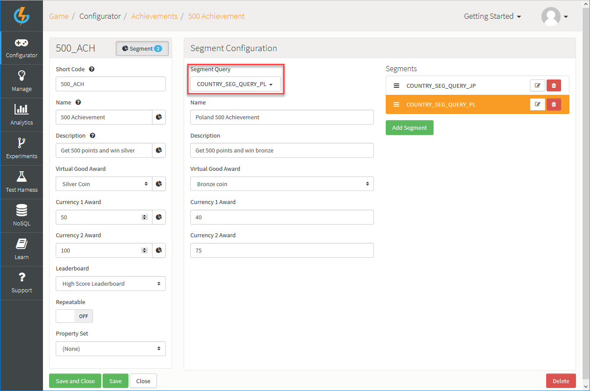
* Here we've selected the *COUNTRY_SEG_QUERY_PL*. This means that any players assigned the Segment/Value pair: *COUNTRY_SEG/PL_COUNTRY_SEGVAL*, will be subject to the alternative values for this Achievement segment.

*9.* Click to *Save and Close* the Achievement segmentation.

### Ordering Segment Configuration

Segmented values within the portal can be ordered - simply click and hold on the *Reorder* icon and drag-and-drop a Segment to where you want it:

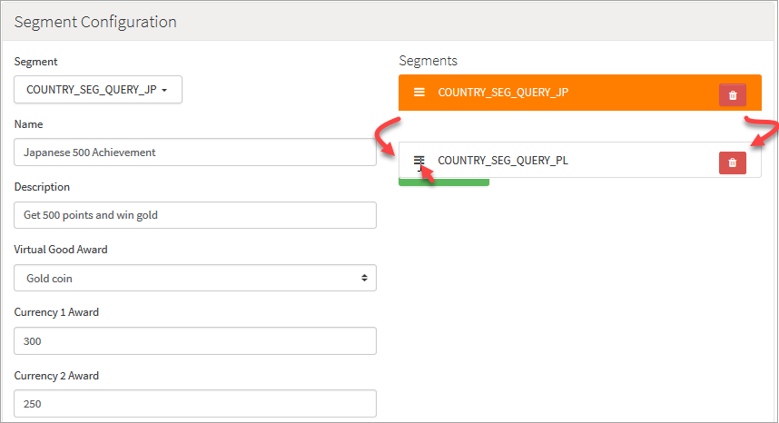

## Social Integration with Segments

One of the most powerful features of Segmentation is that it allows for different segment types to be socially connected to different games or apps. For example, players of different nationalities or language preferences could have segments which would socially connect them to a different version of a developer's app or game on Facebook or Twitter:

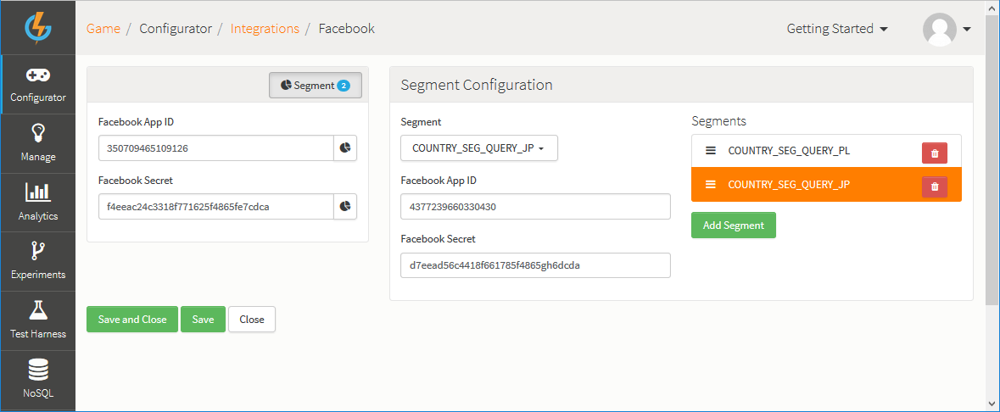
