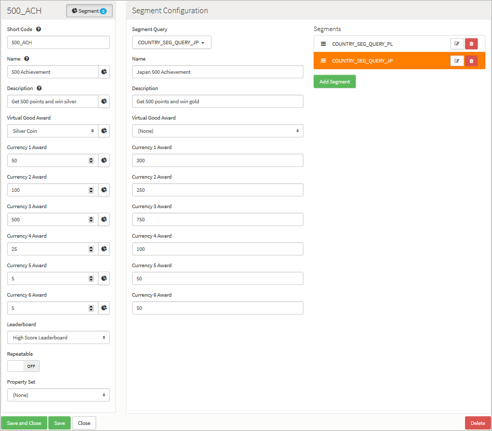

# Segments

## What are Segments?

Segments allow you to create partitions for different users and apply various rules to different areas of the platform. Segments offer you an extra dimension of flexibility for customizing player experience and behavior.

## Examples

Here's two example use cases where Segmentation comes in very useful:

*1.* Let's suppose I have an international blockbuster game with players connecting from different parts of the World. In order to offer a more personalized experience for my players, I might want to segment players by region or country. I can create a Segment based on country, with Segment Values of the countries my players are situated in. When added to such a Segment, the players will receive a different experience. For example, each Segment Value (country in this case) could have assign values for:
* Virtual Goods.
* The awards players receive upon obtaining an Achievement.
* The rates of 6 currencies that spread across their game.

*2.* What about language? A much simpler and customizable method than Geo Locations would be to introduce a language Segment. Based on the user's Segment Values for a language Segment, users could receive messages for new high scores, challenges, and team invitations all in their respective native languages, as well as customizing the name and descriptions of Leaderboards, Challenges, Achievements, and so on.

## Managing Segment Configurations

To create and edit Segments, go to *Configurator > Segments* and select the *Segments* tab. Existing Segments are listed:

You can use the following options (highlighted above):

 * *Add* - Add a new Segment.
 *  - Edit Segment.
 *  - Delete Segment.

## Creating a Segment and Adding Segment Values

You can create and assign multiple segments, each with their own set of values.

*1.* On the *Segments* tab, click *Add*. The page adjusts:

*2.* Enter the details of the new Segment:
* *Short Code* \- A mandatory field used to give the Segment a unique identifier for use elsewhere in the Portal and in Cloud Code.
* *Name* \- A mandatory field used as an identifier to help find the Segment in the Portal.
* *Description* \- A mandatory field which should be used to describe the Segment and explain its purpose.

*3.* To add values to the Segment, under *Values* click *Add*.

*4.* Enter a *Short Code*, *Name*, and *Description* for each Segment value that you add:

In this example, we've added 6 Values to our *Country* Segment.

## Setting Segments Using Cloud Code

Not all Segments have to be set through the Configurator. Segments and their Values can be set on-the-fly using [Cloud Code](/Documentation/Configurator/Cloud Code.md). For any Segment type, a player can have a single Value set, and you can set (or unset) these Values via Cloud Code using _SparkPlayer.setSegmentValue(TYPE, VALUE)_ or find the current Value of a Segment they have, using _myPlayer.getSegmentValue("TYPE")_.

## Segmenting Configuration across the Portal

Within the portal, you can segment your configuration to set different parameters for different Segments. For example, you can have:
* A different price for a virtual good for a particular Segment.
* A different virtual good award and currency reward for an Achievement depending on the player's country Segment:

In this example, we've added Segment configuration to an Achievement to award different Virtual Goods to players in Poland or Japan:
* Here we can see that the currency amounts awarded for the *500 Achievement* for Japanese players are higher than the amounts awarded under the base configuration for the Achievement.

### Ordering Segment Configuration

Segmented values within the portal can be ordered, where the order is used to find the most appropriate value for the current player. Simply click and hold on the *Reorder* icon and drag-and-drop a Segment to where you want it:

## Social Integration with Segments

One of the most powerful features of Segmentation is that it allows for different segment types to be socially connected to different games or apps. For example, players of different nationalities or language preferences could have segments which would socially connect them to a different version of a developer's app or game on Facebook or Twitter:

