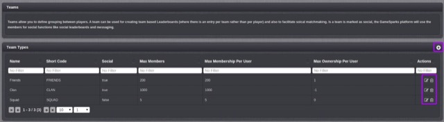
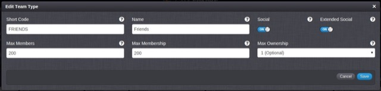

# Teams

The Teams functionality on the GameSparks platform allows you to define different types of grouping between players:
* **Team Types.** You can have a number of different team types with different rules and these rules are respected when using the team-based API Methods. Once you have team types in place, you can use them for all social requests as well as for team-based Leaderboards (where there is an entry for each team, rather than an entry for each player).
* **Team Achievements.** A team can earn achievements in the same way that a player can. When a team earns an achievement, each team member without the achievement is given the award defined against it.

### Managing your Team Types

The Teams page shows you the list of teams you have configured in the platform, adding a new team follows the same pattern as the rest of the platform.

  *  will open the team configuration creation form.
  *  will open the team configuration editor.
  *  will delete the team configuration.

The options available on the form are:

  * *Short Code* \- The shortCode for the team, to be use by API methods.
  * *Name* \- The name of the team (Used within the portal only for identification).
  * *Social* \- The members of this team will be regarded as friends of the friends of the owner.
  * *Extended Social* \- The members of this team will be regarded as friends with each other.
  * *Max Members* \- The maximum number of players that can be in this team.
  * *Max Membership  Per User* \- The maximum number of this team type a player can be in (Set to 0 for unbounded).
  * *Max Ownership  Per User* \- The maximum number of this team type a player can own (Set to 0 for unbounded).
