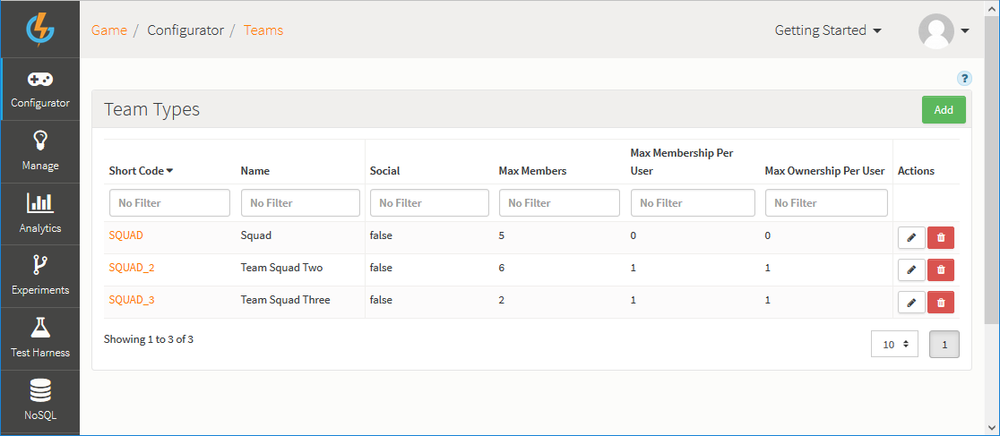

# Teams

The Teams functionality on the GameSparks platform allows you to define different types of grouping between players:
* **Teams.** You can have a number of different Teams with different rules and these rules are respected when using the team-based API Methods. Once you have Teams in place, you can use them for all social requests as well as for team-based Leaderboards (where there is an entry for each Team, rather than an entry for each player).
* **Team Achievements.** A Team can earn achievements in the same way that a player can. When a Team earns an achievement, each Team member without the achievement is given the award defined against it.

## Managing your Teams

The Teams page shows you the list of teams you have configured in the platform. You can use the following options (highlighted above):

  * *Add* - Add a new Team.
  *  - Edit Team.
  *  - Delete Team.

## Creating a Team

Click to *Add* a new Team. The page adjusts:

Enter the details for your new team:

  * *Short Code* \- Short Code for the Team, to be use by API methods. Short Codes are always unique.
  * *Name* \- Name of the Team (Used within the portal only for identification).
  * *Social* \- Team members will be regarded as friends of the friends of the owner.
  * *Extended Social* \- Team members will be regarded as friends with each other.
  * *Max Members* \- Maximum number of players that can be in this Team.
  * *Max Membership Per User* \- Maximum number of this team type a player can be in (Set to 0 for unbounded).
  * *Max Ownership Per User* \- The maximum number of this team type a player can own (Set to 0 for unbounded).
