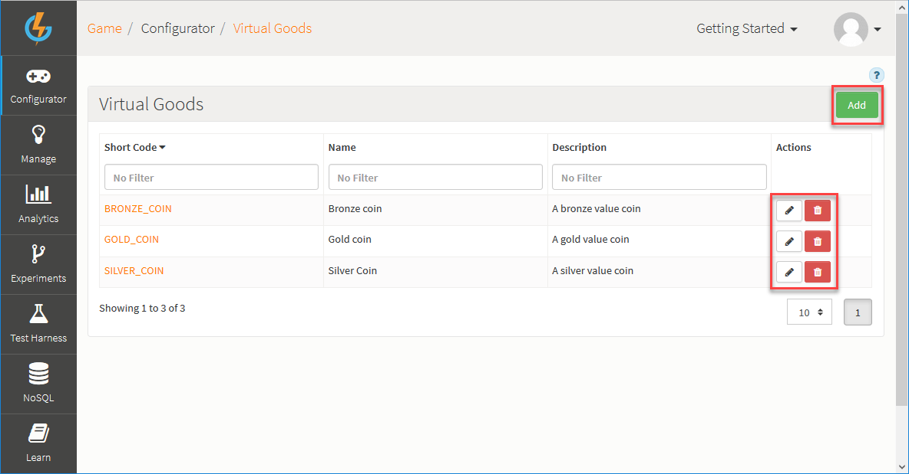
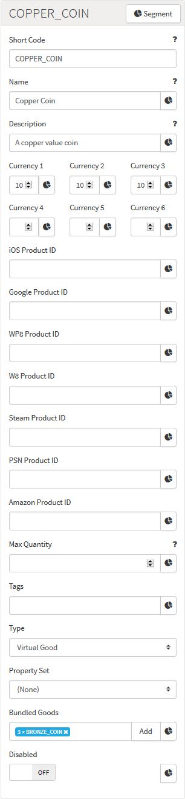
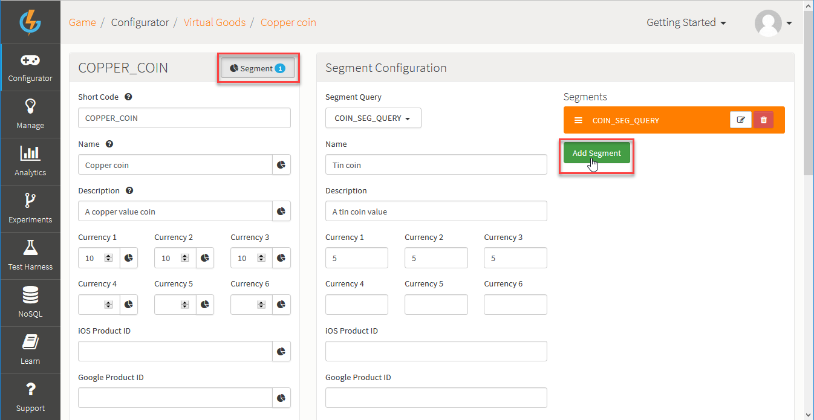

# Virtual Goods

In the GameSparks platform, a Virtual Good is any in-game asset that can be awarded, accumulated, or bought. This would cover XP points and in-game currencies, as well as specific goods that deliver benefits in-game (convenience, customization, competitive advantage, and so on). Virtual Goods:
* Can be used and consumed cross-platform.
* Can be set up to be bought as in-app purchases (IAPs) - you associate the Virtual Goods with the Product IDs of the corresponding items on the stores and when a good is purchased, the store receipts are reconciled with the items.
* Can be traded or converted - you can establish relationships between Virtual Goods to facilitate this.

## Managing Virtual Goods Configurations

The *Configurator > Virtual Goods* page displays the list of Virtual Goods and allows you to create new Virtual Goods and edit or delete existing ones:

You can use the following options (highlighted above):

 * *Add* - Add a new Virtual Good.
 *  - Edit Virtual Good.
 *  - Delete Virtual Good.

## Creating a Virtual Good Configuration

Click to *Add* a new Virtual Good. The page adjusts:

  * *Short Code* \- A mandatory field used to give the Virtual Good a unique identifier for use elsewhere in the Portal and in Cloud Code.
  * *Name* \- A mandatory field used as an identifier to help you find the Virtual Good in the Portal.
  * *Description* \- A mandatory field, which you can use to describe the Virtual Good.
  * *Currencies* \- The amount of each currency needed to buy the Virtual Good. In the above example, the Virtual Good will cost players 10 in any of Currencies 1, 2, or 3.
  * *Product IDs* \- The ID of the item that has been created in the appropriate store.
  * *Max Quantity* \- The maximum quantity of this Virtual Good that the player can own at any one time. Only enforced on [BuyVirtualGoodsRequest](/API Documentation/Request API/Store/BuyVirtualGoodsRequest.md) using virtual currency. Purchases from external stores will still be awarded even if they result in this maximum being exceeded.
  * *Tags* \- Tags associated with the Virtual Good.
  * *Type* \- Specify the type: Is this a Virtual Good or a Currency Pack?
    * You would typically select Currency Pack as the Virtual Goods type when you want to award a Currency Pack as a reward for an achievement in a game. Any player awarded the Currency Pack will then be *granted* each of the currency amounts entered for the Currency 1-6 fields.
  * *Property Set* - Select the [Property Set](/Documentation/Configurator/Properties.md) to which you want the Virtual Good to belong.
  * *Bundled Goods* - Select any other Virtual Good which you want to bundle in with the Virtual Good you are configuring. This means that the bundled goods will also be awarded whenever the Virtual Good is awarded. For example, you might want 3 Bronze coins to be awarded to any player that is awarded a Copper coin.
  * *Disabled* - Switch to disable the Virtual Good. When disabled, a Virtual Good cannot be bought:
    * [BuyVirtualGoodsRequest](/API Documentation/Request API/Store/BuyVirtualGoodsRequest.md) is *not available*.
    * [ListVirtualGoodsRequest](/API Documentation/Request API/Store/ListVirtualGoodsRequest.md) returns *a null*.

## Virtual Good Segment Configuration

Click *Segment* to apply a segmentation query to the Virtual Good. This means that if the segmentation query applies to a player, that player receives the values you configure here - currencies and Product IDs - instead of the values you have set in the main Virtual Good configuration:

In this example, any player to which *COIN_SEG_QUERY* applies receives a *Tin coin* - valued at 5 for Currencies 1, 2, and 3 - instead of a *Copper coin* - valued at 10 for Currencies 1, 2, and 3.

<q>**Note:** You can *disable* the Segment Configuration even if you have *not disabled* the Virtual Good. This means that any players to which the query applies will not be able to buy the Virtual Good.</q>
