# Experiments

You can create *Experiments* to test certain configuration changes on a selective range of Players within your game. For example, you could experiment with the costs of Virtual Goods for a small range of Players on your game for a specified period of time. You might increase or decrease the costs of some Virtual Goods to see how Players would respond to these different degrees of cost change. By reviewing the outcome of such experimental adjustments in Virtual Goods costs, you will be very well-placed to fine-tune your game configuration to make Players more responsive to and more engaged with your game.

## Creating Experiments

*1.* To create an Experiment, click *Experiments* in the main navigation bar. The *Experiments* page opens:

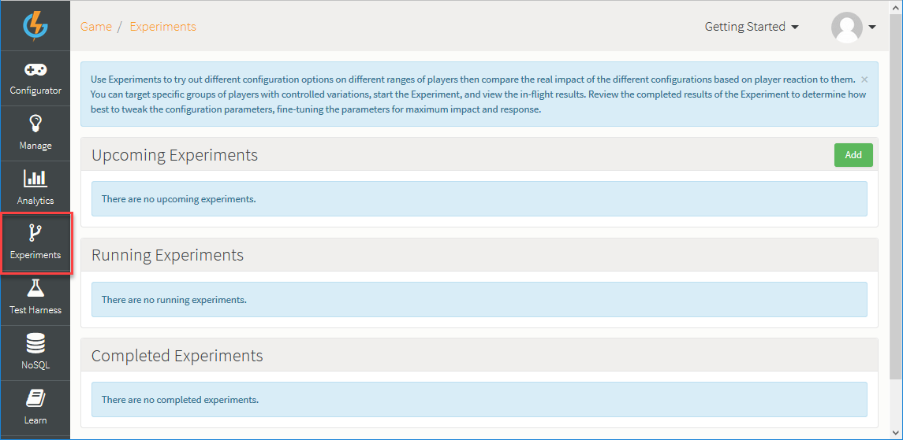

From here you can create and manage your Experiments:
* There are three panels for the different stages of an Experiment - *Upcoming*, *Running*, and *Completed*.
* As your Experiments are created in *Upcoming* and are scheduled to run, then start *Running*, and finally are *Completed*, they move through these three stages.

## Adding and Configuring an Experiment

To create and configure an Upcoming Experiment, you must work through a series of four steps:

*1.* On the *Upcoming Experiments* panel, click to *Add* a new Experiment. You're taken to step 1 - *Experiment Period*:

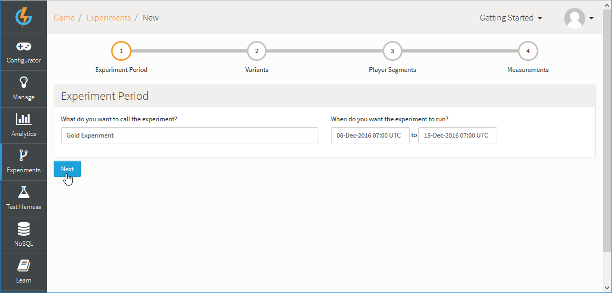

Use this first step to enter:
* *Experiment Name* - The Name field is a mandatory field used to describe the Experiment but does not uniquely identify it.
* *Start and End dates* - A start date and time and an end date and time to define the period the Experiment will run for.

*2.* Click *Next*. You're taken to step 2 - *Variants*:

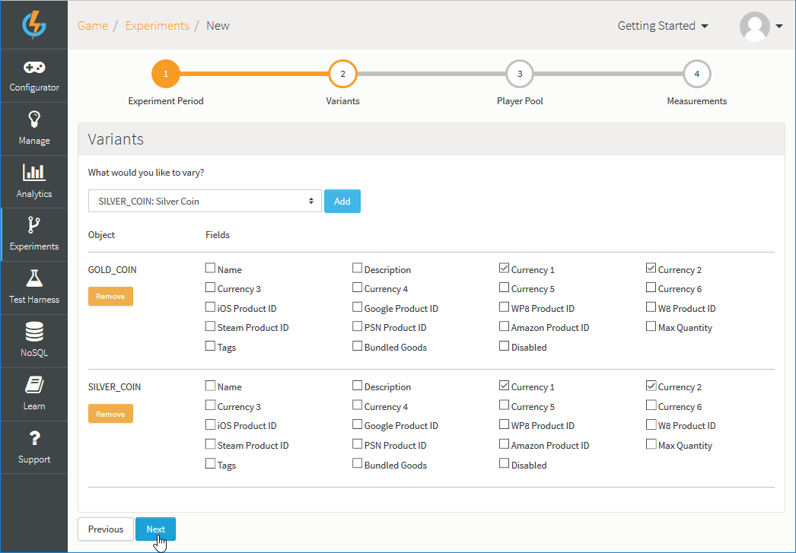

Use this second step to select what you want to vary for the purpose of the Experiment:
* In this example, we've added *GOLD_COIN* and *SILVER_COIN* Virtual Goods as experimental Variants.
* For both, we've selected the *Currency 1* and *Currency 2* fields.

*3.* Click *Next*. You're taken to step 3 - *Player Pool*:

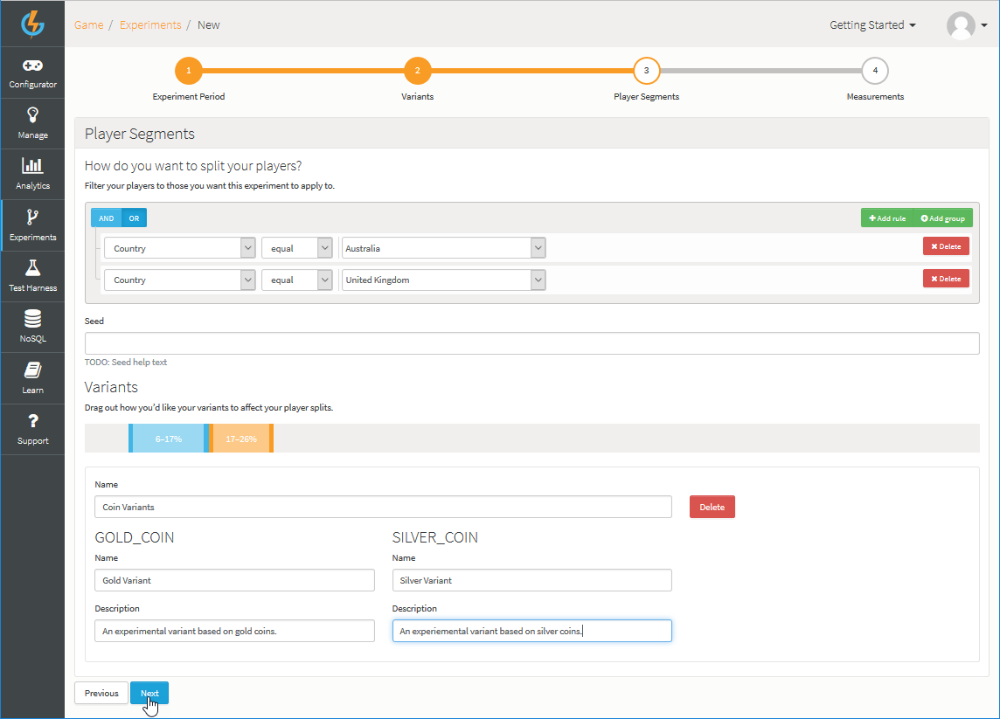

You can use this step to configure several aspects of the Experiment:
* *Player Pool* - Build a filter rule that will determine which players will form the *overall player pool* from which the set of players subjected to the Experiment are chosen:
  * In this example, players from Australia or the United Kingdom will form the overall player pool for the Experiment.

<q>**Player Inclusion!** Only players registered at the time the Experiment starts running are included in the overall player pool - any players that register after the Experiment starts are not included. </q>

* *Seed* - This field is optional. You can use it to tighten the degree of randomization of choice of players to which the experimental variants will be applied:
  * If you supply it, the value is used as part of the hashing calculation when we determine to which percentile each player is randomly assigned. The longer and more unique the value is, the higher the likelihood that the randomization of the Player and the percentile is. For example, If you want to run two Experiments and be sure that the same Player for both the 1st and 2nd Experiment has the same percentile, you should set this Seed hash value to be the same on each Experiment.
* *Variants Configuration* - There are several parts to this section:
  * Add percentile ranges:
    * Click in the percentile bar to add percentile ranges for your experimental Variants.
    * A hashing calculation is applied to the overall player pool to distribute them randomly. The Experiment will then be applied only to those players that are placed in any of the percentile ranges you've added here for the experimental Variants.
    * In this example, we've added two percentile ranges for experimental Variants.
    * If you wanted to conduct A/B testing, you can add two percentile ranges - 0 to 50% and 50 to 100%.

<q>**Browser Zoom!** Please maintain your browser at normal zoom level when you are adding your percentile ranges.</q>

  * You can now configure specific experimental Variants for each of the percentile ranges you've added:
    * Give each Variant a name, which will be visible only to those players who have been placed in the percentile range to which the experimental Variant is applied.
    * Set the alternative values for the fields we selected when we added the each of the Variants to the Experiment in step 2.
    * In this example:
      * For the *50-60* percentile range of the player pool we've *decreased* both the Gold and Silver coin values for Currencies 1 and 2 (as seen above).
      * For the *5-15* percentile range of the player pool, we've *increased* both the Gold and Silver coin values for Currencies 1 and 2:

These combined settings are designed to ensure that when your Experiment runs, the set of players to which the Experiment is applied is a randomly chosen set. Any behavioral changes observed in the players subjected to the Experiment with respect to the Variants - here Virtual Goods whose currency values have been increased or decreased - are therefore less likely to be biased and unrepresentative. This means, in turn, that any decisions you make for *actual changes* you go on to make to your game configuration and which are based on experimental outcomes are much more likely to be predictive of the general behavior of all game players in reaction to these actual changes.

<q>**Note:** We make a best effort to calculate the percentage ranges, however for smaller sample sets of players you might not be returned the exact number of players as anticipated.</q>

*4.* Click *Next*. You are taken to step 4 - *Measurements*:

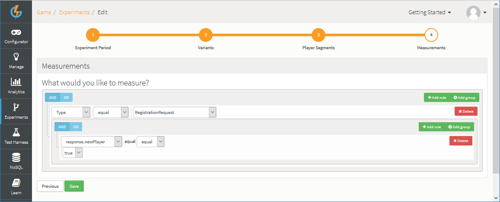

Our measurements could be based on a request that we expect the players subjected to the Experiment to use. If they have used it during the Experiment, we can see the percentage of users that were in the Experiment and how many from each variant of the Experiment submitted the request:
* In this example, we want to measure the number of *BuyVirtualGoodsRequest* calls made by the players chosen for the Experiment during the experimental period.

*5.* Click to *Save* the Experiment. The new Experiment is added to the *Upcoming Experiments* panel.

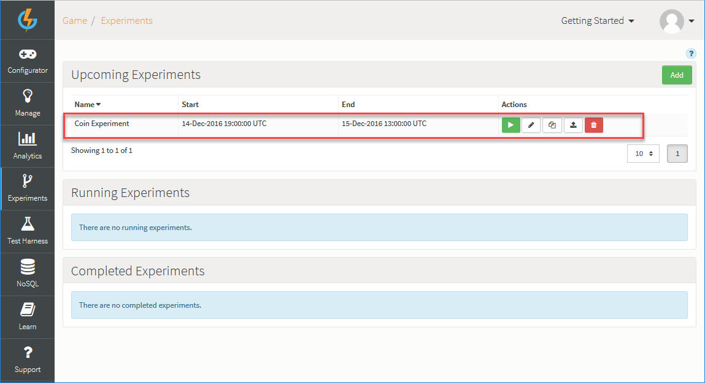

This shows the *Start* and *End* date you have configured for the Experiment and under *Actions* there are several options:
*  - Manually start the Experiment.
*  - Edit the Experiment:
  * You can step through each of the 4 configuration steps again and save any changes at each step.
  * You cannot edit an Experiment after it has started.
*  - Copy the Experiment.
*  - Publish the Experiment.
*  - Delete the Experiment.

## Running Experiments

When the start date for an Upcoming Experiment has passed or you have started the Experiment manually, it moves to *Running Experiments*:

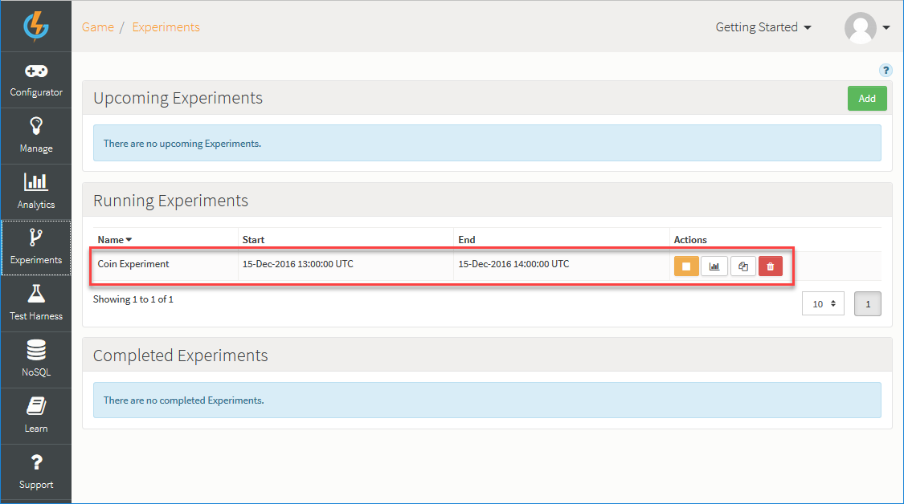

Under *Actions* there are several options:
*  - Manually stop the Experiment:
  * All stopped or expired Experiments move to *Completed Experiments*.
*  - View the results of the Experiment so far (see [below](#Viewing Experiment Results))
*  - Copy the Experiment.
*  - Delete the Experiment.

## Completed Experiments

When a Running Experiment has gone past its end date or you have stopped it, it moves to *Completed Experiments*:

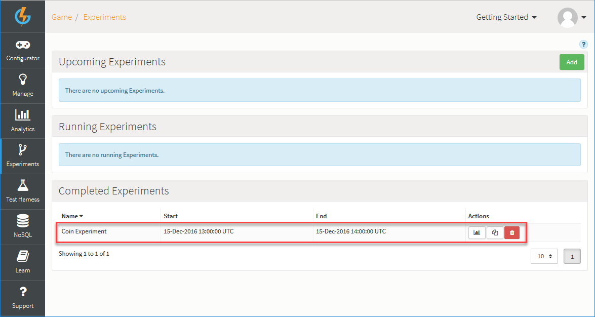

Under *Actions* there are several options:
*  - View the results of the Experiment (see [below](#Viewing Experiment Results)).
*  - Copy the Experiment.
*  - Delete the Experiment.

<<<<  ORIGINAL  >>>>>

## Viewing Experiment Results

Once your Experiment has completed, you can check the results of your Experiment and the impact it has had on the pool of Players who were affected by this Experiment:

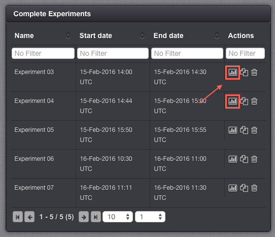

The results page displays graphs which are based on the time duration of the running Experiment and how many Players interacted with the variants on that Experiment Screen:

This is shown in two different graphs:
* One which show both the impact of the Experiment on the entire Player population:

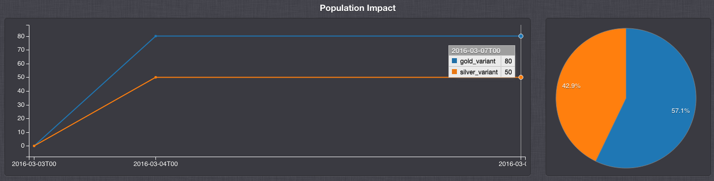

* A second which shows the number of Players that interacted with each variant on the Experiment:

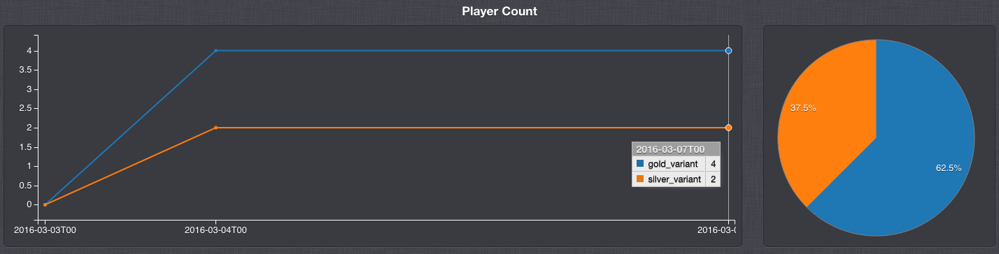
