# Experiments

You can create *Experiments* to test certain configuration changes on a selective range of Players within your game. For example, you could experiment with the costs of Virtual Goods for a small range of Players on your game for a specified period of time. You might increase or decrease the costs of some Virtual Goods to see how Players would respond to these different degrees of cost change. By reviewing the outcome of such experimental adjustments in Virtual Goods costs, you will be very well-placed to fine-tune your game configuration to make Players more responsive to and more engaged with your game.

## Creating Experiments

*1.* To create an Experiment, click *Experiments* in the main navigation bar. The *Experiments* page opens:

From here you can create and manage your Experiments:
* There are three panels for the different stages of an Experiment - *Upcoming*, *Running*, and *Completed*.
* As your Experiments are created in *Upcoming* and are scheduled to run, then start *Running*, and finally are *Completed*, they move through these three stages.

## Adding and Configuring an Experiment

To create and configure an Upcoming Experiment, you must work through a series of four steps:

*1.* On the *Upcoming Experiments* panel, click to *Add* a new Experiment. You're taken to *Step 1 - Experiment Period*:

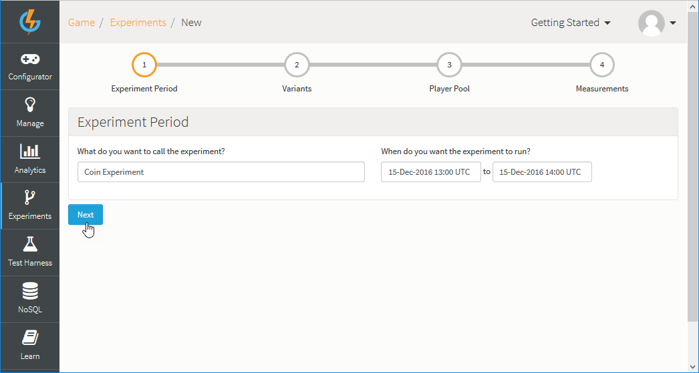

Use this first step to enter:
* *Experiment Name* - A Name for your Experiment, which is a mandatory field used to describe the Experiment but does not uniquely identify it.
* *Start and End dates* - A start date and time and an end date and time to define the period of the Experiment.

*2.* Click *Next*. You're taken to *Step 2 - Variants*:

Use this second step to select what you want to vary for the purpose of the Experiment:
* In this example, we've added *GOLD_COIN* and *SILVER_COIN* Virtual Goods as experimental Variants.
* For both Variants, we've selected the *Currency 1* and *Currency 2* fields.

This means that any players who become participants in the Experiment will be charged Currency 1 & 2 amounts that vary from the regular costs when they purchase either a gold or silver coin Virtual Good.

*3.* Click *Next*. You're taken to *Step 3 - Player Pool and Variant Configuration*:

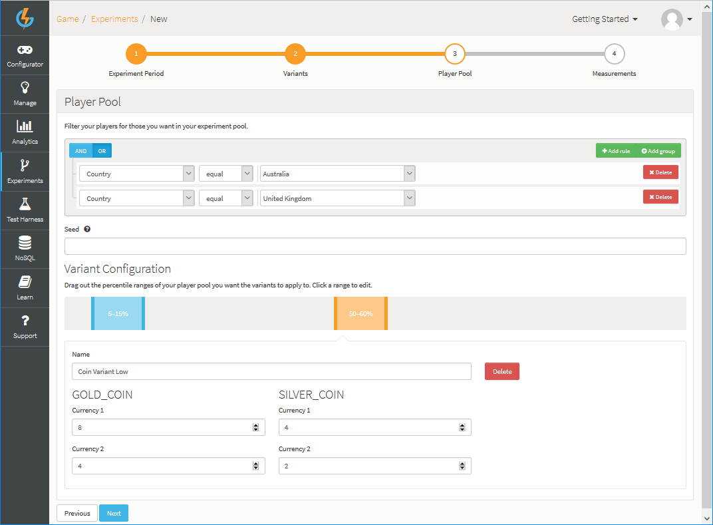

You can use this step to configure several aspects of the Experiment:
* *Player Pool* - Build a filter rule that will determine which players will form the *overall player pool* from which the players who will become participants in the Experiment are chosen:
  * In this example, only players from Australia or the United Kingdom will form the overall player pool for the Experiment.

<q>**Player Inclusion!** Only players registered at the time the Experiment starts running are included in the overall player pool - any players that register after the Experiment starts are not included. </q>

* *Seed* - This field is optional. You can use it to tighten the degree of randomization of choice of players to which the experimental variants will be applied:
  * If you supply it, the value is used as part of the hashing calculation when we determine to which percentile each player is randomly assigned. The longer and more unique the value is, the higher the likelihood that the randomization of the Player and the percentile is. For example, If you want to run two Experiments and be sure that the same Player for both the 1st and 2nd Experiment has the same percentile, you should set this Seed hash value to be the same on each Experiment.
* *Variants Configuration* - There are two parts to this section:
  * First, add percentile ranges:
    * Click in the percentile bar to add percentile ranges for your experimental Variants.
    * A hashing calculation is applied to the overall player pool to distribute them randomly. The Experiment will then be applied only to those players that are placed in any of the percentile ranges you've added here for the experimental Variants.
    * In this example, we've added two percentile ranges for experimental Variants.
    * If you wanted to conduct A/B testing, you can add two percentile ranges - 0 to 50% and 50 to 100%.
  * Second, configure specific Variant values for each of the percentile ranges you've added:
      * Give each Variant a name, which will be visible only to those players who have been placed in the percentile range to which the experimental Variant is applied.
      * Set the alternative values for the fields we selected when we added each of the Variants to the Experiment in Step 2.
      * In this example:
        * For the *50-60* percentile range of the player pool we've *decreased* both the Gold and Silver coin values for Currencies 1 and 2 (as seen above).
        * For the *5-15* percentile range of the player pool, we've *increased* both the Gold and Silver coin values for Currencies 1 and 2:

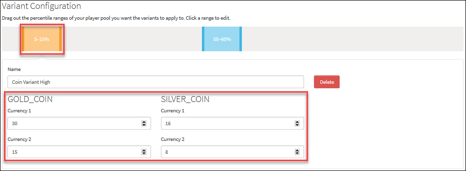

<q>**Browser Zoom!** Please maintain your browser at normal zoom level when you are adding your percentile ranges.</q>

These combined settings are designed to ensure that when your Experiment runs, the set of players who become participants in the Experiment is a randomly chosen set. This random selection of participants means that any behavioral changes observed in the players subjected to the Experiment with respect to the Variants - here Virtual Goods whose currency values have been increased or decreased - are therefore less likely to be biased and unrepresentative. This means, in turn, that any decisions you make for *actual changes* you go on to make to your game configuration and which are based on the observed results of the Experiment are much more likely to be predictive of the general behavior of all game players in reaction to these actual changes.

<q>**Note:** We make a best effort to calculate the percentage ranges, however for smaller sample sets of players you might not be returned the exact number of players as anticipated.</q>

*4.* Click *Next*. You are taken to *Step 4 - Measurements*:

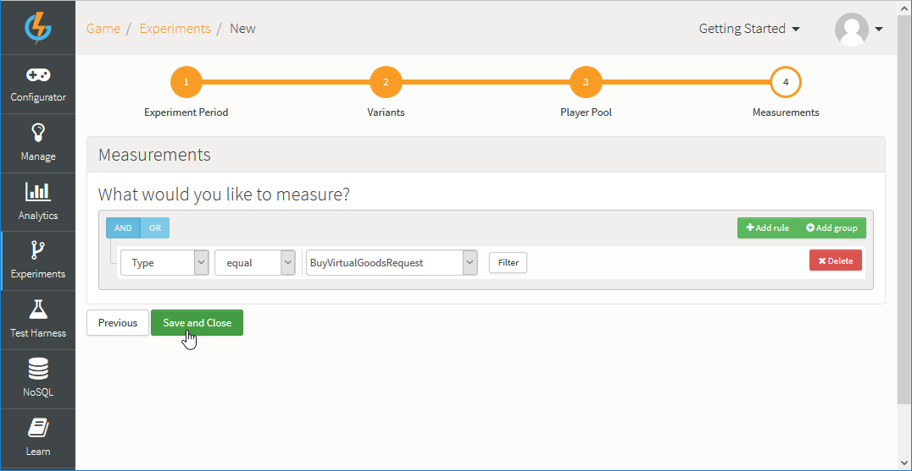

Your measurements for the Experiment could be based on a request that you expect the participant players to use. If they've used it during the Experiment, we can see the percentage of players that were in the Experiment and how many from each Variant of the Experiment submitted the request:
* In this example, we want to measure the number of *BuyVirtualGoodsRequest* calls made by the players chosen as participants for the Experiment during the experimental period.

*5.* Click to *Save and Close* the Experiment. The new Experiment is added to the *Upcoming Experiments* panel.

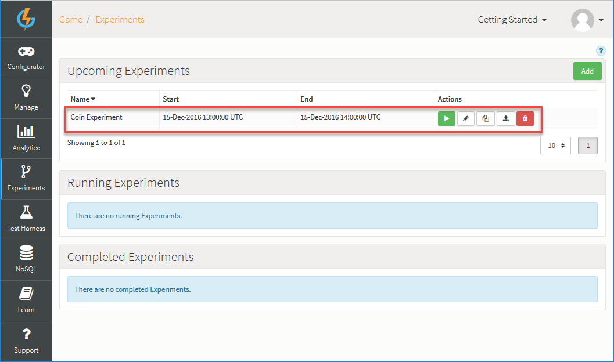

This shows the *Start* and *End* date you have configured for the Experiment and under *Actions* there are several options:
*  - Manually start the Experiment. The Experiment will be moved to *Running Experiments*.
*  - Edit the Experiment:
  * You can step through each of the 4 configuration steps again and save any changes you make to the Experiment set up.
  * You cannot edit an Experiment after it has started.
*  - Copy the Experiment.
*  - Publish the Experiment.
*  - Delete the Experiment.

## Running Experiments

When the start date for an Upcoming Experiment has passed or you have started the Experiment manually, it moves to *Running Experiments*:

Under *Actions* there are several options:
*  - Manually stop the Experiment. All stopped or expired Experiments move to *Completed Experiments*.
*  - View the results of the Experiment so far (see [below](#Viewing Experiment Results))
*  - Copy the Experiment.
*  - Delete the Experiment.

## Completed Experiments

When a Running Experiment has gone past its end date or you have stopped it manually, it moves to *Completed Experiments*:

Under *Actions* there are several options:
*  - View the results of the Experiment (see [below](#Viewing Experiment Results)).
*  - Copy the Experiment.
*  - Delete the Experiment.

## Viewing Experiment Results

Once your Experiment has completed, you can check the results of your Experiment and the impact it has had on the pool of Players who were affected by this Experiment:

*1.* In the *Completed Experiments* panel click to view the results of an Experiment:

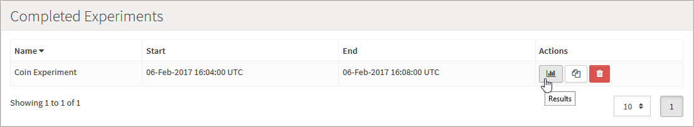

* Here, we're going to open and review the results of a *Coin Experiment* we set up earlier, have copied, and re-ran at a later date.

The *Results* page opens:

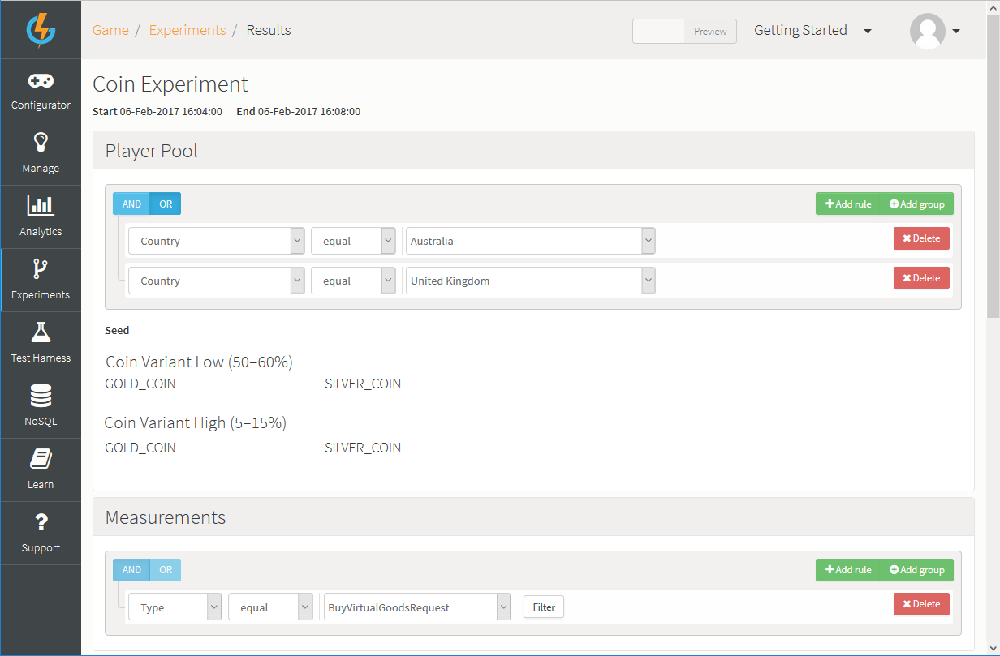

* As a useful reminder, the top of this page shows the *Player Pool* and *Variant Configuration* for the Experiment and the *Measurements* taken for participant players.
* You can use the *Preview/Live* switch at the top of the page to view the results for the Experiment ran against Preview or Live data.
<q>**Important!** - *Preview/Live* will be enabled only if you have published a game configuration Snapshot to Live.</q>

*2.* Scroll down the page to review and analyze the results, which are shown in two different panels:

* *Population Impact*. This is designed to show the impact on the entire experimental player population - it shows the activity logged over the experimental period for the configured Measure by percentage of all the players who participated in the Experiment, relative to each of the Variants you set up:

* For the current example:
  * We can see from the *line graph* data that 100% of those players randomly assigned to the *Coin Variants Low* Variant submitted a *BuyVirtualGoodsRequest* to purchase a gold or silver coin at the reduced cost; whereas only 66% of those players randomly assigned to the *Coin Variants High* Variant purchased either a gold or silver coin at the increased cost.

* *Player Count*. This is designed to show results by counts of players - it shows the actual numbers of players whose activity was logged during the experimental period for the configured Measure, again relative to each experimental Variant that you set up:

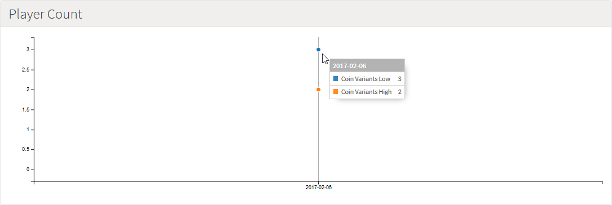

* For the current example:
  * We can see from the *line graph* data that 3 players randomly assigned to the *Coin Variants Low* Variant purchased a gold or silver coin at the reduced cost; whereas only 2 players assigned to the *Coin Variants High* Variant purchased a gold or silver coin at the increased cost.

<q>**Results Delay!** If you stop an Experiment and try to view results straightaway, you will not get the finalized results. This is because there is a slight delay of approximately ten minutes before the data for the activity being measured in the Experiment becomes available to build the results charts.</q>

## Publishing Experiments

Experiments can always be run in your game's Preview stage. If you want to run your Experiment in your game's Live stage, you must publish your Experiment:
* You must first publish a game configuration Snapshot to Live.
* When you publish an Experiment configuration, it is kept separate and distinct from the published game configuration and this separation is very useful:
  * You can work up the Experiments after you've published your game to Live and launched it.
  * Using Experiments is not tied to your game publication lifecycle - you can continue to refine your Experiments independently of the published state of the overall game configuration.

*1.* When you have an Experiment ready for the Live stage, in the *Upcoming Experiments* panel, click the publish  icon:

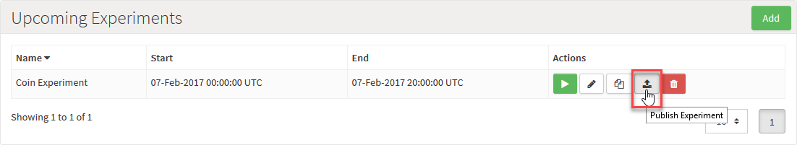

A confirmation dialog appears:

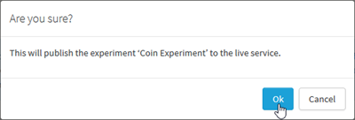

*2.* Click *Ok*. The Experiment is published to the Live game stage and shows in green on the *Upcoming Experiments* panel:

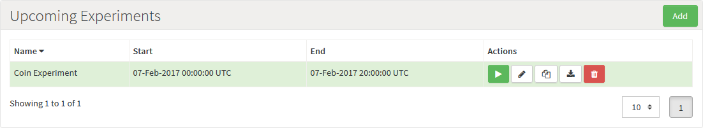
* When you have published an Experiment to your game's Live stage and view the Experiment's results, the *Preview/Live* switch will be enabled on the [Results](#Viewing Experiment Results) page.
