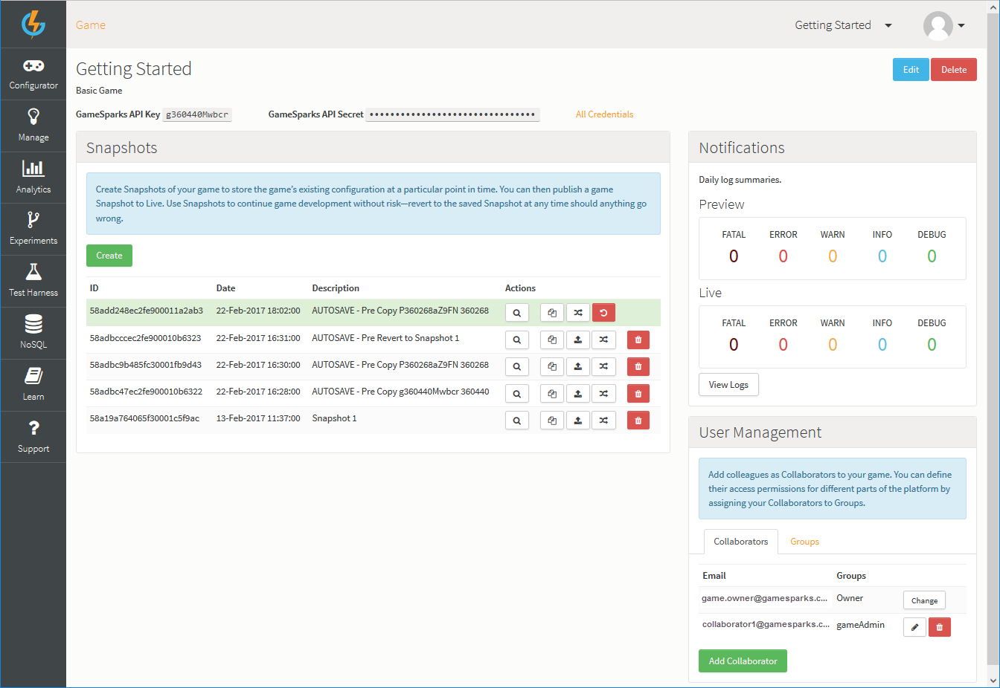
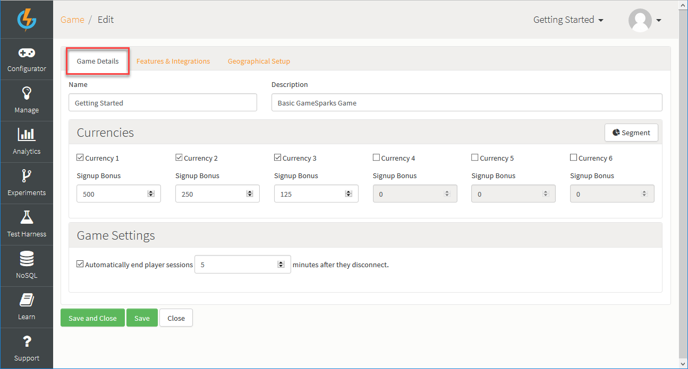

# Game Overview

From the Game Overview page you can:

* View and edit the top-level information and settings of your game.
* Create and manage versions of your game configurations (Snapshots).
* Publish Snapshots of your game to the live servers.
* Inspect access secrets for your game connection types.
* Create Collaborators for your game and configure their security settings.

You can use options at the top-right of the page:
* *Edit* - Edit your game's details.
* *Delete* - Delete your game and send it to the Recycle Bin.

  *  - Set this game as your favorite. Each time you enter the portal the current game will shown without you having to select it.
  *  - View your Games Access Secrets.
  *  - Edit the Geo Restrictions for the game.
  *  - Edit the top level information regarding your game.
  *  - Delete this game.

## Editing Top-Level Game Information

*1.* To edit your game's details, click *Edit*:

* On the *Game Details* tab, you can edit the following:

  * *Name* \- The name of your game, used to identify the game in the portal if you have several games
  * *Description* \- A description of the game
  * *Signup Bonuses* \- The amount of each of the currencies to award a new player when a new account is created
  * *Segment Configuration* - Configure Segments for your game. For more details, see [Segments](/Documentation/Configurator/Segments.md).

* On the *Features & Integrations* tab, you can set up what your want to use in your game:
  * *Platform Features* - Select the GameSparks features you want to enable.
  * *Integrations* - Select the 3rd party providers you want to integrate with.

* On the *Geographical Setup* tab, you can configure for the geographical distribution of your game:
  * *Primary Region* - Select the geographical region where your game will be published.
  * *Geo Restrictions* - Etc Etc.

## Snapshots

You can use icons button options in the Snapshots panel:

  *  - Create a new Snapshot of the configuration currently in the portal.
  *  - Copy this Snapshot to another game.
  *  - Delete this Snapshot.
  *  - Publish this Snapshot to the live servers.
  *  - Revert the portal to the version contained in the Snapshot.
  *  - Preview this Snapshot.

Click [here](/Documentation/Key Concepts/Snapshots.md) for more information about Snapshots, Versioning and Publishing.

## Access Secrets

A number of secrets exist for different types of connections:

  * *Device Api Secret* \- Used by your devices to connect to the service as a player.
  * *Server Api Secret* \- Used for callback urls.
  * *SFTP Secret* \- Used for SFTP access for file delivery (Request access via out support system).
  * *Debug Secret* \- Used by the JavaScript remote debugger.

## User Management

This area allows the creation of game Collaborators and Groups, these will be people that can log in with their user and view/edit the game, depending on the security settings set for them. An in-depth tutorial can be found [here](/Tutorials/Capabilities/README.md).
