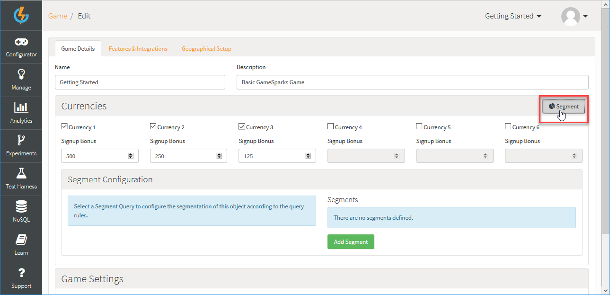
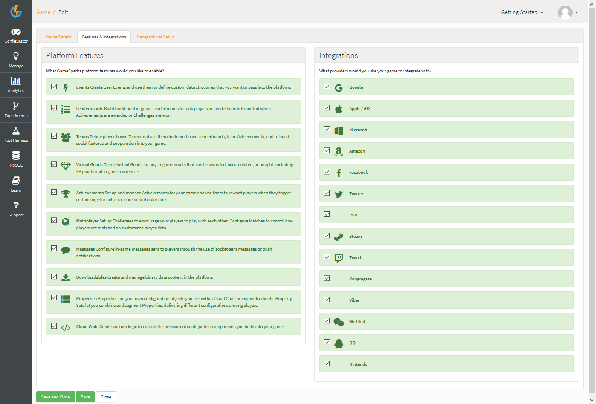

# Game Overview

From the Game Overview page you can:

* View and edit the top-level information and settings of your game.
* Create and manage versions of your game configurations (Snapshots).
* Publish Snapshots of your game to the live servers.
* Inspect access secrets for your game connection types.
* Create Collaborators for your game and configure their security settings.

You can use two main options at the top-right of the page:
* *Edit* - Edit your game's details. See section [below](#Editing Top-Level Game Information).
* *Delete* - Delete your game and send it to the *Recycle Bin*.

## Viewing and Copying Game API Key and Secrets

You can view and copy your game's *API Key* and *API Secret*:
* Your game's *API Key* is shown and you can *Copy* this when required:

* Your game's *API Secret* is hidden when the page first opens, but you can *Show* the secret:

  * And then *Copy* when required:

## Checking Security Credentials

If you need to check the security Credentials for your game, you can click *All Credentials* to go directly to the *Credentials* page:

## Editing Top-Level Game Information

When you click to *Edit* your game's top-level details, you'll see three tabs:
* [*Game Details*](#Editing Game Details)
* [*Features & Integrations*](#Selecting Features and Integrations)
* [*Geographical Setup*](#Configuring Geographical Setup)

### Editing Game Details

To edit your game's details, click *Edit*. The *Game Details* tab is selected:

* On the this tab, you can edit the following:

  * *Name* \- The name of your game, used to identify the game in the portal if you have several games
  * *Description* \- A description of the game
  * *Signup Bonuses* \- The amount of each of the currencies to award a new player when a new account is created:
    * *Segment Configuration* - On the *Currencies*, click *Segment* at top-right to configure the segmentation for your game's currencies.

For more details, see [Segments](/Documentation/Configurator/Segments.md).

### Selecting Features and Integrations

To select the platform features and integrations you want to use for your game, select the *Features & Integrations* tab:

* On the this tab, you can select:
  * *Platform Features* - The GameSparks features you want to enable.
  * *Integrations* - The 3rd party providers you want to integrate your game with.

### Configuring Geographical Setup

To select which geographical regions you want to allow access to your game, click the *Geographical Setup* tab:

* On the this tab, you can configure for the geographical distribution of your game:
  * *Primary Region* - Select the geographical region where your game will be published.
  * *Geo Restrictions* - Select by country the geographical regions that you want to allow access to your game. By default, all countries are selected under *Allow Access*. To deny access to users in a specific country, select the country to move it across to the *Deny Access* box. You can use the double arrows at the top of each box to move all in one box to the other.

## Snapshots

Click *Create* to create a new Snapshot for the current configuration of your game.

You can use icon button options in the Snapshots panel:

  *  - Copy this Snapshot to another game.
  *  - Delete this Snapshot.
  *  - Publish this Snapshot to the live servers.
  *  - Revert the portal to the version contained in the Snapshot.
  *  - Preview this Snapshot.

Click [here](/Documentation/Key Concepts/Snapshots.md) for more information about Snapshots, Versioning and Publishing.

## User Management

You can use the *User Management* panel to create *Collaborators* and *Groups* for your game. Collaborators are people that can log in with their user credentials and view/edit the game, depending on the security settings you have set for them. An in-depth tutorial can be found [here](/Tutorials/Capabilities/README.md).
