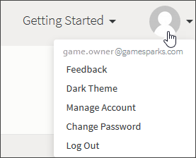
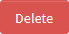
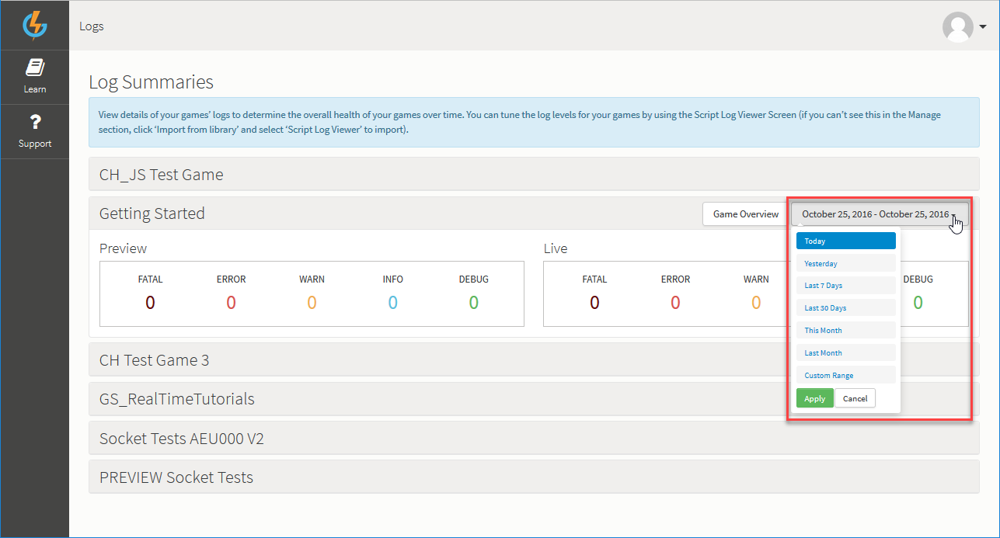
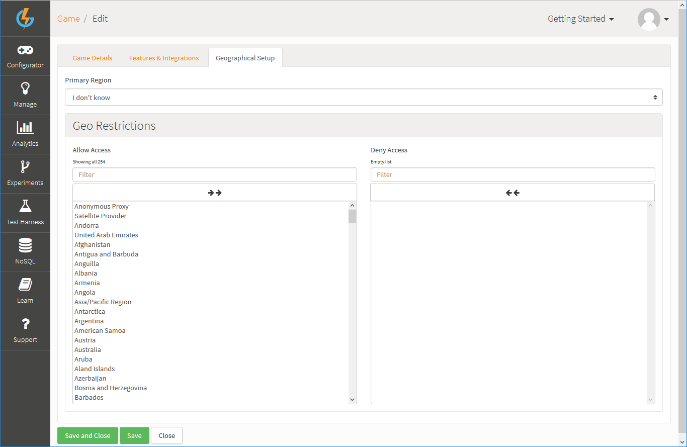
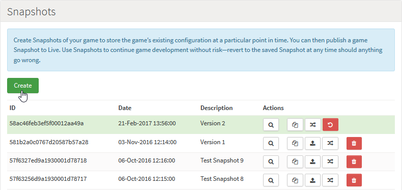

# Game Overview

The Game Overview is designed to help you perform your initial game set up and any continuing game management tasks through the life of your game - from here you can:

* Log out from the portal and manage your GameSparks account.
* Quickly open another game you've created on the portal, add a game, or open the game Recycle Bin.
* Check daily log summaries for both the Preview and Live stages of your game.
* View and edit the top-level information and settings of your game.
* Create and manage versions of your game configurations as [Snapshots](#Snapshots).
* Publish Snapshots of your game to the live servers.
* Inspect access secrets for your game connection types.
* Perform [User Management](#User Management) and create Collaborators for your game and configure their security settings through Groups.

## Logging Out and Managing your GameSparks Account

You can use the drop-down *Account* menu at top-right:

* *Game Owner* - The game-owner e-mail address is shown.
* *Change Password* - Click to change your GameSparks account password.
* *Log Out* - Click to log out of the platform.

### Posting an Avatar

If you want to post an avatar for your GameSparks account, go to https://en.gravatar.com/

## Using the Games Menu

You can use the drop-down *Games* menu at top-right:

* *Open Game* - Select to open another game from your list of games.
* *Add Game* - Click to add a new game.
* *Recycle Bin* - Click to open the game Recycle Bin. When you delete a game it is sent to the *Recycle Bin* but you can restore deleted games from here.

## Main Options

You can use two main options at the top-right of the page:
*  - Edit your game's details. See section [below](#Editing Top-Level Game Information).
*  - Delete your game and send it to the *Recycle Bin* - you can use the [Games](#Using the Games Menu) menu to access the Recycle Bin and restore games you've deleted.

## Checking Game Log summaries

The *Notifications* panel contains daily log summaries for both the *Preview* and *Live* stages of your game:

If you want to view the log summaries for all your games, click *View Logs*. The *Logs* page opens with the current game's log summary expanded. The daily log summary is shown but you can change the range of the log summary using a date range drop-down:

To return to the current game's Overview page, click *Game Overview*:

## Viewing and Copying Game API Key and Secrets

You can view and copy your game's *API Key* and *API Secret*:
* Your game's *API Key* is shown and you can *Copy* this when required:

* Your game's *API Secret* is hidden when the page first opens, but you can *Show* the secret:

  * And then *Copy* when required:

## Checking Security Credentials

If you need to check the security Credentials for your game, you can click *All Credentials* to go directly to the *Credentials* page:

## Editing Top-Level Game Information

When you click to *Edit* your game's top-level details, you'll see three tabs:
* [Game Details](#Editing Game Details)
* [Features & Integrations](#Selecting Features and Integrations)
* [Geographical Setup](#Configuring Geographical Setup)

### Editing Game Details

To edit your game's details, click . The page adjusts for editing the game and the *Game Details* tab is selected:

* On the this tab, you can edit the following:

  * *Name* \- The name of your game, used to identify the game in the portal if you have several games
  * *Description* \- A description of the game
  * *Signup Bonuses* \- The amount of each of the currencies to award a new player when a new account is created:
    * *Segment Configuration* - On the *Currencies*, click *Segment* at top-right to configure the segmentation for your game's currencies.

For more details, see [Segments](/Documentation/Configurator/Segments.md).

### Selecting Features and Integrations

To select the platform features and integrations you want to use for your game, select the *Features & Integrations* tab:

* On the this tab, you can select check boxes for:
  * *Platform Features* - The GameSparks features you want to enable.
  * *Integrations* - The 3rd party providers you want to integrate your game with.

### Configuring Geographical Setup

To select which geographical regions you want to allow access to your game, click the *Geographical Setup* tab:

* On the this tab, you can configure for the geographical distribution of your game:
  * *Primary Region* - Select the geographical region where your game will be published.
  * *Geo Restrictions* - Select by country the geographical regions that you want to allow access to your game. By default, all countries are selected under *Allow Access*. To deny access to users in a specific country, select the country to move it across to the *Deny Access* box. You can use the double arrows at the top of each box to move all in one box to the other.

## Snapshots

Click *Create* to create a new Snapshot for the current configuration of your game.

You can use icon button options in the Snapshots panel:
  *  - Preview this Snapshot.
  *  - Copy this Snapshot to another game.
  *  - Delete this Snapshot.
  *  - Publish this Snapshot to the live servers.
  *  - Revert the portal to the version contained in the Snapshot.

Click [here](/Documentation/Key Concepts/Snapshots.md) for more information about Snapshots, Versioning and Publishing.

## User Management

You can use the *User Management* panel to create *Collaborators* and *Groups* for your game. Collaborators are people that can log in with their user credentials and view/edit the game, depending on the security settings you have set for them. An in-depth tutorial can be found [here](/Tutorials/Capabilities/README.md).
