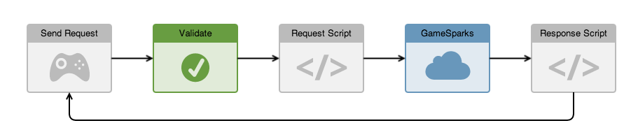
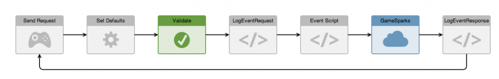
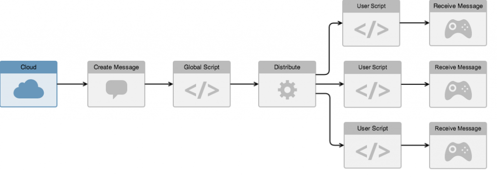

# Cloud Code

## Interception points for Cloud Code

The GameSparks platform uses the concept of interceptors to trigger the execution of Cloud Code scripts. There are 4 key interception points:

  * Before a request is processed.
  * Before a response is delivered.
  * After a message is created.
  * Before a message is delivered to a particular player.

## Request / Response Interceptors

  * When a request is received by the platform it is validated.
    * If validation is unsuccessful, an error response is returned to the device and no further processing takes place:
    * If validation is successful, the platform will determine if the request type has a script bound to it. If it has the script will be executed and the request is available to that script for querying.
  * Once the script has been executed the platform determines whether the script has added an error to the request:
    * If an error has been added, an error response is returned to the device and no further processing takes place.
    * If there is no error, the platform performs the standard processing on the request and a response is generated.
  * Before sending the response to the device the platform will determine if the response type has a script bound to it:
    * If it has the script is executed and the response is sent to the device.

## Event / Challenge Event Interceptors

Event and Challenge Event interceptors are specialized versions of the standard Request interceptors:
* They are executed against *LogEventRequest* and *LogChallengeEventRequest* objects.
* The binding is based on the event key specified when the event type was set up. This allows you to have separate scripts for each event type, rather than having a single script that is bound to the *LogEventRequest* and the *LogChallengeEventRequest*.

## Message Interceptors

When a message is created in the GameSparks platform, it contains a list of target players the message should be sent to. A player message object is then created for each player and sent directly to them. This process allows you to bind code to both global message creation and player message delivery. A good example of where this is useful is when a challenge starts - a single *ChallengeStartedMessage* is created that you can execute script against to ensure a particular set of code is only executed once for a challenge.

  * Once the message has been created, the platform determines whether a global message script exists for the type of message:
    * If one exists, it is executed.
  * The message is then used to create a player message for each player defined as a target for the message.
  * Once the player message is created, the platform determines whether a player message script exists for the type of message:
    * If one exists, it is executed.
  * The player message is then delivered to the device.
