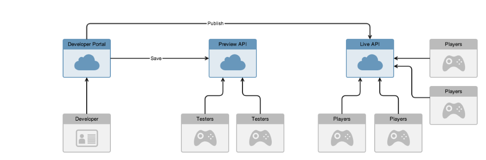

# Development Process

The GameSparks platform follows best practice in content management processes and provides a simple workflow for managing the life cycle of your game.

When you initially create your game within the platform it is in a *preview* state. This means the game is not yet available to the public and is accessed via a private url. Load is restricted to 100 concurrent connections by default (this number can be increased on request).

<q>**Note:** You should not launch your game while the client is using the preview servers because players' devices will not be able to connect once concurrency limits are reached!</q>

## Taking a Snapshot and Publishing

At any point during development you might want to create a version of the configuration that you can either publish or save. To do this you take a *snapshot*. When you take a snapshot the platform will record all of your configuration (including all metadata collections and their content) into a configuration set.

To publish your game, you select the snapshot you want to use and click the publish icon. This copies the configuration set to the live servers, overwriting any previous configuration for the game.

At this point, the configuration between the preview and live servers is separated. You can make changes to other versions in the developer portal and the snapshot published to the live servers will not be affected. This allows you to work on the next version of your game or make a minor update to the game and test it before you go through the publish process again. If you are working on a significant update, you might be in a position where your preview configuration is very different to your live configuration.

## Reverting to Snapshots and Bug Fixing

If there is an urgent bug fix that needs to be applied to the live service, you can do this without disrupting work-in-progress on updates or new versions.

You can select the snapshot that is published and *revert* to that one. This copies the configuration set from the snapshot to the developer portal (and the preview servers). You can fix the bug and test the change before taking a new snapshot and (re)publishing the live service.

**What about my update version before I reverted to the published snapshot?**

A snapshot of the update you had been working on was automatically taken, so you can then revert to that to get back into the state you were in before you started the fix.
