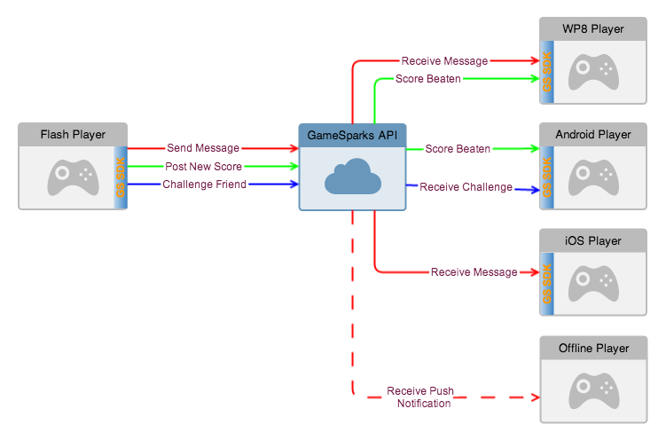

# Messaging

Messaging is one of the core features of the GameSparks platform. Messages are primarily used to keep your players informed about events within your game, as those events occur.

This diagram shows several messaging use-cases in action.

Messages within GameSparks are entirely cross-platform - it doesn't matter what client your players are using they will receive the messages, even if they originate from a player on a different platform.

## Message Delivery

There are two mechanisms that the GameSparks platform uses to deliver messages to a player, depending on the state of the message recipient:

*1.* **Online Player**

As well as using WebSockets for standard request/response use-cases, the GameSparks platform also uses WebSockets for delivering asynchronous messages. This means that an online player will receive any messages sent to them almost instantly.

In the above diagram 'Offline Player' represents a player without an authenticated WebSocket connection. All the other players currently have authenticated WebSocket connections, so receive their messages as they are sent, via the WebSocket.

*2.* **Offline Player**

The GameSparks platform allows you to set up a Game to use push notifications where they are supported on the players' devices. The set up for these notifications varies depending on the target device, so some configuration is required for your game within the GameSparks Developer Portal to get these notifications to work.

In addition to the configuration, the players' devices must be registered to receive push notifications, which can be done using a [PushRegistrationRequest](/API Documentation/Request API/Misc/PushRegistrationRequest.md). When a message is sent to a player who does not have an authenticated WebSocket connection, the GameSparks platform will send a notification to all of the players' devices that have been registered to receive a push notification.

## Message Triggers

There are three types of trigger that you can use to send a message:

*1.* **Request message**

Requests such as [SendFriendMessageRequest](/API Documentation/Request API/Player/SendFriendMessageRequest.md) and [ChatOnChallengeRequest](/API Documentation/Request API/Multiplayer/ChatOnChallengeRequest.md) are explicit calls to the platform to send requests to the target players. The content of the message is determined by the sender of the request.

*2.* **Event message**

Certain events that occur within the platform will trigger a message to be sent to the relevant players. For example, a message will be sent to a player when they post the new high score on a Leaderboard or once a challenge they are participating in has officially started. The content of the message is determined by [message templates](/Documentation/Configurator/Messages.md) configured within the GameSparks Developer Portal.

*3.* **Script message**

Like the Request messages, this is an explicit call to the platform to send a message to the target players, but in this case it's invoked via Cloud Code using [Spark.sendMessage](/API Documentation/Cloud Code API/Spark.md). The content of the message is an argument provided to the sendMessage method.

## Messages and Cloud Code

You can also tie Cloud Code scripts to the sending of messages to further customize the platform behavior. For more information on this see [Cloud Code](/Tutorials/Cloud Code and the Test Harness/Using Cloud Code.md).
