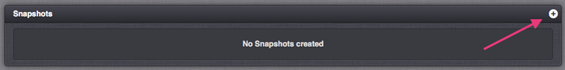
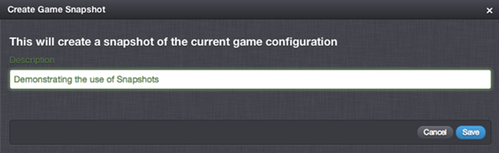
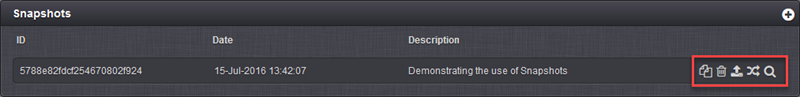
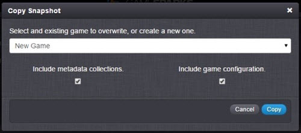
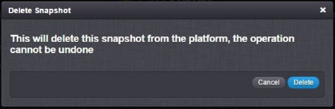
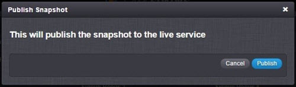
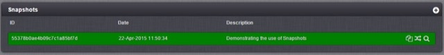
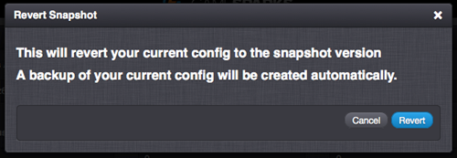
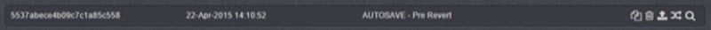

# Snapshots

The Snapshots feature allows you to *Create*, *Copy*, *Delete*, *Publish*, *Revert* and *Preview* the configuration of your Game, allowing for in-depth management of each stage of the release.

## Snapshots: Creation and Basics

You can create a Snapshot of the current game configuration by pressing the  button in the *Snapshots* section on the *Overview* page.

A *Create* form appears where you can enter a meaningful description of the Snapshot.

Click *Save* to create the Snapshot:

You can then use icon button options (highlighted):

  *  - Copies the Snapshot to create a new or overwrite an existing game. You can only overwrite a game if you are a game owner or admin for the game. You'll have the option to copy:
    * Only the metadata from the original Snapshot.
    * Only the game configuration.
    * Both the metadata and the game configuration.

<q>**Important!** Don't worry about overwriting the target games configuration. There is a fail-safe - a snapshot of the target games previous version is automatically created (called "AUTOSAVE - Pre Copy") before the copy occurs.</q>
  *  - Deletes the snapshot.
  *  - Publish the configuration to the LIVE servers. The snapshot that is currently published is highlighted in green. See below for more detail on publishing.
  *  - Revert your workspace with the selected snapshot version. There is another fail-safe - a snapshot of the previous version is automatically taken (called "AUTOSAVE - Pre Revert").
  *  - Preview any of the Snapshots without having to revert to them, editing will be disabled when previewing.

## Copying a Snapshot

The *Copy Snapshot* form gives you options for customizing your copy:

  * *Game* \- from the drop-down, you can choose to copy the Snapshot to a new game or to overwrite an existing game that you have access and permissions to edit.
  * *Include metadata collections* \- choose whether to include the metadata for the copy of the game.
  * *Include game configuration* \- choose whether to copy the game configuration onto an existing game, overwriting any existing configuration. When copying to a new game, this option is disabled because in this case the Snapshot's game configuration is always copied.

## Deleting a Snapshot

When you select delete, a confirmation form appears. Press *Delete* to confirm only if you are absolutely sure you want to delete the Snapshot.

## Publishing a Snapshot

Publishing a Snapshot places the configuration of the game into the LIVE environment, where the game can then be accessed by your players. For in-depth tutorial on versioning read [here](/Tutorials/Versioning and the Publishing Process/Versioning and Publishing a Game.md).

Once you confirm your selection to publish the Snapshot, it will be highlighted in green within the list of Snapshots:

## Reverting a Snapshot

You might want to revert to earlier version of your game configuration or saved metadata collections if you have accidentally removed some configuration details or if something recently went wrong. When Reverting a Snapshot you'll be prompted for a confirmation.

<q>**Snapshot AUTOSAVE!** When you revert a Snapshot, your current configuration is saved to create an automatic Snapshot of everything as it was before the revert:</q>

## Previewing a Snapshot

You can preview a Snapshot and inspect the game configuration of that Snapshot, which saves you having to fully revert to it then having to revert back to your original state. In Snapshot Preview mode, all editing is disabled and you'll see what's being previewed at the top of GameSparks Configurator:

The Snapshot Preview header tells you what Snapshot you are currently previewing, when it was created, whether it is live or not, and who it was created by.

To exit the Snapshot preview, click *Exit Preview* or navigate away from the Configurator.
