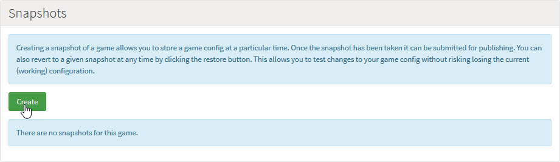
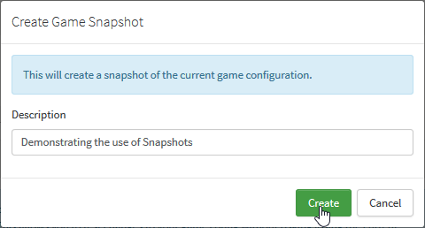
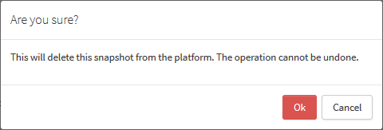
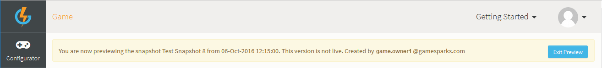

# Snapshots

The Snapshots feature allows you to *Create*, *Copy*, *Delete*, *Publish*, *Revert* and *Preview* the configuration of your Game, allowing for in-depth management of each stage of the release.

<q>**Game Snapshots vs. Screen Snapshots!** Game Snapshots *do not contain* any of the Manage section configuration you've built up for your Admin Screens. You can create separate *Screen Snapshots* for the Manage configuration and publish these to the Live environment independently of your game Snapshots. For details, see [below](#What is Not Included in Game Snapshots?).

## Snapshots: Creation and Basics

You can create a Snapshot of the current game configuration by clicking *Create* in the *Snapshots* section on the *Game Overview* page.

A *Create Game Snapshot* dialog appears where you can enter a description of the Snapshot.

Click *Create* to create the Snapshot:

You can then use icon button options (highlighted):

  *  - Copies the Snapshot to create a new or overwrite an existing game. You can only overwrite a game if you are a game owner or admin for the game. You'll have the option to copy:
    * Only the metadata from the original Snapshot.
    * Only the game configuration.
    * Both the metadata and the game configuration.
    * Downloadables
    * Collaborators

<q>**Important!** Don't worry about overwriting the target game's configuration. There is a fail-safe - a Snapshot of the target game's previous version is automatically created (called "AUTOSAVE - Pre Copy") before the copy occurs.</q>
  *  - Deletes the Snapshot.
  *  - Publish the configuration to the LIVE servers. The snapshot that is currently published is highlighted in green. See below for more detail on publishing.
  *  - Revert your workspace with the selected Snapshot version. There is another fail-safe - a Snapshot of the previous version is automatically taken (called "AUTOSAVE - Pre Revert").
  *  - Preview any of the Snapshots without having to revert to them, editing will be disabled when previewing.

### Mongo Database Collections for Snapshots

When you take a Snapshot, the platform records all of your game's configuration into a configuration set:
  * This *includes* all Metadata Collections and their content.
  * This *excludes* all Runtime and System Collections and their content. These are created new for the Live stage when you *first publish* a game Snapshot and remain untouched when future Snapshots are published.

### What is Not Included in Game Snapshots?

Two areas of your game are *not included* in a game Snapshot:
* A game Snapshot does not include anything you set up in the [Manage](/Documentation/Manage/README.md) section for your *Admin Screens* - these are published to Live separately as *Screen Snapshots*. See [Creating and Managing Screen Snapshots](/Documentation/Manage/Creating and Managing Screen Snapshots.md).
* Secondly, [Experiments](/Documentation/Experiments/README.md) are also published to the game's Live stage separately.

## Copying a Snapshot

The *Copy Snapshot* dialog gives you options for customizing your copy.

### Choosing the Target Game for your Copy

On the *Copy Snapshot* dialog, you can use the *Game* drop-down to choose to copy the Snapshot to a new game or to overwrite an existing game that you have access to and permissions to edit. When the copy completes, a confirmation dialog appears and you can click to view the target game:

  * If you copied the Snapshot to a new game, you'll be taken to a new game that has been named by prefixing "COPY" to the source game's name and you can edit the new game's name from the *Game Overview* page.
  * If you copied the Snapshot to an existing game, you'll be taken to that game.

### Choosing What to Include in your Copy

You can select just what you what to include in the copy Snapshot using four check boxes:
  * *Include metadata collections* \- choose whether to include the metadata for the copy of the game.
  * *Include game configuration* \- choose whether to copy the game configuration onto an existing game, overwriting any existing configuration. When copying to a new game, this option is disabled because in this case the Snapshot's game configuration is always copied.
  * *Include downloadables* - choose whether to copy the binary data content you have uploaded to the game.
  * *Include collaborators* - choose whether to copy the game's collaborators.

## Deleting a Snapshot

When you select delete, a warning/confirmation dialog appears. Press *Ok* to confirm *only if you are absolutely sure* you want to delete the Snapshot.

## Publishing a Snapshot

Publishing a Snapshot places the configuration of the game into the LIVE environment, where the game can then be accessed by your players. For in-depth tutorial on versioning read [here](/Tutorials/Versioning and the Publishing Process/Versioning and Publishing a Game.md).

Once you confirm your selection to publish the Snapshot, it will be highlighted in green within the list of Snapshots:

* Note that when you publish a Snapshot, you can *unpublish* it - for details see [below](#Unpublishing a Snapshot).

<q>**Going Live Checklist!** Before you publish your Snapshot to Live, please review the [Going Live Checklist](/Getting Started/Going Live Checklist/README.md) to ensure everything runs smoothly.</q>

### Publishing Snapshots and Evaluation Users

If you are logged into the platform as an *Evaluation* user, you won't be able to publish your games through to the Live stage for the typical case:
* Where you have created a game for yourself, developed the game and created Snapshots in Preview, the publish icon button will not be available for your game Snapshots.
* However, if a user with a full user account has made you a Collaborator on their game and assigned you a permissions Group with Publish Snapshot write permission and you log into their game, you'll see the publish icon button and can publish Snapshots on the game.

See the [Going Live Checklist](/Getting Started/Going Live Checklist/README.md) for information on upgrading your account status.

### Publishing a Snapshot for the First Time

When you publish one of your game's Snapshots from *Preview* to *Live* for the first time, a confirmation dialog appears. This acts as a reminder, which you can use to finally decide on the *Primary Region* for your game:

* In this example, although we selected the *Americas* as the game's primary region when we created the game, we've changed the *Primary Region* to Asia, since we expect most of our players to be located in this region. If we hadn't changed the region for the published game, players in Asia would have been far more susceptible to possible latency issues when playing the game:
  * **IMPORTANT!** When you have selected the *Primary Region* on first publication of a Snapshot, you cannot change it on any subsequent Snapshot publication!
  * **No Region Specified?** If you've not selected for a specific *Primary Region* when you created your game and have left the region as the default: *I don't know*, you can leave this as the selection and publication will not be blocked. However, the region used for your game is unpredictable.

## Reverting a Snapshot

You might want to revert to earlier version of your game configuration or saved metadata collections if you have accidentally removed some configuration details or if something recently went wrong. When Reverting to a Snapshot you'll be prompted for a confirmation.

<q>**Snapshot AUTOSAVE!** When you revert a Snapshot, your current configuration is saved to create an automatic Snapshot of everything as it was before the revert:</q>

## Previewing a Snapshot

You can preview a Snapshot and inspect the game configuration of that Snapshot, which saves you having to fully revert to it then having to revert back to your original state. In Snapshot Preview mode, all game configuration editing is disabled and you'll see what's being previewed at the top of the page:

* The Snapshot Preview header tells you what Snapshot you are currently previewing, when it was created, whether it is live or not, and who it was created by.
* To exit the Snapshot preview, click *Exit Preview*.

<q>**Game Overview Editing?** Note that in Snapshot Preview mode, you can still perform editing for game details, such as adding Groups for *User Management*.</q>

## Unpublishing a Snapshot

You might inadvertently publish a Snapshot to the game's Live stage, for example:
* Before your game development is complete and you are not ready to launch your game.
* On a game you are using specifically as a *test* game.

In such cases as these you won't want to revert to another Snapshot. However, you can quickly *unpublish* the Snapshot:

*1.* In the *Snapshots* panel, click the unpublish  icon on the published Snapshot:

A confirmation dialog appears:

* Note that any data in the game's MongoDB is held for 30 days after which it is deleted.

*2.* Click *Ok*. The dialog closes and you will see the Snapshot as unpublished in the *Snapshots* panel and no longer highlighted in green:

