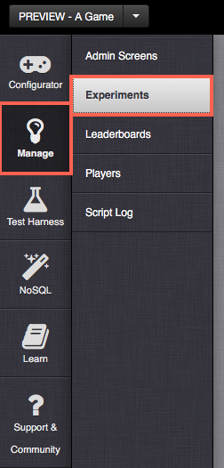
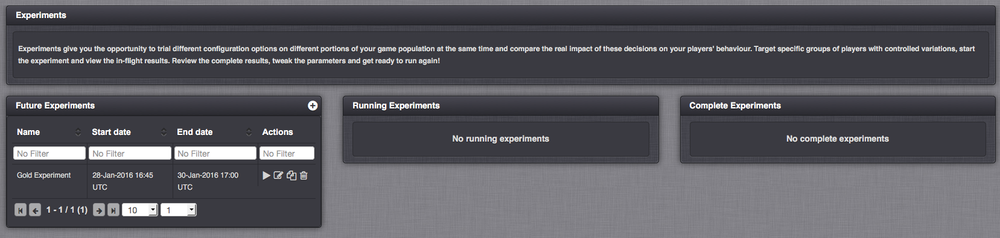
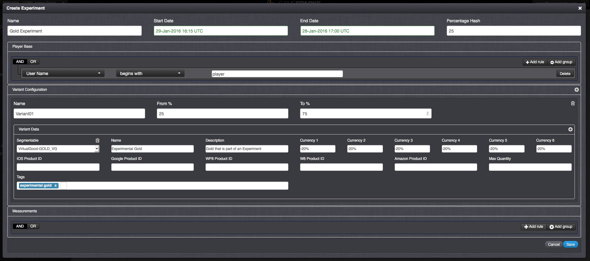
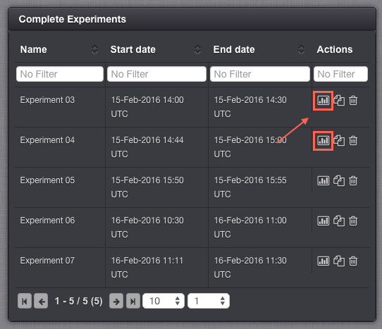
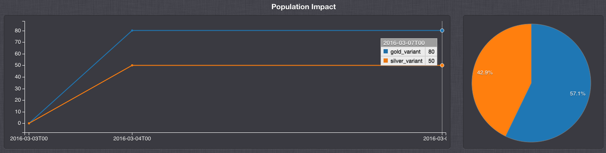
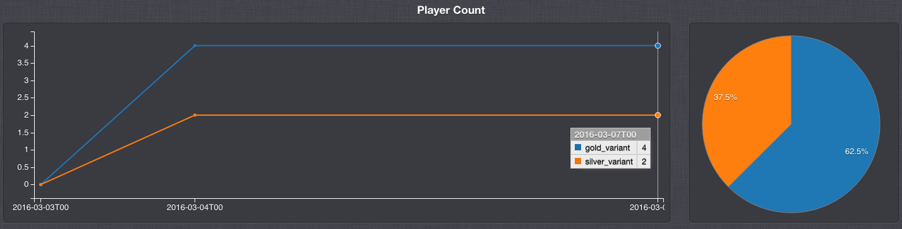

# Experiments
Experiments allow users to A/B test certain configuration changes on a selective range of Players within the game.  For example, a user could experiment with the costs of Virtual Goods for a small range of Players on the game for a specified period of time.  The costs could be increased or decreased marginally or drastically, to see how Players would respond to these changes.  This allows the user to fine-tune their configuration to make their Players more responsive to it.

## Creating Experiments
The Experiments feature lies within the Manage section, in the form of an Admin Screen.

The Experiments Screen is the main area where all Experiments are created and managed.  It consists of Future, Running and Complete Experiments.  As they are created in the Future Experiments section and scheduled to run, they move from left to right in the flow process until they are completed.

Adding a new Experiment brings up a new form:

The form is very detailed, but divided into sections – Configuration, Player Base, Variant Configuration and Measurements.

## Experiment Configuration

*Name* - The Name field is a mandatory field used to describe the Experiment but does not uniquely identify it.

*Start Date* – Start date and time for the Experiment to start.

*End Date* - Time and date for the Experiment to end.

*Percentage Hash* - This field is optional. If you supply it, the value is used as part of the hashing calculation when we determine which percentile each Player is randomly provided. The longer and more unique the value is, the higher likelihood that the randomisation of the Player and the percentile is.  For example, If you want to run two Experiments and be sure that the same Player for both the 1st and 2nd experiment has the same percentile, you should set this hash value to be the same on each experiment

<q>**Note:** We make a best effort to calculate the percentage ranges, however for smaller sample sets of players, you may not be returned the exact number of Players as anticipated.</q>

## Player Base Configuration

*User Query* - The search criteria required for Player results.
Variant Configuration

*Name* - A description of the variant.

*From/To %* - The percentile range of the Player results, from which the Experiment participants will be chosen.  For example, of the Players returned in the User Query results, those  assigned the 0 to 50 percentiles, are part of this variant of the Experiment.  Other variants could be created for 51 to 75 and 76 to 100, to maximize coverage of the Player results across all the variants of the Experiment.

*Variant Data* – Here, you can select the configuration that will be part of the Experiment.  You can give it a discernible name that will be visible only to those who are part of the Experiment, as well as the differing configuration values.

## Measurements

*Grouping Query* – We can define here how our Experiment results are measured based on the available groups relative to the result data.  For example, our measurements could be based on a request that we expect the Experimental Players to use.  If they have used it during the Experiment, we can see the percentage of users that were in the Experiment, and how many from each variant of the Experiment, submitted the request.

## Starting / Stopping Experiments
Experiments will either start at their scheduled time or can be started immediately using the Play button.  Similarly, they can also be stopped using the Stop button. NOTE:  Once Experiments have been created or have passed their Start Date, they cannot be edited.  They can, however, be modified up until that Start Date. All stopped or expired Experiments will move to the Complete section.

## Viewing the Results
Once your Experiment has completed, you can check the results of your Experiment and the impact it has had on the pool of Players who were affected by this Experiment:

The results page displays graphs which are based on the time duration of the running Experiment and how many Players interacted with the variants on that Experiment Screen:

This is shown in two different graphs:
* One which show both the impact of the Experiment on the entire Player population:

* A second which shows the number of Players that interacted with each variant on the Experiment:

