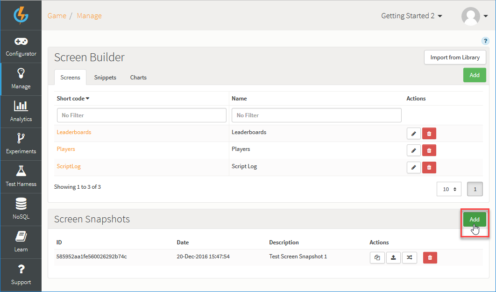
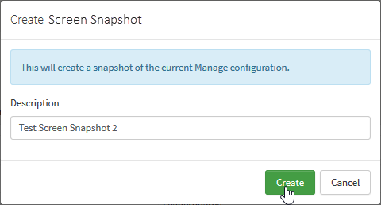
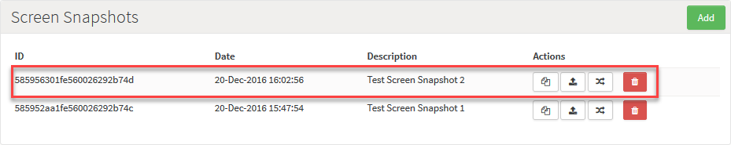
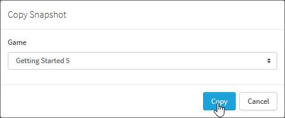
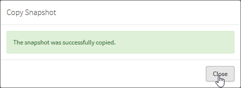
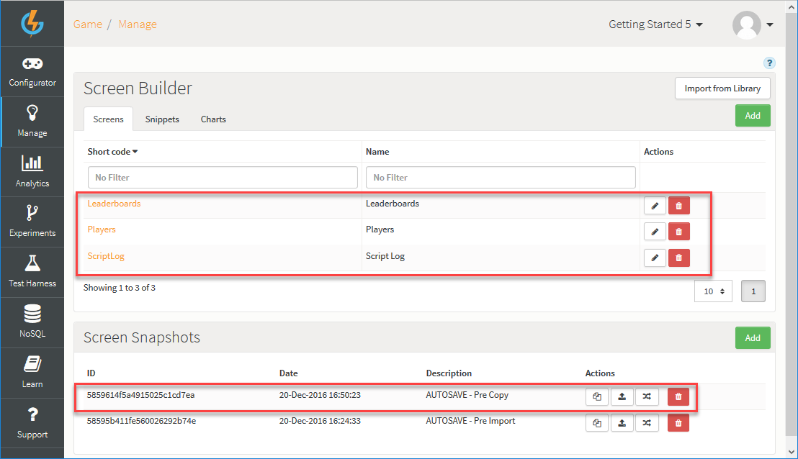
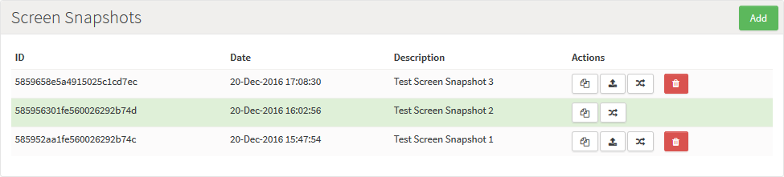
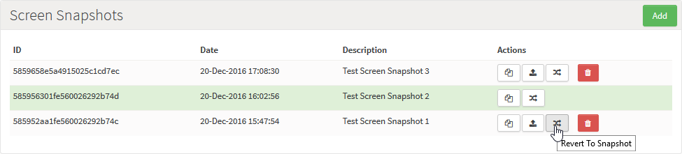
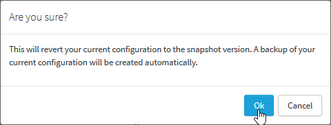
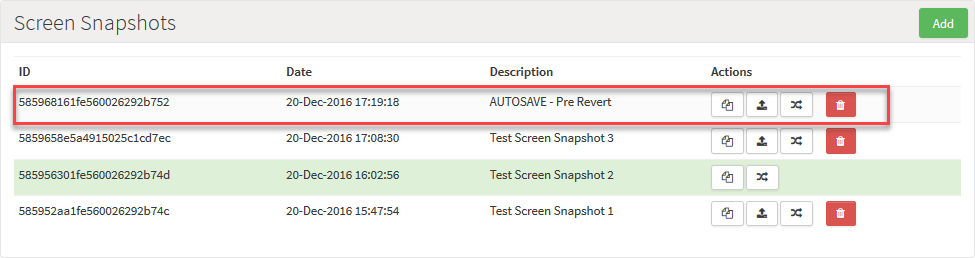

# Creating and Managing Screen Snapshots

In very much the same way that you can create and publish Snapshots of your game's entire configuration, you can create a *Screen Snapshot* of the configuration you have built up in the Manage section of the portal for your Screens, Snippets, and Charts. The *Screen Snapshot* feature is specifically designed to help you develop the set of Admin Screens and forms you need for your game management and monitoring purposes in the first instance, push these out to Live for your Live game, and then manage successive versions of Admins Screens through their lifecycle:
* It's important to note right away that the Manage configuration saved when you create a Screen Snapshot is kept *entirely separate and distinct* from the rest of the Game configuration - game configuration [Snapshots](/Documentation/Key Concepts/Snapshots.md) *do not contain* the Manage configuration. This separation of Manage configuration and game configuration brings clear advantages:
  * You might not yet have all of your Admin Screens up and running when you are ready to publish your game to Live and launch it - you can bring in your Admin Screens to Live later.
  * If you publish some Admin Screens to Live but then carry out further development on some of them, you can create a new Screen Snapshot and version-up your Admin Screens without being tied to the game's lifecycle - you don't have to wait for when you create a new game config Snapshot and publish that.
* When you have worked in Preview stage to create and configure some Admin Screens and now feel they are ready for the Live game environment, you simply create a Screen Snapshot and publish this to the Live stage servers.

This topic explains how to create and manage your Screen Snapshots.

## Adding a Screen Snapshot

*1.* Go to Manage>Admin Screens.

*2.* On the *Screen Snapshot* panel, click *Add*:

A *Create Screen Snapshot* dialog appears.

*3.* Enter a *Description* for the new *Screen Snapshot* and click *Create*:

The dialog closes and the new Screen Snapshot is added to the *Screen Snapshots* list:

Under *Actions* you can use these icon button options:

*  - [Copies](#Copying a Screen Snapshot) the Snapshot to another game.

<q>**Important!** Don't worry about overwriting the target game's Manage configuration. There is a fail-safe - a Screen Snapshot of the target game's previous Manage configuration version is automatically created (called *AUTOSAVE - Pre Copy*) before the copy occurs.</q>
*  - [Publishes](#Publishing a Screen Snapshot) the Manage configuration saved in the Screen Snapshot to the LIVE servers. The Screen Snapshot that is currently published is highlighted in green.
*  - [Reverts](Reverting to a Screen Snapshot) your Manage section to the configuration saved in the selected Screen Snapshot version. There is another fail-safe - a Snapshot of the previous version is automatically taken (called *AUTOSAVE - Pre Revert*).
*  - Deletes the Snapshot.

## Copying a Screen Snapshot

Many of the Admin Screens and their constituent Snippets and Charts that you have developed for one of your games might be of use in another game - even if you have to make some minor adjustments to the way they work and the data they show for the second game. The Screen Snapshot copy feature lets you quickly copy a saved version of your game's Manage configuration into another game's Manage section.

*1.* On the *Screen Snapshots* panel, click to copy  a Screen Snapshot. A *Copy Snapshot* dialog appears.

*2.* Use the *Game* drop-down to select the target game to which you want to copy the Screen Snapshot and click *Copy*:

When the copy process completes, you'll get a message.

*3.* Click to *Close* the message dialog:

*5.* Now open the target game you selected for the Screen Snapshot copy and navigate to *Manage>Admin Screens*:

Notice that:
* The configuration in the target game's Manage section for Screens, Snippets, an Charts has been replaced by the Manage configuration saved under the source game's Screen Snapshot.
* To preclude any unwanted loss of Screens, Snippets, or Charts, a *Pre Copy* Screen Snapshot of the target game's manage configuration has been automatically made. You can revert to this again should you need to.

## Publishing a Screen Snapshot

Publishing a Screen Snapshot places the Manage configuration saved in the Snapshot into the LIVE environment:

*1.* On the *Screen Snapshots* panel, click to publish  a Screen Snapshot. The Screen Snapshot is published and is highlighted in Green:

## Reverting to a Screen Snapshot

You might want to revert to earlier version of your Manage configuration which was saved under an earlier Screen Snapshot if you have accidentally removed some Manage configuration details or if something recently went wrong.

*1.* On the *Screen Snapshots* panel, click to revert  to an earlier Screen Snapshot:

A confirmation dialog appears:

*2.* Click *Ok* to continue with reverting to the Screen Snapshot.

<q>**Snapshot AUTOSAVE!** When you revert to a Screen Snapshot, your current Mange configuration is saved to create an automatic Screen Snapshot of everything as it was before the revert:</q>

