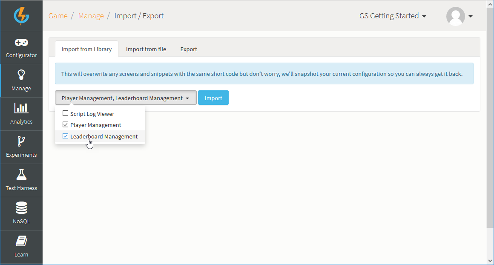
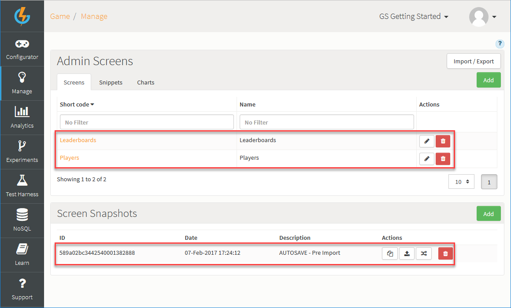

# Importing Screens from Library

The Gamesparks platform offers several pre-built management Screens, which you can import from a Screen library into your game. The Screens are designed to help you perform your core game management tasks:
* Player Management
* Leaderboard Management
* Script Log Viewer

These Screens have been built with ease of use and convenience very much in mind:
* User friendly, customizable, and provide you with very useful ways of visually searching for, accessing, and editing records.
* When you import a Screen, its constituent Snippets are imported along with it as a package.
* Working with the Screens requires no code-writing skills or ability to access and work with the NoSQL database, which means your non-dev team members can easily set-up and use them.

This topic shows you how to download any of the pre-configured Screens and introduces you to the functionality each Screen offers.

<q>**Player Profile Screen!** For a detailed account of importing and building a Player Profile Screen, check out this tutorial.</q>

## Importing a Pre-Built Screen

*1.* Go to *Manage>Admin Screens*. The *Manage* page opens.

*2.* Click *Import from Library*:

The *Import from Library* page opens.

*3.* Click the *Import* drop-down and select the Screens you want to import:

Here, we've selected to import the *Player Management* and *Leaderboard Management* Screens.

*4.* When you've selected the Screens you want click *Import*. When the import completes, you are taken back to the *Manage* page:

* The imported Screens are added to the *Screen Builder*.
* A Screens Snapshot has been automatically taken to safeguard any existing Screens configuration - if you had already created Screens with the same Short Codes as any imported Screens, these existing Screens will have been overwritten. You can revert to the Screen Snapshot at any time.

*5.* Select the *Snippets* tab:

* You'll see fourteen new Snippets have also been imported for the *Player Management* and *Leaderboard Management* Screens.

## The Screens

### Player Management

### Leaderboard Management

### Script Log Viewer

Etc.
