# Importing and Exporting Admin Screens

From *Manage>Admin Screens*, you can perform several useful import/export tasks to ensure you have just the Admin Screens and assets you need for your managing your game:
* [Import pre-built management screens](#Importing Screens from Library) from the Screens Library.
* [Import JSON format files](#Importing JSON Files) for additional Screen, Snippets, and Charts(Queries).
* [Export](#Exporting Screens Snippets and Charts) any of your Screens, Snippets, or Charts(Queries):

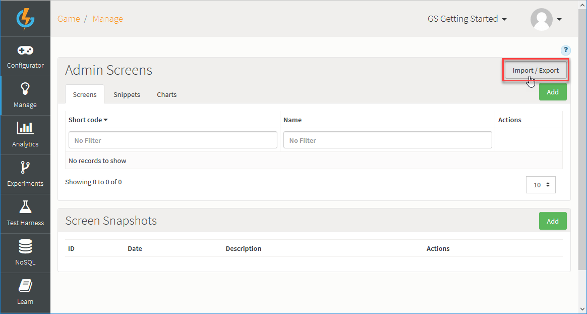

## Importing Screens from Library

The Gamesparks platform offers several pre-built management Screens, which you can import from a Screen library into your game. The Screens are designed to help you perform your core game management tasks:
* Player Management
* Leaderboard Management
* Script Log Viewer

These Screens have been built with ease of use and convenience very much in mind:
* User friendly, customizable, and provide you with very useful ways of visually searching for, accessing, and editing records.
* When you import a Screen, its constituent Snippets are imported along with it as a package.
* Working with the Screens requires no code-writing skills or ability to access and work with the NoSQL database, which means your non-dev team members can easily set-up and use them.

This topic shows you how to download any of the pre-configured Screens and introduces you to the functionality each Screen offers.

<q>**Player Profile Screen!** For a detailed account of importing and building a Player Profile Screen, check out this [tutorial](/Tutorials/Analytics and Game Management/Creating a Player Profile Screen.md).</q>

### Importing a Pre-Built Screen

*1.* Go to *Manage>Admin Screens*. The *Manage* page opens with the *Screens* tab selected.

*2.* Click *Import/Export*. The *Import/Export* page opens with the *Import from Library* tab selected.

*3.* Click the *Import* drop-down and select the Screens you want to import:

Here, we've selected to import the *Player Management* and *Leaderboard Management* Screens.

*4.* Click *Import*. When the import completes, you are taken back to the *Manage* page:

* The imported Screens are added to the *Screen Builder*.
* A Screens Snapshot has been automatically taken to safeguard any existing Screens configuration - if you had already created Screens with the same Short Codes as any imported Screens, these existing Screens will have been overwritten. You can revert to the Screen Snapshot at any time.

*5.* Select the *Snippets* tab:

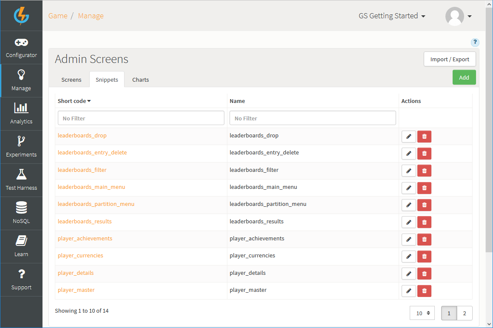

* You'll see that fourteen new Snippets have also been imported for the *Player Management* and *Leaderboard Management* Screens.
* If you import the *Script Log Viewer* screen, three Snippets will also be imported for this Screen.

*6.* Select the *Charts* tab:

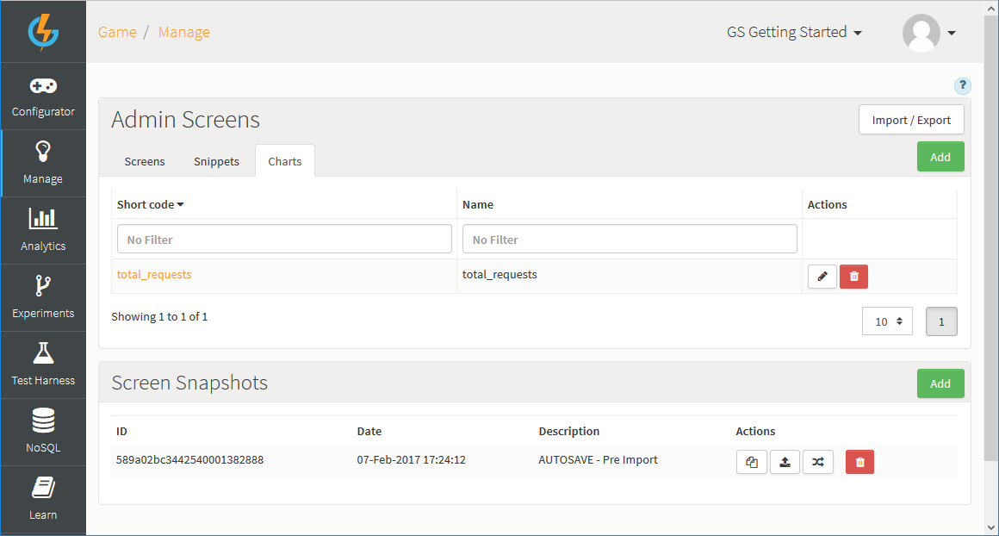

* You'll see the a new *total_requests* Chart also been imported for the *Player Management* Screen.

### The Screens

When you have imported a Screen from the library, you'll see it available for selection from the *Manage* menu:

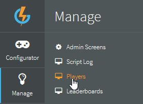

Imported library Screens and their supportive Snippets and Charts are designed for common game management and monitoring tasks and this section introduces each of the Screens. You can also modify and extend imported Screens, Snippets, and Charts to suit your own specific requirements - see [Working with Dynamic Forms](/Documentation/Manage/Working with Dynamic Forms.md).

#### Player Management

The *Player Management* Screen lets you build a search query for players and then bring up a Screen to show details of a player's profile for reviewing and editing.

*1.* Open the *Player Management* Screen, build a player search query and click *Submit*.

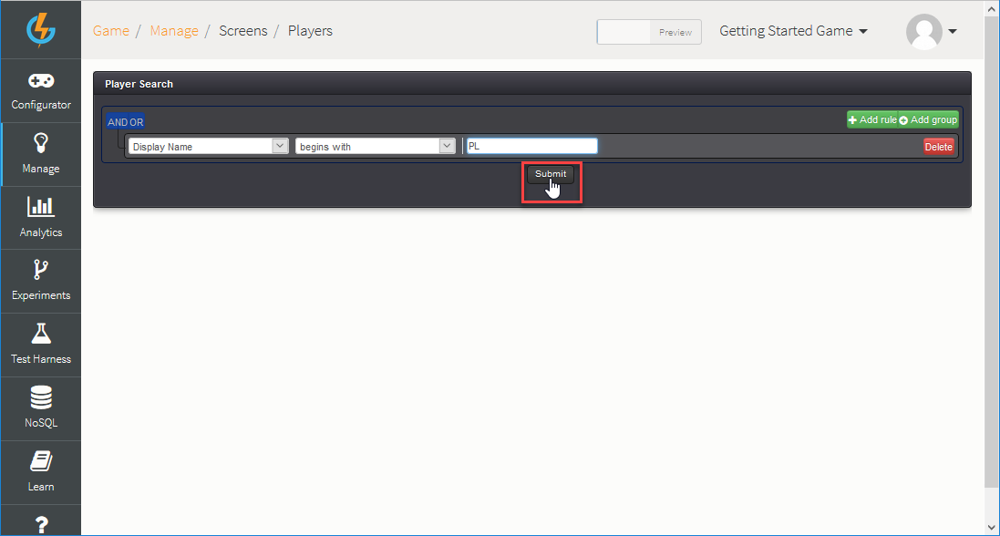

The players that satisfy your search query criteria are returned:

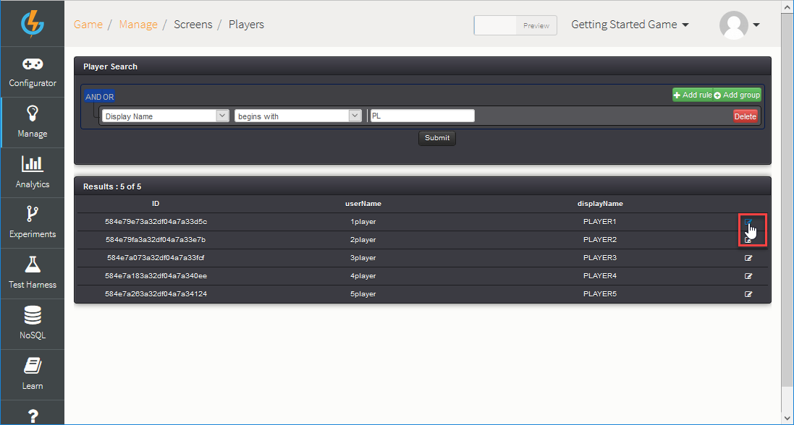

*2.* Click to view and edit  a player's details. An *Edit Player* Screen appears where you can review and edit various aspects of the player's profile.

<q>**More on this Screen?** For a fuller account of working with the *Player Management* Screen, see the [Player Profile Screen](/Tutorials/Analytics and Game Management/Creating a Player Profile Screen.md) tutorial.</q>

#### Leaderboard Management

The *Leaderboard Management* Screen allows you to view the Leaderboards in your game and review the ranking and entries on each Leaderboard.

*1.* Open the *Leaderboard Management* Screen. The Leaderboards are listed:

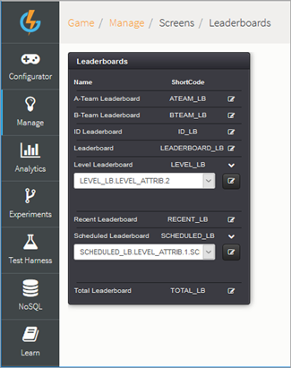

In this game, note that we have two partitioned Leaderboards which we can click to expand and use a drop-down to select for each partition - *Level Leaderboard* and *Scheduled Leaderboard*.

*2.* Click to view and edit  a Leaderboard:

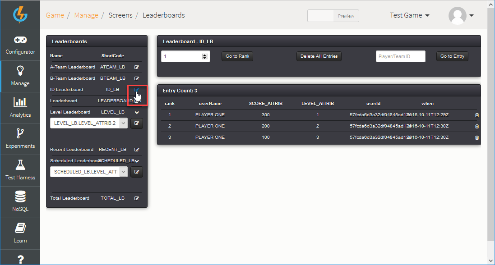

You can:
* Review the details for each entry on the Leaderboard.
* Enter a rank value and click to *Go To Rank*.
* Enter a player or Team ID and click *Go to Entry*.
* Delete individual entries.
* Click to *Delete All Entries*.

#### Script Log Viewer

You can use the *Script Log Viewer* Screen to search for and review the logs for your game.

<q>**Logging for Games?** For more details about logging, see [SparkLog](/API Documentation/Cloud Code API/Utilities/SparkLog.md).</q>

*1.* Open the *Script Log Viewer* Screen and build a log search query:

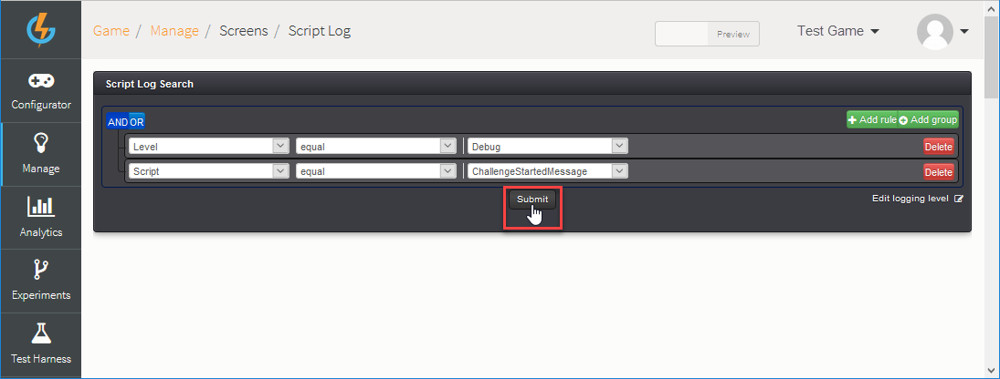

* You can click to *Edit logging level*.

In this example, we've built a query that searches for log entries at the *Debug* level against the *ChallengeStartedMessage* script.

*2.* Click *Submit*. The log entries for your game that satisfy the search query criteria are returned:

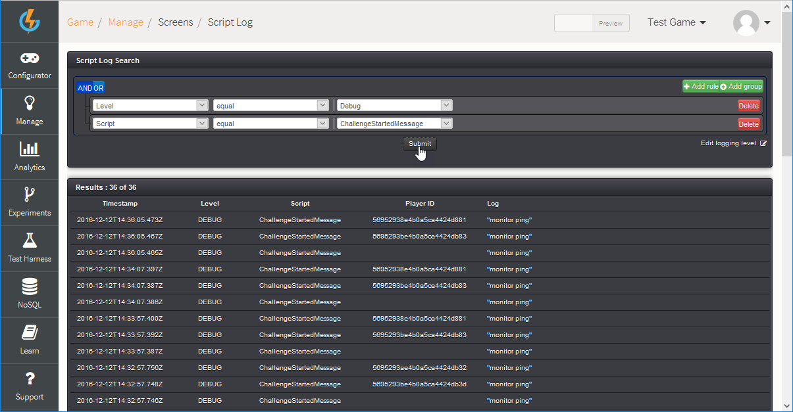

## Importing JSON Files

You can import Screen, Snippet, or Chart(Query) JSON format files. When you import a file, the file's content is unpacked and each part is saved as a Screen, Snippet, or Chart.

*1.* Go to *Manage>Admin Screens*. The *Manage* page opens with the *Screens* tab selected.

*2.* Click *Import/Export*. The *Import/Export* page opens with the *Import from Library* tab selected.

*3.* Select the *Import from file* tab.

*4.* Click the *Browse* button:

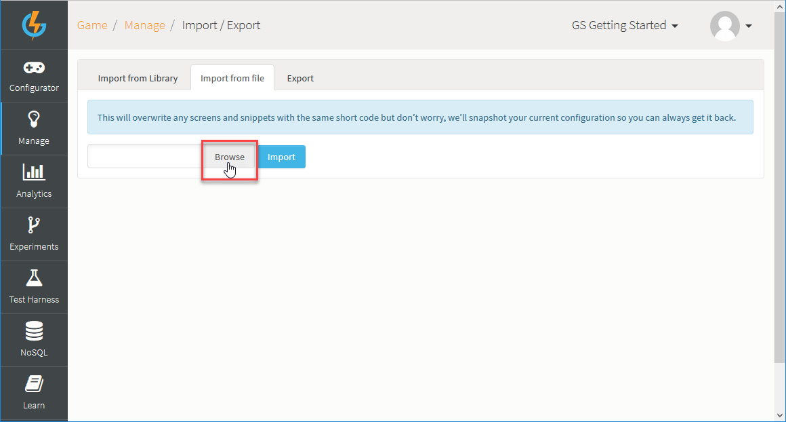

A *File Upload* browse dialog appears.

*5.* Navigate to the JSON file you want to import and click *Open*.

*6.* Click *Import*:

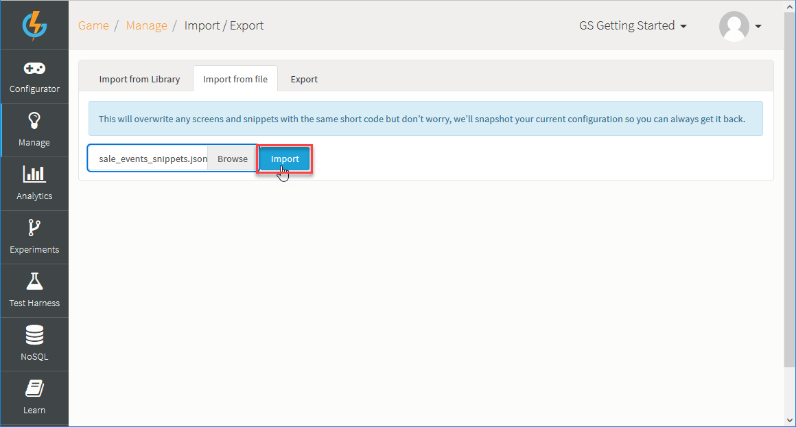

* In this example, we've selected to import a JSON file for a *Sales Events* Screen and its constituent Snippets. The import process checks the content of the imported file and on the basis of the JSON file's contents, creates the appropriate Screens, Snippets, or Charts.

*7.* When the Import process completes, you'll find the JSON file's contents in the relevant parts of the *Admin Screens* section. In this example, we find that the imported Sales Events file resulted in:
* A *Sales Events* Screen:

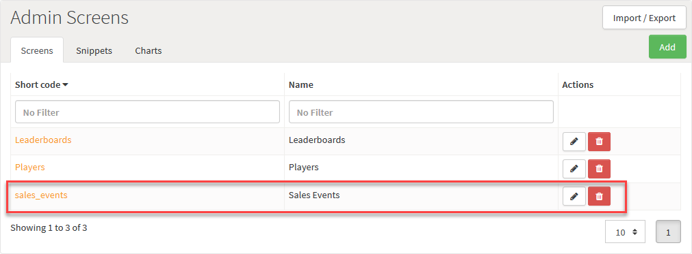

* Several *sales* Snippets:

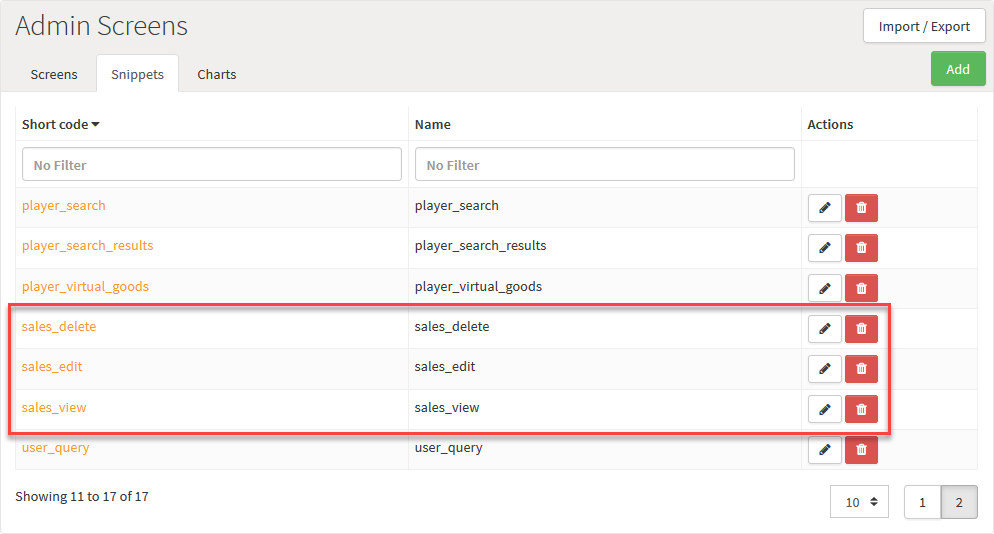

* No Charts were found in the imported JSON file.

## Exporting Screens Snippets and Charts

You can export your Screens, Snippets, or Charts and save the exported JSON files in a preferred location.

*1.* Go to *Manage>Admin Screens*. The *Manage* page opens with the *Screens* tab selected.

*2.* Click *Import/Export*. The *Import/Export* page opens with the *Import from Library* tab selected.

*3.* Select the *Export* tab:

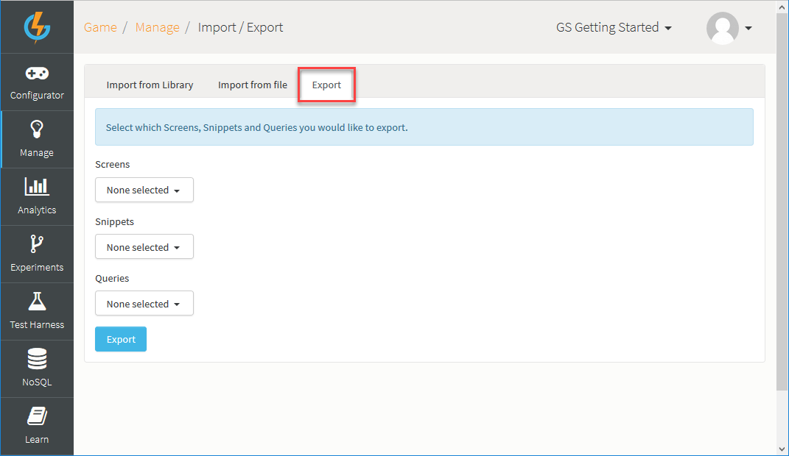

*4.* Use the drop-downs to select which Screens, Snippets, or Charts you want to export from your game:

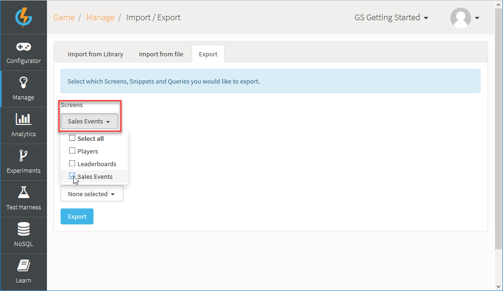

In this example, we've selected to export the *Sales Events* Screen but no Snippets or Charts.

*5.* Click *Export*. A dialog opens, which you can use to save the exported JSON file to a preferred location.
