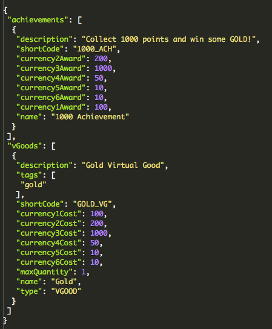

# Dynamic Forms

Since Dynamic Forms are very flexible in the way you implement them, there certainly isn't one right way of creating them. This tutorial provides an example of the preferred way of implementing Dynamic Forms, highlighting their key features. You don't need to finish the full tutorial and understand all of the concepts to begin developing Dynamic Forms. This tutorial highlights only the basic capabilities within Dynamic Forms and, as a working example, we'll create Dynamic Forms for the management of Players in our game.

Lastly, we give an example of how you can build pop-up behavior into a Snippet for use on your Dynamic Forms.

<q>**Important!** Before you start this tutorial, it's vital that you understand the [Dynamic Forms API](/API Documentation/Dynamic Forms API.md).</q>

## Basics of Dynamic Forms

This section covers:
* How to create a basic Screen and a Snippet.
* How to link a Screen and a Snippet together.

### Creating a Screen

Whenever you want to create a Dynamic Form, you should start with a Screen. A Screen is powered by the structure of Snippets that you create. You can have as many Screens as you want, however a Screen should have a meaningful name. In this section, we'll call the Screen we create *Tutorial Players*.

*1.* To create a Screen, navigate to *Manage > Admin Screens*:


In *Admin Screens*, you'll see that the screen is split between the *Snapshots* and *Screen Builder* panels:


#### Snapshots

The *Snapshots* panel works in a similar way to the *Snapshots* feature on the *Game Overview* page - you can use it to backup and restore the state of your created Screens and Snippets.

<q>**Note:** The *Screen Snapshots* you create here are separate and distinct from the *Game Snapshots* you create from the *Overview* page.</q>

#### Screen Builder
On the *Screen Builder*, there are three tabs:
* *Screens* - Create and configure Screens for your Dynamic Forms.
* *Snippets* - Create and configure Snippets for your Screens.
* *Charts* - Charts will not be covered here, instead you can find a separate tutorial on them [here](/Tutorials/Analytics, Segmentation and Game Management/Building Custom Analytics Dashboards.md).

<q>**Note:** There are three default Screens available when you create a game: *Leaderboards*, *Players*, and *Script Log*.</q>

*2.* On the *Screen Builder*, click the plus  icon. The *Create Screen* dialog appears:


Enter the details for the new Screen:
* *Name* - Mandatory field for the name of the Screen.
* *Short Code* - Mandatory field used to uniquely identify the Screen.
* *Groups* - Optional field to assign a pre-configured Group to the Screen to control which users have read/write permissions to the Screen. For more details, see [Capabilities and User Permissions](/Tutorials/Capabilities/README.md)

*3.* Click *Save*. When the Screen is created, it's added to the *Screen Builder* list and you'll see a new tab appear on the GameSparks *Manage* navigation bar:


<q>**No Screen Content?** If you click to open the new screen, the page will be blank. This is because you have not yet added any GSML to the Screen, rendered it, and saved the change. How to do this is covered in the next section.</q>

### Adding HTML/GSML to Screens

Here we'll open the default *Players* screen and put in some dummy GSML code and test that the output is rendered as expected.

*1.* On the *Screen Builder*, click the edit  icon. The *Screen Builder - Players* appears:


You'll see the GSML for this default Screen in the left panel.

*2.* Replace the GSML with this "Dummy Data" GSML:

```
<gs-title-block title="Test Title" padding="10">
This is Dummy Data
</gs-title-block>

```

*3.* Click the play  icon to render the GSML into the right panel and preview it:


*4.* Click *Save* to save the changes to your Screen. You'll get a *Saved!* confirmation.

*5.* Navigate to the updated *Players* Screen where you'll see the same rendered output:

  

<q>**Minimize Screen Logic!** As a rule of thumb, you'll want very little logic in the Screen itself, because it should only act as a placeholder and an initiator for the Snippets.</q>

### Creating a Snippet

Snippets contain the logic of how your Dynamic Forms behave. Snippets should have meaningful names and Short Codes because they are accessed by their Short Code. Following the design principle where Screens should contain as little logic as possible, we'll create a Snippet that will execute the same Dummy Data as the Screen we updated in the previous section.

*1.* On the *Players Screen > Screen Builder* select the Snippets tab.

*2.* Click the plus  icon. The *Create Snippet* dialog appears:


Enter the details for the new Snippet:
* *Name* - Mandatory field for the name of the Snippet.
* *Short Code* - Mandatory field used to uniquely identify the Snippet.
* *Groups* - Optional field to assign a pre-configured Group to the Snippet to control which users have read/write permissions to the Snippet. For more details, see [Capabilities and User Permissions](/Tutorials/Capabilities/README.md)

*3.* Click *Save* to save the new Snippet, which is added to the list on the *Snippets* tab.

### The Snippet Builder

*1.* On the *Snippets* tab, click the edit  icon for a *Snippet*. The *Snippet Builder* - here we'll edit *player_search*:


The *Snippet Builder* is divided into 4 quadrants:

**1** - The top-left quadrant is for JavaScript or Cloud Code that provides the logic and behavior of the Dynamic Form.

**2** - The top-right quadrant is for adding HTML/GSML or Handlebars code that renders the view.

**3** - The bottom-right quadrant is the preview panel where the Dynamic Form will be rendered when you click the  icon, including the logic provided by the JavaScript panel.

**4** - The bottom-left quadrant represents the JSON formatted response to the JavaScript / Cloud Code provided in the quadrant above it.

*2.* Edit the *Snippet* code using the same GSML that we set for the Players Screen previously. Put this in the top-right, *Handlebars* quadrant and save the changes.

<q>**Self-Contained Snippets!** Although there are many ways of writing the logic in Snippets, one of the more important things to consider when creating Snippets is that ideally they should be self-contained and not dependent on other Snippets. This logic will be explained in more detail later on.</q>

### Snippet Workflow

Before we begin to design and build our Snippets, it's important to understand the flow of their creation using the *Snippet Builder* and the preferred order of using the quadrants on the Builder.

We can define variables for input values entered onto the corresponding Screen, or Script Data that needs to be accessed using Cloud Code. But, which one do we use first?

The typical Snippet creation workflow breaks down into 4 steps:
* *Step 1* - **Create Snippet Script Data.** Normally, our first thought would be to know what Script Data the Snippet will require. Therefore, we'll typically start the creation of most Snippets using the JavaScript quadrant **1**:
* *Step 2* - **Check Scipt Data.** To ensure we are getting the right data that we require for the Snippet at this stage, we can preview the Cloud Code using the   icon. This will generate a JSON formatted response in the bottom-left JSON response quadrant **4**.
* *Step 3* - **Design Snippet Screen Presentation.** Once we are happy that we have all the required data for the Snippet, we can design how it will be presented to the Screen by adding the HTML / GSML code for the elements we want to see in quadrant **2**. Using Handlebars, we can also access and manipulate the data from the JSON response.
* *Step 4* - **Test Snippet Presentation.** To test all of this, we can use the   icon to preview the rendering of the Snippet in quadrant **3**.

However, this order may not always be the preferred way. For example, we might design a Screen using the Handlebars quadrant first, then realize we need to retrieve some more Script Data by then calling that information using the JavaScript quadrant. As mentioned earlier, there are many routes to creating Snippets.

### Linking the Screen to the Snippet

The next step is to remove the logic from the Screen itself, retaining only this code within the Snippet. Instead, we want to use the Players Screen to call the Snippet.

*1.* Select the *Screens* tab on the *Screen Builder*

*2.* Click the edit  icon for the *Players* Screen. *Screen Builder - Players* appears.

*3.* Remove the existing GSML code and replace it with this:

```
<gs-snippet snippet="player_search"></gs-snippet>

```

*4.* Click the Click the play  icon to render the GSML into the right panel and preview it:


The Screen no longer contains any logic. It simply calls the Snippet using the *<gs-snippet>* tag with the value pointing at the *player_search* Snippet. The content of the Screen is now determined by what we have built into the Snippet.

### Master Snippets

A Master Snippet is a Snippet that can hold multiple Snippets that both manipulate data and render forms. Typically, a Master Snippet is a collection of Snippets. It doesn't hold much logic of it's own, and merely serves as a container for other self-contained Snippets.

## Dynamic Forms Player Search

Now that we have seen how to build a Dynamic Form by creating Screens and linking them to Snippets, we'll run through a concrete example of how to build a Dynamic Form for searching players in a game.

### Players Screen

Our *Players* Screen will contain the code to execute the *player_search* Snippet as well as including a placeholder for the *player_results* Snippet that will serve as a target where we want to render our search results.

*1.* In the *Players Screen*, replace the following code with this:

```
<gs-row>
<gs-title-block title="Player Search" padding="10">
    <gs-row>
        <gs-snippet snippet="player_search"></gs-snippet>
    </gs-row>
</gs-title-block>
</gs-row>

<gs-row>
<gs-placeholder id="player__results"></gs-placeholder>
</gs-row>

```

The above code gives us two rows, one containing the yet-to-be-implemented Player Search title bar and another row that will contain the results of whatever our Snippets submit.

### player_search Snippet

This Snippet will be solely responsible for displaying the *gs-query* and passing on the query input to the next "processing" Snippet once the Submit button is pressed.

*2.* Replace the existing code in the *player_search* Snippet with the following:

```
<gs-form snippet="player_search_results" target="player__results">
<gs-snippet snippet="user_query"></gs-snippet>
    <gs-col width="12">
        <gs-submit>Submit</gs-submit>
    </gs-col>
</gs-form>
```

As seen above, the Snippet contains a form that will execute the *player_search_results* Snippet, and render it's output in the placeholder, *player_results*, which is also defined in our Screen. The Snippet also contains another Snippet executor for *user_query*. Running the Screen now would render the following output:  


We can see our Submit button, as well as an area with an undefined error. This is because our Snippet is trying to execute the *user_query* Snippet, which does not yet exist. It's important to implement Dynamic Forms this way, treating them as modular units that you can independently test before moving on and making them more complex. At this point, we know that we have a working *Players* Screen that executes a working *player_search* Snippet, which in turn tries to execute an undefined *user_query* Snippet.  

It's also worth noting that in the code, *user_query* is contained within a form, so whatever output the Snippet renders, it will be submitted together with the form.

### user_query Snippet

We now want to create a *user_query* Snippet which we referred to earlier in our *player_search* Snippet.

*3.* Create a *user_query* Snippet. This Snippet will contain the code for dynamically building a MongoDB query.  

Using the preferred order of the quadrants, we initially need to know what Script Data the Snippet will require. In our example, we know that we want to query what Achievements and Virtual Goods the players have for this particular game.  

To do this, we must first get a list of all the instances of a particular item using *Spark.getConfig()* and define that list within a local variable. Then, we have to set that list as Script Data, which can be modified using the HTML / GSML we wrote in the Handlebars quadrant.

*4.* Add the following to the JavaScript quadrant for the *user_query* Snippet:

```
Spark.setScriptData("config", SnippetProcessor(Spark.getData().scriptData))

function SnippetProcessor(data){

var form = {};

return view(data);

function view(data){

    var config = Spark.getConfig();

    // raw rules allow setting the view of user query
    var rawRules = data.rawRules;
    if(rawRules){
        form.rawRules = rawRules;
    }

    // if there are virtual goods add them to the form
    var vGoods = config.getVirtualGoods();
    if(vGoods && vGoods.length > 0){
        form.vGoods = vGoods;
    }

    // if there are achievements add them to the form
    var achievements = config.getAchievements();
    if(achievements && achievements.length > 0){
        form.achievements = achievements;
    }

    // if there are segments add them to the form
    var segments = config.getSegments();
    if(segments && segments.length > 0){
        form.segments = segments;
    }

    return form;
}
}
```

After previewing the results using the   icon, the Response JSON quadrant obtains the list of Achievements and Virtual Goods for the current game (if any), then passes them into Script Data, where later it can be accessed by the Handlebars quadrant.  
Here is the response from the code entered into the JavaScript quadrant, against a particular game:



We want to search for specific search criteria against the player. To do this, we can create a set of *<gs-query-field>* tags to hold the input data we provide to the Screen.

*5.* Enter the following code into the Handlebars quadrant of the Snippet Builder:

```
<gs-query name="gsUserQuery" rules="{{config.rawRules}}">

<gs-query-field id="_id"
                label="ID"
                type="oid"/>

<gs-query-field id="userName"
                label="User Name"
                type='string'
                operators="equal,begins_with,not_equal"/>

<gs-query-field id="displayName"
                label="Display Name"
                type='string'
                operators="equal,begins_with,not_equal"/>

<gs-query-field id="location.country"
                label="Country"
                type="country"/>

<gs-query-field id='lastSeen'
                label='Last Seen'
                type='date'/>

<gs-query-field id="pushRegistrations.deviceOS"
                label="Push Registration Type"
                type='string'
                values='{"IOS" : "IOS", "ANDROID" : "Android", "KINDLE" : "Kindle", "WP8" : "Windows Phone 8", "W8" : "Windows 8"}'/>

<gs-query-field id="pushRegistrations.pushId"
                label="Push Registration ID"
                type='string'/>

<gs-query-field id="externalIds.AM"
                label="Amazon ID"
                type='string'
                group="External IDs"
                operators="equal,exists,not_equal,not_exists"/>

<gs-query-field id="externalIds.FB"
                label="Facebook ID"
                type='string'
                group="External IDs"
                operators="equal,exists,not_equal,not_exists"/>

<gs-query-field id="externalIds.GP"
                label="Google Plus ID"
                type='string'
                group="External IDs"
                operators="equal,exists,not_equal,not_exists"/>

<gs-query-field id="externalIds.ST"
                label="Steam ID"
                type='string'
                group="External IDs"
                operators="equal,exists,not_equal,not_exists"/>

<gs-query-field id="externalIds.TW"
                label="Twitter ID"
                type='string'
                group="External IDs"
                operators="equal,exists,not_equal,not_exists"/>

{{#if config.vGoods}}
    {{#each config.vGoods}}
        <gs-query-field id="goods.{{shortCode}}"
                        label="{{name}}"
                        type='integer'
                        group="Virtual Goods"
                        operators="between,less,less_or_equal,greater,greater_or_equal,exists,not_exists"/>
    {{/each}}
{{/if}}

{{#if config.achievements}}
    <gs-query-field id="achievements"
                    label="Achievement"
                    group="Achievements"
                    type='string'
                    values='{ {{#each config.achievements}}"{{shortCode}}":"{{name}}" {{#unless @last}},{{/unless}} {{/each}} }'/>
{{/if}}

{{#if config.segments}}
    {{#each config.segments}}
        {{#if values}}
            <gs-query-field id="segments.{{shortCode}}"
                            label="{{name}}"
                            type='string'
                            group="Segments"
                            values='{ {{#each values}}"{{shortCode}}":"{{name}}" {{#unless @last}},{{/unless}} {{/each}} }'/>
        {{/if}}
    {{/each}}
{{/if}}

</gs-query>
```

The Achievement and Virtual Good Script Data that we retrieved earlier, will be passed onto the Handlebars quadrant, where we can manipulate our GSML based on it.  

At the bottom of the GSML, we use Handlebars helpers (*if*, *each* and *unless*) to dynamically update the query display. The Handlebars code checks if an Achievement, Virtual Good, or Segment exists and if so, iterates through each of them whilst refreshing the rendering of the GSML.

*6.* Save the changes to the *user_query* Snippet and select Preview .


The search feature is now complete.

*7.* Select the Players tab on the GameSparks Management navigation bar. This will display the following rendered output:


You can see that the *user_query* has been rendered within the form. This allows you to create form Snippets that you can re-use in any form.

### player_search_results Snippet

When we click the Submit button on the Players Screen, all the data input into the form that was built using *player_search* Snippet will be collected and passed to the *player_search_results* Snippet, which does not yet exist. As the target of the form is defined as *player_results*, the output of this Snippet will be rendered there. We can now test that the query we've built is submitted correctly into the *player_search_results* Snippet.

*8.* Create a new Snippet called *player_search_results* and enter the following into the JavaScript quadrant:

```
var query = Spark.data.scriptData.gsUserQuery;

Spark.setScriptData("query", JSON.stringify(query));
```

*Spark.data.scriptData.*{_variable_} allows us to access the variable that's been passed into the Snippet.  

<q>**Note:** At this point, because the *player_search* Snippet hasn't been executed on our Players Screen, the variable in the example above (gsUserQuery) is null. Previewing  the *user_query* Snippet at this point, would not produce any results.</q>  

*Spark.setScriptData* allows Script Data to be produced that will be later used in GSML / Handlebars code without requiring other Snippets to be executed.   

*9.* Enter the following into the Handlebars quadrant:

```
<gs-row>
<gs-title-block title="Query" padding="5">
Your query was: {{query}}
</gs-title-block>
</gs-row>
```

This will simply output a title block containing our query data.

*10.* Go to the *Players* Screen and submit a search. Note how we're accessing the data that was set in the JavaScript quadrant of the *player_search_results* Snippet, using the Handlebars notation *{{variable}}*:


Now that we've validated that our query is being passed in with the form into *player_search_results* Snippet, we should query the mongo database and display the results.

*11.* Add the following code to the JavaScript quadrant of the *player_search_results* Snippet:  

```
Spark.setScriptData("results", SnippetProcessor(Spark.getData().scriptData))

function SnippetProcessor(data){

var form = {};

return view(data);

function view(data){

    // query from the query builder
    var query = data.gsUserQuery;

    var playerCollection = Spark.systemCollection("player");
    // total count of players matching query
    var count = playerCollection.count(query);
    // limit of results returned
    var limit = 50;

    form.count = count;
    // find and return id, userName and displayName of the players matching query
    form.players = playerCollection.find(query, {"userName" : 1, "displayName" : 1}).limit(limit);

    // if count is lower that the limit
    if(count < limit){
        form.limit = count;
    } else{
        form.limit = limit;
    }

    return form;
}
}

```

*playerCount* will contain the count of how how many records matched our query.  

*results* will have all of the data associated with each player that matched the query, limited to 5 search results for the tutorial.  

*12.* Append the following GSML code to the *player_search_results* Handlebars quadrant:

```
<gs-title-block title="Results : {{results.limit}} of {{results.count}}">
{{#if results.players}}
<gs-row>
    <b>
    <gs-row>
        <gs-col width="3">ID</gs-col>
        <gs-col width="4">userName</gs-col>
        <gs-col width="4">displayName</gs-col>
    </gs-row>
    </b>
    {{#each results.players}}
        <hr/>
        <gs-row>
            <gs-col width="3">{{_id.$oid}}</gs-col>
            <gs-col width="4">{{userName}}</gs-col>
            <gs-col width="4">{{displayName}}</gs-col>
            <gs-col width="1"><gs-link snippet="player_master?playerId={{_id.$oid}}" target="modal-large"><i class="icon-edit"/></gs-link></gs-col>
        </gs-row>
    {{/each}}
</gs-row>
{{/if}}
</gs-title-block>
```

*13.* Go to the *Players* Screen and submit another search.

The above code will display the number of records that were found, and if there are any results, it will iterate through them displaying basic information and adding a link to each of the results:   


When the link is clicked, it will execute the yet-to-be-implemented *player_master* Snippet, passing in the PlayerId of that player and rendering the results from the Snippet in a wide modal form.  

### player_master Snippet

*14.* Create a new Snippet called *player_master* and enter the following into the JavaScript quadrant:  

```
Spark.setScriptData("form", SnippetProcessor(Spark.getData().scriptData))

function SnippetProcessor(data){

var form = {};

return view(data);

function view(data){

    form.player = Spark.systemCollection("player").findOne({"_id" : {"$oid" : data.playerId}}, {"userName" : 1, "displayName" : 1});

    return form;
}
}
```

We could pass in the userName of the player from the *player_search_results* Snippet, however typically it's best practice to pass in as little data as possible into the Snippet and make it self-contained. This allows re-use of the Snippet in different Dynamic Forms without requiring any changes to be made in the code.  

*15.* Enter the following GSML code into the Handlebars quadrant:

```
<gs-row>
<gs-col width="12">
    <gs-title-block title="Edit Player - {{form.player._id.$oid}} - {{form.player.userName}}" margin="0" padding="10">

        <gs-row>
            <gs-col width="3">
                <gs-placeholder id="details__{{form.player._id.$oid}}">
                    <gs-snippet snippet="player_details?action=view&playerId={{form.player._id.$oid}}"></gs-snippet>
                </gs-placeholder>        
            </gs-col>

            <gs-col width="3">
                <gs-placeholder id="achievements__{{form.player._id.$oid}}">
                    <gs-snippet snippet="player_achievements?action=view&playerId={{form.player._id.$oid}}"></gs-snippet>
                </gs-placeholder>        
            </gs-col>

            <gs-col width="3">
                <gs-placeholder id="virtual__goods__{{form.player._id.$oid}}">
                    <gs-snippet snippet="player_virtual_goods?action=view&playerId={{form.player._id.$oid}}"></gs-snippet>
                </gs-placeholder>        
            </gs-col>

            <gs-col width="3">
                <gs-placeholder id="currencies__{{form.player._id.$oid}}">
                    <gs-snippet snippet="player_currencies?action=view&playerId={{form.player._id.$oid}}"></gs-snippet>
                </gs-placeholder>        
            </gs-col>
        </gs-row>

    </gs-title-block>
</gs-col>
</gs-row>

```

The *player_master* Snippet contains 4 other Snippets (*player_details*, *player_achievements*, *player_virtual_goods* and *player_currencies*) and their respective placeholders wrapped around them. The Snippets will target these placeholders, re-rendering them after an update is made:  


### player_currencies Snippet

This Snippet is responsible for displaying the currencies for the given player.  

First we will need to obtain the Currencies for the player and set them into the scriptData.  

*16. *Create a new Snippet called *player_currencies* and enter the following Cloud Code into the JavaScript quadrant:

```
Spark.setScriptData("currencies", SnippetProcessor(Spark.getData().scriptData))

function SnippetProcessor(data){

var form = {};
// load player for view/edit
var playerId = data.playerId;
var player = Spark.loadPlayer(playerId);

return view(data);

function view(data){

    //get form data for view
    form.playerId = playerId;

    // get balance for each currency
    form.currency1 = player.getBalance1();
    form.currency2 = player.getBalance2();
    form.currency3 = player.getBalance3();
    form.currency4 = player.getBalance4();
    form.currency5 = player.getBalance5();
    form.currency6 = player.getBalance6();

    return form;
}
}
```

When the Currencies are set we can then display them using GSML.  

*17.* Enter the following GSML into the Handlebars quadrant:

```
<gs-form snippet="player_currencies?action=update&playerId={{currencies.playerId}}" target="currencies__{{currencies.playerId}}">
<gs-title-block title="Currencies" padding="5" height="250">
    <gs-row>
        <gs-col width="2">
            C1
        </gs-col>
        <gs-col width="4">
            <input name="currency1" type="number" min="0" value="{{currencies.currency1}}"/>
        </gs-col>
        <gs-col width="2">
            C2
        </gs-col>
        <gs-col width="4">
            <input name="currency2" type="number" min="0" value="{{currencies.currency2}}"/>
        </gs-col>
    </gs-row>
    <br/>
    <gs-row>
        <gs-col width="2">
            C3
        </gs-col>
        <gs-col width="4">
            <input name="currency3" type="number" min="0" value="{{currencies.currency3}}"/>
        </gs-col>
        <gs-col width="2">
            C4
        </gs-col>
        <gs-col width="4">
            <input name="currency4" type="number" min="0" value="{{currencies.currency4}}"/>
        </gs-col>
    </gs-row>
    <br/>        
    <gs-row>
        <gs-col width="2">
            C5
        </gs-col>
        <gs-col width="4">
            <input name="currency5" type="number" min="0" value="{{currencies.currency5}}"/>
        </gs-col>
        <gs-col width="2">
            C6
        </gs-col>
        <gs-col width="4">
            <input name="currency6" type="number" min="0" value="{{currencies.currency6}}"/>
        </gs-col>
    </gs-row>
    <br/>
    <gs-row>
        <gs-col width="7" offset="1">
            {{#if currencies.updated}}<gs-alert type="success" message="Saved!"></gs-alert>{{/if}}
        </gs-col>
        <gs-col width="4">
            <gs-submit>Save Changes</gs-submit>
        </gs-col>
    </gs-row>

</gs-title-block>
</gs-form>
```

As seen above, the Snippet is built as a form and is submitted to the placeholder that was set in *player_master.* It passes in an additional variable, *action* which is set to *edit*. We can now edit our *player_currencies* JavaScript to detect if this variable has been passed, and if so, edit the values and refresh the Snippet.  

*18.* Replace the Cloud Code in the *player_currencies* Snippet JavaScript quadrant with the following:

```
Spark.setScriptData("currencies", SnippetProcessor(Spark.getData().scriptData))

function SnippetProcessor(data){

var form = {};
// load player for view/edit
var playerId = data.playerId;
var player = Spark.loadPlayer(playerId);

switch(data.action){
    case "view":
        return view(data);
    case "update":
        update(data);
        return view(data);
}

function view(data){

    //get form data for view
    form.playerId = playerId;

    // get balance for each currency
    form.currency1 = player.getBalance1();
    form.currency2 = player.getBalance2();
    form.currency3 = player.getBalance3();
    form.currency4 = player.getBalance4();
    form.currency5 = player.getBalance5();
    form.currency6 = player.getBalance6();

    return form;
}

function update(data){

    // credit or debit ( if getDifference is negative ) the player
    player.credit1(getDifference(player.getBalance1(), data.currency1));
    player.credit2(getDifference(player.getBalance2(), data.currency2));
    player.credit3(getDifference(player.getBalance3(), data.currency3));
    player.credit4(getDifference(player.getBalance4(), data.currency4));
    player.credit5(getDifference(player.getBalance5(), data.currency5));
    player.credit6(getDifference(player.getBalance6(), data.currency6));

    form.updated = true;
}

// gets the difference between current balance and the one to set
function getDifference(balance, toSet){

    var toSetInt = parseInt(toSet);
    return toSetInt - balance;
}
}
```

The code above will check if the action has been performed, and, if so, it will edit the currencies that were passed in.  

*19.* Go back to the *Players* Screen, run the search, choose a result and ensure that the *player_currencies* placeholder has been populated:  


*player_virtual_goods, player_achievements, player_details Snippets*

The remaining three Snippets behave just like the *player_currencies* Snippet, in that they all obtain their own respective Script Data that is required to be displayed for that particular player.  They then allow the editing of that data, by invoking themselves with additional variables and finally rendering the changes in the placeholders which are located within the *player_master* Master Snippet.   

<q>**Congratulations!** If you have successfully followed everything up to this point, you should have a firm understanding of the Dynamic Forms workflow.</q>   

The following steps are the final portions of code to be entered for the remaining Snippets that will fill the placeholders for the *player_master* Master Snippet.  

*20.* Enter the following Cloud Code into the JavaScript quadrant for the *player_virtual_goods* Snippet:

```
Spark.setScriptData("form", SnippetProcessor(Spark.getData().scriptData))

function SnippetProcessor(data){

var form = {};
// load player for view/edit
var playerId = data.playerId;
var player = Spark.loadPlayer(playerId);
var listVirtualGoodsRequest = new SparkRequests.ListVirtualGoodsRequest();
var response = Spark.sendRequestAs(listVirtualGoodsRequest, playerId);

switch(data.action){
    case "view":
        return view(data);
    case "update":
        update(data);
        return view(data);
}

function view(data){

    //get form data for view
    form.playerId = playerId;

    var aggregatedVGoods = [];

    for(var i in response.virtualGoods){

        var virtualGood = response.virtualGoods[i];
        var max = virtualGood.maxQuantity;

        // if no maxQty is set use 100
        if(!max){
            max = 100;
        }

        aggregatedVGoods.push({name:virtualGood.name, shortCode:virtualGood.shortCode, owned:player.hasVGood(virtualGood.shortCode), max:max});
    }

    form.aggregatedVGoods = aggregatedVGoods;

    return form;
}

function update(data){

    // check and set each virtual good
    for(var i in response.virtualGoods){

        var virtualGood = response.virtualGoods[i].shortCode;

        if(data[virtualGood]){
            setVGoods(virtualGood, player.hasVGood(virtualGood), data[virtualGood]);
        }
    }
    form.updated = true;
}

// gets the difference between owned and new virtual goods
// then adds or removes accordingly
function setVGoods(shortCode, owned, toSet){

    var toSetInt = parseInt(toSet);

    if(toSetInt > owned){

        var toAdd = toSetInt-owned;
        player.addVGood(shortCode, toAdd);

    } else if(toSetInt < owned){

        var toRemove = owned-toSetInt;
        player.useVGood(shortCode, toRemove);
    }
}
}
```

*21.* Enter the following GSML into the Handlebars quadrant for the *player_virtual_goods* Snippet:

```
<gs-form snippet="player_virtual_goods?action=update&playerId={{form.playerId}}" target="virtual__goods__{{form.playerId}}">
<gs-title-block title="Virtual Goods" padding="5" height="250">
    {{#if form.aggregatedVGoods}}
        {{#each form.aggregatedVGoods}}
            <gs-row>
                <gs-col width="5">{{name}}</gs-col>
                <gs-col width="7"><input name={{shortCode}} type="number" min="0" max="{{max}}" value="{{owned}}"/></gs-col>
            </gs-row>
            <br/>
        {{/each}}
        <gs-row>
            <gs-col width="7" offset="1">
                {{#if form.updated}}<gs-alert type="success" message="Saved!"></gs-alert>{{/if}}
            </gs-col>
            <gs-col width="4">
                <gs-submit>Save Changes</gs-submit>
            </gs-col>
        </gs-row>
    {{else}}
        <gs-row>
            <b>The game doesn't have any Virtual Goods.</b>
        </gs-row>
    {{/if}}
</gs-title-block>
</gs-form>
```

*22.* Enter the following Cloud Code into the JavaScript quadrant for the *player_achievements* Snippet:

```
Spark.setScriptData("form", SnippetProcessor(Spark.getData().scriptData))

function SnippetProcessor(data){

var form = {};
// load player for view/edit
var playerId = data.playerId;
var player = Spark.loadPlayer(playerId);

switch(data.action){
    case "view":
        return view(data);
    case "update":
        update(data);
        return view(data);
}

function view(data){

    //get form data for view
    form.playerId = playerId;
    // list achievements for the player
    var listAchievementsRequest = new SparkRequests.ListAchievementsRequest();

    var response = Spark.sendRequestAs(listAchievementsRequest, playerId);
    var earnedAchievements = [];
    var unearnedAchievements = [];

    for(var i in response.achievements){

        var achievement = response.achievements[i];

        // if the player has this achievement add it to the earnedAchievements list
        if(achievement.earned == true){
            earnedAchievements.push({name: achievement.name, shortCode: achievement.shortCode});
            // else add it to the unearnedAchievements list
        } else{
            unearnedAchievements.push({name: achievement.name, shortCode: achievement.shortCode});
        }
    }

    // add the achievements to the form
    form.earnedAchievements = earnedAchievements;
    form.unearnedAchievements = unearnedAchievements;

    return form;
}

function update(data){

    // get the achievement to add or remove
    var addAchievement = data.unearnedAchievements;
    var removeAchievement =data.deleteShortCode;

    // add the achievement
    if(addAchievement != null){
        player.addAchievement(addAchievement);
    }

    // remove the achievement
    if(removeAchievement != null){
        player.removeAchievement(removeAchievement);
    }

    // flag the form as updated
    form.updated = true;
}
}
```

*23.* Enter the following GSML into the Handlebars quadrant for the *player_achievements* Snippet:

```
<gs-title-block title="Achievements" padding="5" height="250">
<gs-form snippet="player_achievements?action=update&playerId={{form.playerId}}" target="achievements__{{form.playerId}}">

    <gs-row>
        <b>
        <gs-col width="10" align="left">Earned</gs-col>
        </b>
    </gs-row>

    {{#each form.earnedAchievements}}
        <gs-row>
            <gs-col width="10" align="left">{{name}}</gs-col>
            <gs-col width="2">
                <gs-link snippet="player_achievements?action=update&deleteShortCode={{shortCode}}&playerId={{../form.playerId}}" target="achievements__{{../form.playerId}}">
                    <i class="icon-trash"/>
                </gs-link>
            </gs-col>
        </gs-row>
        <hr/>
    {{/each}}

    <br/>
    {{#if form.unearnedAchievements.length}}
        <gs-row>
            <b>
            <gs-col width="10" align="left">Unearned</gs-col>
            </b>
        </gs-row>
        <gs-row>
            <gs-col width="10">
                <select name="unearnedAchievements" class="input-block-level">
                    {{#each form.unearnedAchievements }}
                        <option value={{shortCode}}>{{name}}</option>
                    {{/each}}
                </select>
            </gs-col>
            <gs-col width="2">
                <gs-submit>
                    <i class="icon-plus"></i>
                </gs-submit>
            </gs-col>
        </gs-row>
    {{else}}
        <gs-row>
            <b>
            <gs-col width="10">All Achievements Earned</gs-col>
            </b>
        </gs-row>
    {{/if}}

</gs-form>

{{#if form.updated}}
    <gs-snippet snippet="player_currencies?action=view&playerId={{form.playerId}}" target="currencies__{{form.playerId}}"></gs-snippet>
    <gs-snippet snippet="player_virtual_goods?action=view&playerId={{form.playerId}}" target="virtual__goods__{{form.playerId}}"></gs-snippet>
{{/if}}

</gs-title-block>
```

*24.* Enter the following Cloud Code into the JavaScript quadrant for the *player_details* Snippet:

```
Spark.setScriptData("player", SnippetProcessor(Spark.getData().scriptData))

function SnippetProcessor(data){

var form = {};
// load player for view/edit
var playerId = data.playerId;
var player = Spark.loadPlayer(playerId);

switch(data.action){
    case "view":
        return view(data);
    case "update":
        update(data);
        return view(data);
}

function view(data){

    //get form data for view
    form.playerId = playerId;
    form.userName = player.getUserName();
    form.displayName = player.getDisplayName();
    form.isHidden = player.isHiddenOnLeaderboards();

    return form;
}

function update(data){

    //create a ChangeUserDetails request
    var changeUserDetailsRequest = new SparkRequests.ChangeUserDetailsRequest();

    var newUserName = data.userName;
    var newDisplayName = data.displayName;
    var hidden = data.hidden;

    // check that old username doesn't match the new one
    if(player.getUserName() != newUserName){
    changeUserDetailsRequest.userName = newUserName;
    }

    changeUserDetailsRequest.displayName = newDisplayName;

    var response = Spark.sendRequestAs(changeUserDetailsRequest, playerId);

    // if ChangeUserDetails response contained an error
    if(response.error != null){
        form.error = JSON.stringify(response.error);
    } else{
        // set leaderboard visibility for the player
        if(hidden == "on"){
            player.hideOnLeaderboards();
        } else{
            player.showOnLeaderboards();
        }

        form.success = true;
    }

    form.updated = true;   
}
}
```

*25.* Enter the following GSML into the Handlebars quadrant for the *player_details* Snippet:

```
<gs-form snippet="player_details?action=update&playerId={{player.playerId}}" target="details__{{player.playerId}}">
<gs-title-block title="Player Details" padding="5" height="250">

    <gs-row>
        <gs-col width="4">
            ID
        </gs-col>
        <gs-col width="8">
            <input value="{{player.playerId}}" type="text" required name="playerId" disabled/>
        </gs-col>
    </gs-row>
    <br/>
    <gs-row>
        <gs-col width="4">
            User Name
        </gs-col>
        <gs-col width="8">
            <input value="{{player.userName}}" type="text" required name="userName"/>
        </gs-col>
    </gs-row>
    <br/>
    <gs-row>
        <gs-col width="4">
            Display Name
        </gs-col>
        <gs-col width="8">
            <input value="{{player.displayName}}" type="text" required name="displayName"/>
        </gs-col>
    </gs-row>
    <gs-row>
        <gs-col width="4">
            Hide On Leaderboards
        </gs-col>
        <gs-col width="8">
            <input rel="confirm-check" type="checkbox" name="hidden" id="hidden" class="checky" {{#compare player.isHidden "==" true}}checked{{/compare}} />
			<label for="hidden" class="checky"><span></span></label>
        </gs-col>
    </gs-row>
    <gs-row>
        <gs-col width="7" offset="1">
        {{#if player.updated}}
            {{#if player.success}}
                <gs-alert type="success" message="Saved!"></gs-alert>
            {{else}}
                <gs-alert type="error" message="{{error}}"></gs-alert>
            {{/if}}
        {{/if}}
        </gs-col>
        <gs-col width="4">
            <gs-submit>Save Changes</gs-submit>
        </gs-col>
    </gs-row>

</gs-title-block>
</gs-form>
```

The complete *player_master* Master Snippet with all sub-Snippets:


## Dynamic Forms - Pop-Up example

*1.* First, we have a snippet called *popup_bttn_view* with a button where we can call this popup modal. Here we send the variable *action=view* to the *popup_example* snippet when the button is pressed:

```

<gs-link snippet="popup_example?action=view" target="modal-small">
    <button>Show Popup</button>
</gs-link>

```


*2.* Then in the snippet called *popup_example* we use that variable to let the pop-up snippet know when to show the pop-up and when to go back to the last screen


*3.* We can follow the steps for this snippet:


1. We sent *action=view* from the previous screen, so we can check this in a switch-case to see if we should view or exit the pop-up.
2. If there is other data you want to send with the form, you can do that in the view method.
3. In html we use handlebars to check if *exit* was sent in the form and, if not, we draw a simple title with some text and a button.
4. The button triggers the same snippet, only this time we pass in the *action=exit* and the target is our original placeholder screen.
5. The snippet runs again, only instead of view, we'll run the exit method which adds the exit variable to the form.
6. Now when we run the html we close the modal and bring up the last screen again.
