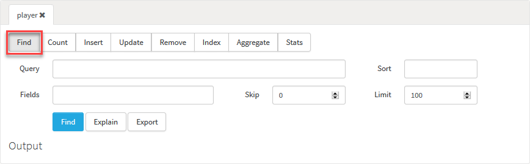
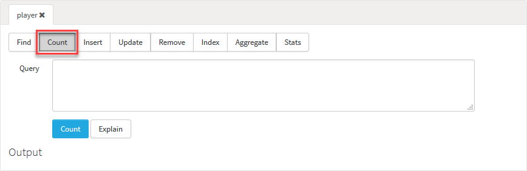
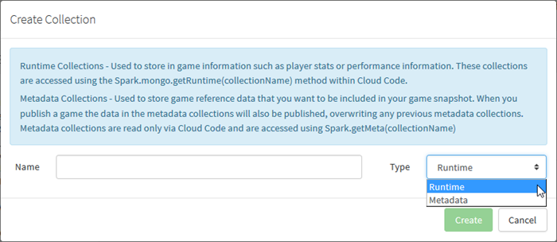
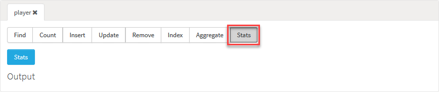

# NoSQL Explorer

## Introduction

From the *NoSQL* tab you have the ability to interact with the data stored on the platform.

When you open the *NoSQL Explorer*, there are two main things to note:
* Do you want to work with your game's PREVIEW stage or LIVE stage Mongo database?
* What operation do you want to perform against the database collections?

### PREVIEW Stage or LIVE Stage Database?

Each game has its own *PREVIEW stage* Mongo database. If you've taken a game Snapshot and published the game to LIVE stage, the game will also have a *LIVE stage* Mongo database:
* The PREVIEW stage and the LIVE stage Mongo databases are *entirely distinct and separate databases*.
* You can select the database you wish to look at from the drop-down in the top-left of the page. In the example above, only one game - *Test Game 1* - has been published to LIVE.

### What Database Collection Operation?

The *Actions* panel contains a series of tabs, each of which represents the different operations you can perform against the data in the selected Mongo database. See below for a detailed account of how to work with these tabs.

## Using Collection Drop-Down Menu Filtering

You can use the *Collection* drop-down on each *Actions* tab to select from the list of Collections that are available in your database. If the Collections list is a long list, you can use filter switches to turn on and off sections of the Collections list and make things more manageable.

You can also filter the Collection list by starting to type the name of the Collection you want in the text entry field at the top of the drop-down. The list is dynamically updated as you type:

## Working with the Output Panel

The results for the operations you perform against a database Collection are returned into the *Output* panel - you can click *Find* or *Explain* to get results. For example, here is the result for *Explain* for the *Find* tab:

When the panel loads, the result is single-line formatted. You can click in the panel to re-format the result into a standard form:

Click the clear  icon to clear out the content of the *Output* panel.

## Actions

When you've selected the correct DB you can select one of the tabs in the *Actions* section: *Find*, *Count*, *Insert*, *Update*, *Remove*, *Index*, *Aggregate*, *Create*, *Drop*, and *Stats*.

### Find

[MongoDB Find Manual](http://docs.mongodb.org/manual/reference/method/db.collection.find)

From the *Find* tab you can execute queries against Collections:
* If you have existing Mongo experience, the Find form builds a db.<collection>.find(<query>, <fields>).sort(<sort>).limit(<limit>).skip(<skip>) command based on the data populated in the form fields:

* *Collection* : Select the Collection you want to query.
* *Query* : The query you want to execute in JSON form:
  * To find players with displayName "testUser" the following JSON should be used {"displayName" : "testUser"}
* *Sort* : The JSON representation of the sort for the query:
  * To sort by userName in ascending order the following JSON should be used {"userName" : 1}
* *Fields*: Allows you to limit the fields that are returned in the results:
  * This is useful for Collections with large document.
  * To limit the results to only contain the userName and displayName the following JSON should be used : {"userName" : 1, "displayName" : 1}. 1 indicates inclusion and 0 indicates exclusion for a field. You cannot mix inclusion and exclusion in a single query.
* *Skip / Limit* : The number of documents to skip, useful for paging in combination with limit:
  * To get the 3rd page of 10 documents per page, use skip=20 and limit=10.
  * The maximum that the limit value can be set to for finds is 1000.
* *Explain* button : Enter your query and click this button to get information about the query returned into the *Output* panel. You can review and analyze this information to optimize your query.
* *Export* button : The *Find* tab allows you to export the results to a local file. Set up your query as normal and press the *Export* button. The maximum that the limit value can be set to for exports is 10000.

### Count

[MongoDB Find Manual](http://docs.mongodb.org/manual/reference/method/db.collection.count)

From the *Count* tab you can get a count of the number of documents in a Collection that match a *Find* query.

* *Collection* : Select the Collection for which you want to get a count.
* *Query* : The query you want to execute in JSON form:
  * To find players with displayName “testUser” the following JSON should be used {“displayName” : “testUser”}.
* *Explain* button : Enter your query and click this button to get information about the query returned into the *Output* panel. You can review and analyze this information to optimize your query.

### Insert

[MongoDB Insert Manual](http://docs.mongodb.org/manual/reference/method/db.collection.insert)

From the *Insert* tab you can insert documents directly into a Collection.

* *Collection* : Select the Collection into which you want to insert a document.
* *Document* : Add the document you want to insert into the *Document* field.
  * If the document you supply does not have an \_id field, mongo will create one for you.
  * If the document you supply does have an \_id field and it is already in use within the Collection the insert will fail.

### Update

[MongoDB Update Manual](http://docs.mongodb.org/manual/reference/method/db.collection.update)

From the *Update* tab you can modify an existing document(s) in a Collection.

* *Collection* : Select the Collection which you want to update.
* *Query* : The selection criteria for the update. Use the same query selectors as used in the Find method.
* *Update* : The modifications to apply. 
* *Multi* : Set to true if all documents meeting the criteria should be modified.
* *Upsert* : Set to true to create a new document when no document matches the query.

### Remove

[MongoDB Remove Manual](http://docs.mongodb.org/manual/reference/method/db.collection.remove)

From the *Remove* tab you can remove all documents matching the supplied query from a Collection.

* *Collection* : Select the Collection from which you want to remove documents.
* *Query* : The selection criteria for the Remove operation. All documents matching this criteria will be removed.

### Index

[MongoDB Index Manual](https://docs.mongodb.com/manual/reference/method/db.collection.getIndexes/#db.collection.getIndexes)

From the *Index* tab, you can view the indexes that have been created for a Collection.

* *Collection* : Select the Collection for which you want to get indexes.

### Aggregate

[MongoDB Aggregate Manual](http://docs.mongodb.org/manual/reference/method/db.collection.aggregate)

From the *Aggregate* tab you can calculate aggregate values for data in the Collection.

* *Collection* : Select the Collection for which you want to calculate aggregate values.
* *Pipeline* : A JSON array of pipeline commands.
  * If you are supplying more than one pipeline stage you must wrap then within a JSON array.
* *Explain* button : Enter your query and click this button to get information about the query returned into the *Output* panel. You can review and analyze this information to optimize your query.

### Create

From the *Create* tab, you can create a new Collection in the database:
* Collections can be created as *Runtime* (non-versioned) or *Metadata* (versioned).

* *Name* : The name to give the Collection. Within the database:
  * Metadata Collections are prefixed with "meta."
  * Runtime Collections are prefixed with "script."

### Drop

[MongoDB Drop Manual](http://docs.mongodb.org/manual/reference/command/drop)

From the *Drop* tab, you can permanently remove a Collection from the database.

* *Collection* : Select the Collection you want to permanently remove.

### Stats

[MongoDB Stats Manual](http://docs.mongodb.org/manual/reference/method/db.collection.stats)

From the *Stats* tab you can obtain statistics about the selected collection.

* *Collection* : Select the Collection for which you want to get statistics.
* *Stats* button : Shows the Collection statistics.
* *DB Stats* button : Shows the database statistics.
