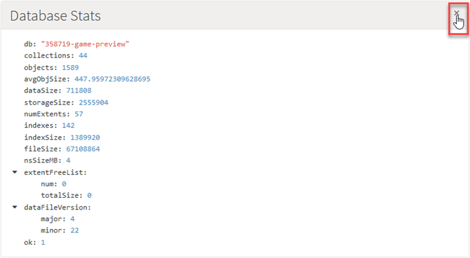
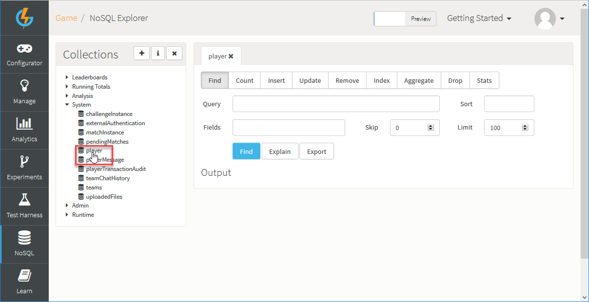
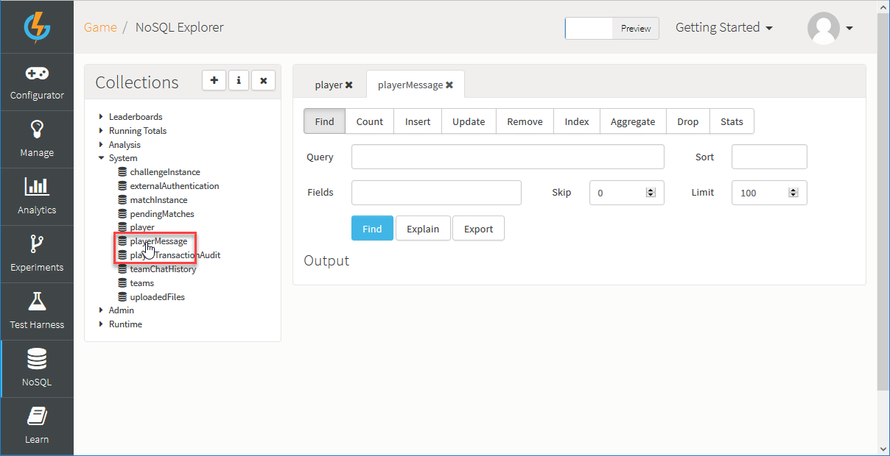
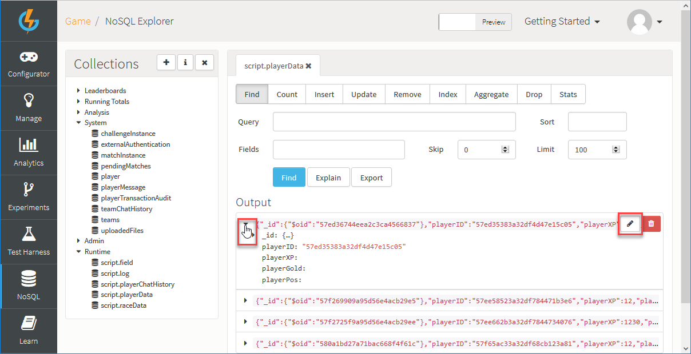
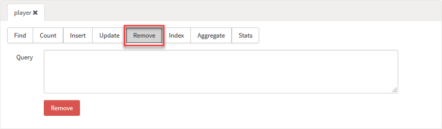
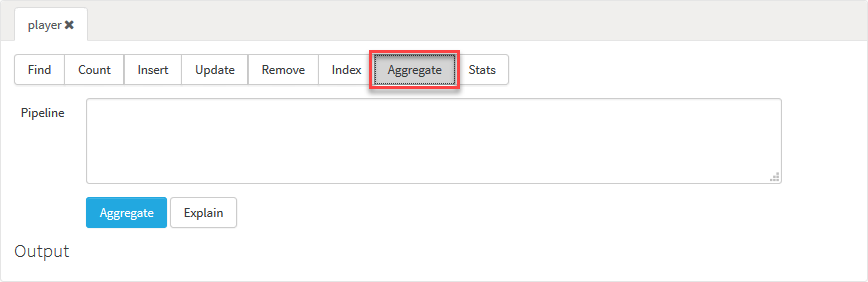

# NoSQL Explorer

## Introduction

From the *NoSQL* tab you have the ability to interact with the data stored on the platform.

When you open the *NoSQL Explorer*, there are two main things to note:
* Do you want to work with your game's PREVIEW stage or LIVE stage Mongo database?
* What operation do you want to perform against the database collections?

### PREVIEW Stage or LIVE Stage Database?

Each game has its own *PREVIEW stage* Mongo database. If you've taken a game Snapshot and published the game to LIVE stage, the game will also have a *LIVE stage* Mongo database:
* The PREVIEW stage and the LIVE stage Mongo databases are *entirely distinct and separate databases*.
* You can select the database you wish to look at using the *Stage* switch at the top-right of the page and the *Collections* panel adjusts accordingly:

<q>**Note** The *Stage* switch appears *only if* you have already published a Snapshot of your game to *Live*. The default selection is *Preview* stage.</q>

### What Database Collection Operation?

When you select a Database Collection, the *Actions* available for use with that Collection represent the different operations you can perform against the data in the selected Mongo database. See [below](#Actions) for a detailed account of how to work with these operations.

## Checking Database Statistics

If you want to check the database statistics for the current game's Mongo database, click the information icon on the *Collections* panel. A *Database Stats* panel opens:

Click to close the *Database Stats* panel at any time:

## Selecting a Mongo DB Collection

You can use the *Collections* panel to select the Mongo DB Collection that you want to work with - click to expand any of the headings in the listing:

Here, we've selected the *System>player* Collection.

### Selecting Actions

When you select a Collection, the *Actions* available for use with that Collection are shown as a series of option buttons. When you select an *Action*, the panel adjusts for the entering the specific operation parameters:

For details of the parameters used for each operation, see the following [section](#Actions)

### Selecting Multiple Collections

If you want to work with more than one Collection, each selection you make adds a tab for a Collection:

## Working with the Output Panel

The results for the operations you perform against a database Collection are returned into the *Output* panel - you can click *Find* or *Explain* to get results. For example, here is the result for *Explain* for the *Find* tab:

When the panel loads, the result hierarchy is collapsed. You can drill-down to expand the levels and read-off details:

You can [edit](#Editing a Document) or [delete](#Deleting a Document) individual Documents in a Collection from the *Output* panel:

<q>**NOT SYSTEM COLLECTIONS!**. Do not attempt to edit or delete any System Collection Documents manually. Caching operations which are managed by the platform will end up with invalid data if you do this!</q>

<q>**RUNTIME or META COLLECTIONS?** You can manually edit or delete Documents from these Collections, but only update **META** Collections in **PREVIEW**. You can update **RUNTIME** Collections in both **PREVIEW** and **LIVE**.</q>

### Editing a Document

*1.* Select a Collection and submit a [Find](#Find) to return results into the *Output* panel:

*2.* Expand the individual Document returned for your query and that you want to edit:

* In this example, we've submitted a *Find* against the *Runtime>script.playerData* Collection.

*3.* Click to edit  the Document you've expanded. An *Edit Document* dialog appears.

*4.* Use the editor in the dialog to make your editing changes to the Document and click *Save*:

### Deleting a Document

*1.* Select a Collection and submit a [Find](#Find) to return results into the *Output* panel:

*2.* Expand the individual Document returned for your query and that you want to delete.

*3.* Click to delete  the Document you've expanded. A confirmation dialog appears with details of the Document you're about to delete from the Collection:

*4.* Click *Delete* again, if you want to continue and delete the Document.

## Actions for Selected Collection

When you've selected the database Collection you want to work with, you can select one of the *Actions* available for that Collection: *Find*, *Count*, *Insert*, *Update*, *Remove*, *Index*, *Aggregate*, *Drop*, and *Stats*.

<q>**Creating Collections?** For how to create a new Collection, see the [following section](#Creating a Collection).</q>

### Find

[MongoDB Find Manual](http://docs.mongodb.org/manual/reference/method/db.collection.find)

Using the *Find* option, you can execute queries against Collections:
* If you have existing Mongo experience, the Find form builds a db.<collection>.find(<query>, <fields>).sort(<sort>).limit(<limit>).skip(<skip>) command based on the data populated in the form fields:

* *Query* : The query you want to execute in JSON form:
  * To find players with displayName "testUser" the following valid JSON must be used {"displayName" : "testUser"}
* *Sort* : The JSON representation of the sort for the query:
  * To sort by userName in ascending order the following valid JSON must be used {"userName" : 1}
  * To sort by id, the following valid JSON must be used {"\_id": -1} or {"\_id": 1}
* *Fields*: Allows you to limit the fields that are returned in the results:
  * This is useful for Collections with large document.
  * To limit the results to only contain the userName and displayName, the following JSON should be used : {"userName" : 1, "displayName" : 1}. 1 indicates inclusion and 0 indicates exclusion for a field. You cannot mix inclusion and exclusion in a single query.
* *Skip / Limit* : The number of documents to skip, useful for paging in combination with limit:
  * To get the 3rd page of 10 documents per page, use skip=20 and limit=10.
  * The maximum that the limit value can be set to for Finds is 1000.
* *Explain* button : Enter your query and click this button to get information about the query returned into the *Output* panel. You can review and analyze this information to optimize your query.
* *Export* button : The *Find* option allows you to export the results to a local file. Set up your query as normal and press the *Export* button. The maximum that the limit value can be set to for exports is 10000.

<q>**You Must Use Valid JSON!** If you want to use *Query*, *Sort*, or *Fields*, you must use valid JSON syntax and only valid JSON syntax, as shown in the examples given above. Importantly, JavaScript syntax is *NOT VALID*.</q>

### Count

[MongoDB Find Manual](http://docs.mongodb.org/manual/reference/method/db.collection.count)

Using the *Count* option, you can get a count of the number of documents in a Collection that match a *Find* query.

* *Query* : The query you want to execute in JSON form:
  * To find players with displayName “testUser” the following JSON should be used {“displayName” : “testUser”}.
* *Explain* button : Enter your query and click this button to get information about the query returned into the *Output* panel. You can review and analyze this information to optimize your query.

### Insert

[MongoDB Insert Manual](http://docs.mongodb.org/manual/reference/method/db.collection.insert)

Using the *Insert* option, you can insert documents directly into a Collection.

* *Document* : Add the document you want to insert into the *Document* field.
  * If the document you supply does not have an \_id field, Mongo will create one for you.
  * If the document you supply does have an \_id field and it is already in use within the Collection the insert will fail.

### Update

[MongoDB Update Manual](http://docs.mongodb.org/manual/reference/method/db.collection.update)

Using the *Update* option, you can modify an existing document(s) in a Collection.

* *Query* : The selection criteria for the update. Use the same query selectors as used in the [Find](#Find) method.
* *Update* : The modifications to apply. 
* *Multi* : Set to true if all documents meeting the criteria should be modified.
* *Upsert* : Set to true to create a new document when no document matches the query.

### Remove

[MongoDB Remove Manual](http://docs.mongodb.org/manual/reference/method/db.collection.remove)

Using the *Remove* option, you can remove all documents matching the supplied query from a Collection.

* *Query* : The selection criteria for the Remove operation. All documents matching this criteria will be removed.

### Index

[MongoDB Index Manual](https://docs.mongodb.com/manual/reference/method/db.collection.getIndexes/#db.collection.getIndexes)

Using the *Index* option, you can view the indexes that have been created for a Collection.

### Aggregate

[MongoDB Aggregate Manual](http://docs.mongodb.org/manual/reference/method/db.collection.aggregate)

Using the *Aggregate* option, you can calculate aggregate values for data in the Collection.

* *Pipeline* : A JSON array of pipeline commands.
  * If you are supplying more than one pipeline stage you must wrap them within a JSON array.
* *Explain* button : Enter your query and click this button to get information about the query returned into the *Output* panel. You can review and analyze this information to optimize your query.

<q>**You Must Use Valid JSON!** You must use valid JSON syntax and only valid JSON syntax for the *Aggregate* field. Importantly, JavaScript syntax is *NOT VALID*.</q>

### Drop

[MongoDB Drop Manual](http://docs.mongodb.org/manual/reference/command/drop)

Using the *Drop* option, you can permanently remove a Collection from the database.

### Stats

[MongoDB Stats Manual](http://docs.mongodb.org/manual/reference/method/db.collection.stats)

Using the *Stats* option, you can obtain statistics about the selected collection.

* *Stats* button : Shows the Collection statistics.

## Creating a Collection

From the *Collections* panel, you can create a new Collection in the database:

*1.* Click the add  icon. The *Create Collection* dialog appears:

* Collections can be created as *Runtime* (non-versioned) or *Metadata* (versioned).

*2.* Select the type of Collection you want to create and enter a name for the new Collection:

* *Name* : The name to give the Collection. Within the database:
  * Metadata Collections are prefixed with "meta."
  * Runtime Collections are prefixed with "script."

*3.* Click to *Create* the new Collection.
