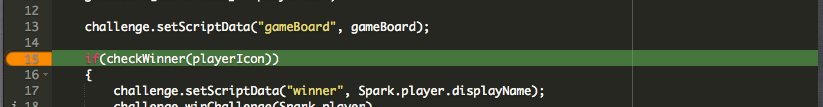
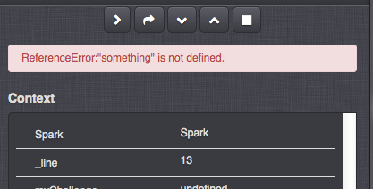

# GameSparks Debugger

The GameSparks Debugger allows you to test your [Cloud Code](/Documentation/Key Concepts/Cloud Code.md). If you have an Event, Request, Response or Message that has custom Cloud Code written to it, by enabling the GameSparks Debugger you can step through your code to examine what's happening, as it's happening.

The GameSparks Debugger can be both enabled exclusively and in combination for Requests, Responses and Messages.

<q>**Please Note!** The Debugger panel will only display if there is some Cloud Code written against the Event, Request, Response or Message.</q>

To enable the GameSparks Debugger, check any or all of the tick boxes that you wish to debug Cloud Code for, under the "Statistics" panel on the [Test Harness](/Documentation/Test Harness/README.md).

For example, checking only the Debug checkbox for Responses, will only activate the GameSparks Debugger when the Response is triggered, providing the Response has some Cloud Code written for it.

Now, when you send a request that has some Cloud Code written to it, the GameSparks Debugger will appear as an overlay on the left side of the screen:

The Context menu (center) is where all your variables and objects will be shown.  Because your variables and objects are defined, you will see their values being populated there. The buttons on the Context menu are:

 **Continue** - This will continue execution of the current script until either a breakpoint is hit, or the script finishes.

 **Step Over** \- Proceeds to the next line in your current scope (that is, it goes to the next line), without descending into any method calls on the way. This is generally used for following the logic through a particular method without worrying about the details of its collaborators, and can be useful for finding at what point in a method the expected conditions are violated.

 **Step In** - This will cause the debugger to descend into any method calls on the current line. If there are multiple method calls, they'll be visited in order of execution; if there are no method calls, this is same as step over. This is broadly equivalent to following every individual line of execution as would be seen by the interpreter.

 **Step Out** - Proceeds until the next "return" or equivalent - that is, until control has returned to the preceding stack frame. This is generally used when you've seen all you need to at this point/method and you want to bubble up the stack a few layers to where the value is actually used.

 **Stop** - Stops the debugging session, the script will be executed and the debug session will stop.

Objects that you create in your Cloud Code will appear as hierarchical trees in the context menu so you can expand and minimize them to view their variables. All requests are also shown as hierarchical trees in which you can check the responses by expanding them in the Context menu.  Responses to [SendRequests](/API Documentation/Cloud Code API/Spark.md) within Cloud Code viewed within the Debugger are displayed similar to the way the Test Harness Inspector displays them.

Here, the Cloud Code calls an [AuthenticationRequest](/API Documentation/Request API/Authentication/AuthenticationRequest.md) and an AuthenticationResponse. The values attributed to the Request and Response are shown as child properties of that object:

### Breakpoints

As in standard developer IDE's, the Breakpoint feature allows you to navigate to and wait at desired steps within the Cloud Code. This is enabled by clicking to the left of the line number of the Cloud Code that you wish to set the breakpoint:

The line number will be highlighted in orange. These breakpoints are persistent and will be retained, even if you exit and re-enter the Test Harness at a later date. They can be disabled by clicking again to the left of the line number.

If you have multiple Debug checkboxes enabled and your Cloud Code invokes other Cloud Code items which in turn, also have Cloud Code attributed to them, then multiple debugging panels may be opened simultaneously in the form of tabbed panels:

### Time-outs

If the Debugger has been inactive or idle for 2 minutes, the GameSparks Debugger pane will automatically close.

Imposing this time-out is in everyone's interest:
* It's reasonable to assume that you've finished debugging if there's no activity after 2 minutes.
* Any infinite loops you may have gotten in are terminated promptly!
* The socket connections we keep open internally while the Debugger is in use consume a lot of platform resources. Letting these close automatically and freeing-up these resources ensures the platform's performance is optimized.

### Break on Error

Another feature available is that of the ‘Break on Error’. There may be instances when your [Cloud Code](/Documentation/Key Concepts/Cloud Code.md) throws an error exception that is not seen within the [Test Harness](/Documentation/Test Harness/README.md) or won’t necessarily halt the rest of the event but invalidates the test.

The ‘Break on Error’ will display any exceptions encountered within the Context menu.

