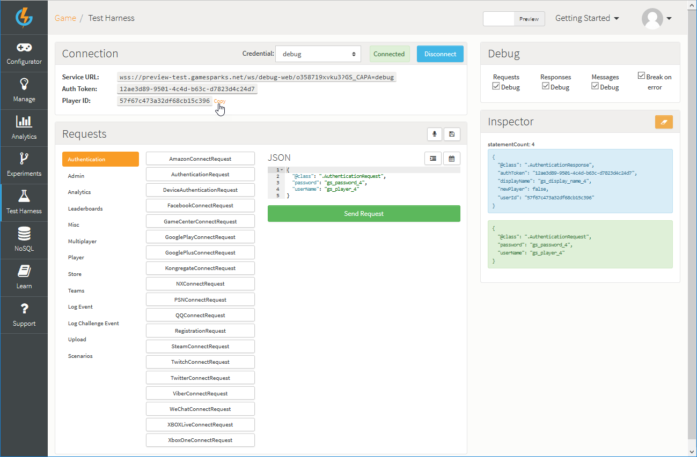

# Test Harness

The Test Harness allows you to send API requests into the GameSparks platform in their raw form to see the responses that the server returns for any given request:
* **Mimics Connected Devices.** Because the browser uses WebSockets for communication, the Test Harness can mimic a connected device by receiving asynchronous messages when they are generated by the platform.
* **Invaluable Tool.** The Test Harness is an invaluable tool for testing your game configuration.  We recommend that you always try out any game configuration changes that you make in the Test Harness before writing the game client code that uses it.

## Getting to Know the Test Harness

You can open the Test Harness directly from the main left-hand navigation menu in the Portal:

There are several sections in the Test Harness:

  * **Connection**
    * *Details* \- Shows details of the current connection such as the *Auth Token* (authentication token) and the *Service URL*.
    * *Stage* \- Use the drop-down menu to select connection to the Preview or the Live stage of your game.
    * *Credential* \- Use the drop-down menu to select the Credential you want to use when connecting. In the above example, the Test Harness is connected using the *debug* system Credential.
    * *Connect/Disconnect* \- Use the *Connect/Disconnect* button to connect and disconnect. Connection status will be shown - Connected is green; Disconnected is red.
  * **Debug**
    * *Debug Options* \- Use the checkboxes to select which Cloud Code you want to debug in the current session - the Cloud Code attached to *Requests*, *Responses*, or *Messages*. You can also enable/disable *Break On Error*. Click [here](/Documentation/Test Harness/Debugger.md) to go to the GameSparks Debugger tutorial.
  * **Requests**
    * *API Requests* \- lists all the available GameSparks API requests grouped according to functional area.  Each submenu item allows you to quickly select a request and then populate the JSON entry field with a correctly formatted request.
    * *JSON* \- enter your JSON request text here. You can click:
      *  to save the request.
      *  to record a scenario - that is, a sequence of requests.
      *  to easily populate any date fields in your JSON request.
      * *Send Request* to send your request.
  * **Inspector**
    * Keep track of the requests, responses, and asynchronous messages in your Test Harness session:
      * *Requests sent* - Shown in green.
      * *Responses received* - Shown in blue.
      * *Asynchronous messages received* - Shown in yellow.
    * To clear out the Inspector at any time, click the clear  icon.

<q>**Seeing Debugger!** The Debugger is not always in view. If you have selected an event which has Cloud Code attached to it, the Debugger will automatically appear but only when you run the event.</q>

## Starting a Test Harness Session

When you first access the Test Harness page within the Developer Portal it will establish a session with the GameSparks platform.  At this point the Test Harness is connected to GameSparks but no player is currently authenticated within this session.  The initial connection handshaking methods are shown in the *Inspector* section.

 Once you have issued one of the available authentication requests (for example, [AuthenticationRequest](/API Documentation/Request API/Authentication/AuthenticationRequest.md), [DeviceAuthenticationRequest](/API Documentation/Request API/Authentication/DeviceAuthenticationRequest.md), and so on) with valid player details you will see an *Auth Token* (authentication token) in the *Connection* section.

## Issuing a Request

To issue a request from the Test Harness, simply enter the JSON for the request into the *JSON* section and press *Send Request*.

The *Inspector* will show the request (in green), and the response (in blue).

## Working with Requests

The *Requests* section contains a selection of buttons which will populate the *JSON* section with the correctly formatted text for a given request.  The requests are grouped by functional area.  Click on a functional area to display a submenu of buttons for each request it contains:

  * **Authentication** \- Requests relating to authentication and registration.
  * **Admin** \- Requests relating to administration jobs.
  * **Analytics** \- Requests relating to [Analytics](/Documentation/Analytics/README.md).
  * **Leaderboards** \- Requests relating to [Leaderboards](/Documentation/Configurator/Leaderboards/README.md).
  * **Misc** \- Requests that don't belong anywhere else!
  * **Multiplayer** \- Requests relating to multiplayer contexts.
  * **Player** \- Requests relating to the Player.
  * **Store** \- Requests relating to third party app stores such as Google play.
  * **Teams** \- Requests relating to Teams.
  * **Log Event** \- Contains a [LogEventRequest](/API Documentation/Request API/Player/LogEventRequest.md) for each of the [Events](/Documentation/Configurator/Events.md) that you have defined in the Configurator.
  * **Log Challenge Event** \- Contains a [LogChallengeEventRequest](/API Documentation/Request API/Multiplayer/LogChallengeEventRequest.md) for each of the [Events](/Documentation/Configurator/Events.md) that you have defined in the Configurator.
  * **Upload** \- Requests relating to uploading.
  * **Scenarios** \- Requests that you have saved for later use.

<q>**Debugger!** If you are using [LogEventRequest](/API Documentation/Request API/Player/LogEventRequest.md) with Cloud Code scripts, then at execution the [Debugger](/Documentation/Test Harness/Debugger.md) may appear.</q>

### Example Requests

#### Example 1

*1.* Click the *Player* functional area to display the player-related requests.

*2.* Click [ChangeUserDetailsRequest](/API Documentation/Request API/Player/ChangeUserDetailsRequest.md) button and populate the *JSON* section with the specific request details:

Make any changes to the request that you require, such as removing optional fields or changing the default data values and click to *Send Request*.

#### Example 2

You can also issue several requests at once simply by creating a JSON array of requests in the *JSON* section.  For example to authenticate a player and then query their details include the two requests in a JSON array such as this.

<q>**Note:** You will need outer square brackets and comma separator between each request to build a well-formed JSON array.</q>

## Saving Requests as a Scenario

To save an individual request click on the  icon in the *JSON* section.

Give your scenario a meaningful name and click the *Save* button.

The scenario is saved to *Scenarios* group of the *Request* section and can be recalled to the *JSON* section in the future.

## Recording Multi-Request Scenarios

You can also record a sequence of requests with the Test Harness. Enter the first request in to the *JSON* section then click the microphone  icon which will change color to red to indicate that the Test Harness is now recording subsequent requests.

Issue the command as normal with the Play icon  and then choose your next command.

Once you have entered and sent all the requests in your scenario click the red microphone icon  a second time to stop recording.  The JSON section will be populated with an array of all the requests that you sent whilst recording.

This scenario can now be saved as described in the previous section.
