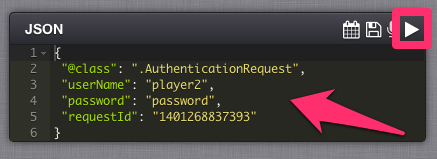
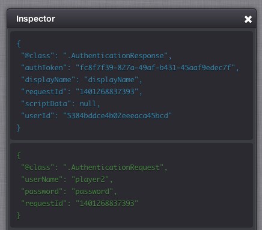
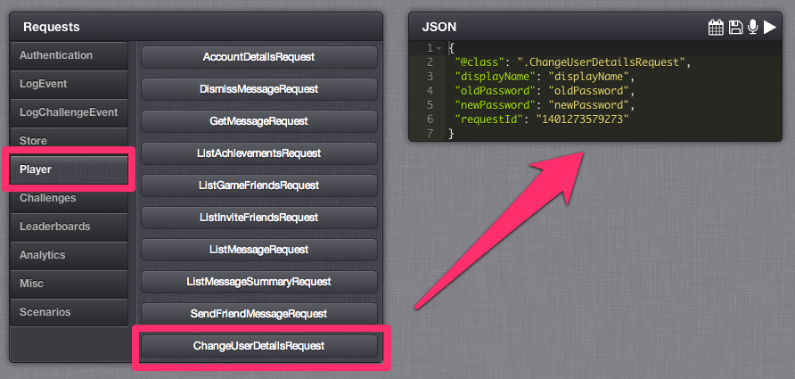
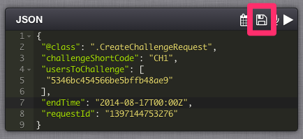
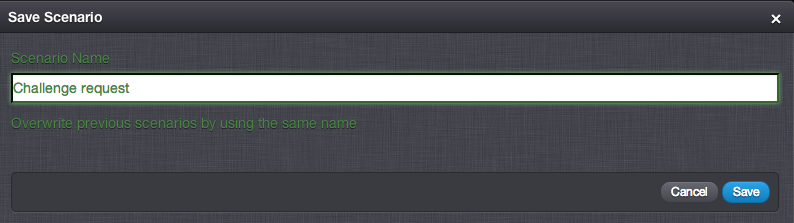
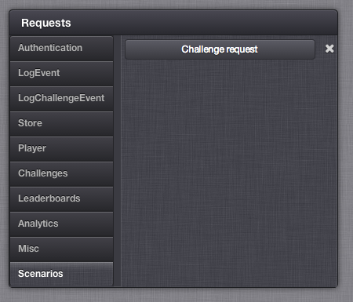

# Test Harness

The Test Harness allows you to send API requests into the GameSparks platform in their raw form to see the responses that the server returns for any given request.  As the browser uses WebSockets for communication, the Test Harness can mimic a connected device by receiving asynchronous messages when they are generated by the platform.  The Test Harness is an invaluable tool for testing your game configuration.  We recommend that you always try out any game configuration changes that you make in the Test Harness before writing the game client code that uses it. Access the Test Harness from the left hand navigation menu in the Developer Portal.

There are several sections in the Test Harness:

  * *Connection* \- shows details of the current connection such as the authentication token and the session id.
  * *Statistics* \- shows a numbers of counters as well as a Connect / Disconnect button.
  * *Requests* \- contains all the available GameSparks API requests grouped according to functional area.  Each submenu item allows you to quickly populate the JSON entry field with a correctly formatted request.
  * *JSON* \- enter your JSON request text here.  Send your request using the play icon {playIcon}.  Save a request using the disk icon. Record a scenario (a sequence of requests) using the microphone icon. Use the calendar  icon to easily populate any date fields with the JSON request that you wish to send.
  * *Inspector* \- shows sent requests (in green), received responses (in blue) and asynchronous message received (in orange).
  * *Stage selector menu* \- the drop down menu in the top left of the screen allows you to select whether you are connecting to the preview or live stage of you game.
  * *Debugger* \- Allow you to debug your Cloud Code which is attached to your requests. Click [here](/Documentation/Test Harness/Debugger.md) to go to the GameSparks Debugger tutorial.

<q>**Seeing Debugger!** The Debugger is not always in view. If you have selected an event which has Cloud Code attached to it, the Debugger will automatically appear but only when you run the event.</q>

When you first access the Test Harness page within the Developer Portal it will establish a session with the GameSparks platform and you will see a session id in the *Connection* section.  At this point the Test Harness is connected to GameSparks but no player is currently authenticated within this session.  The initial connection handshaking methods are shown in the *Inspector* section.

 Once you have issued one of the available authentication requests (for example, AuthenticationRequest, DeviceAuthenticationRequest, and so on) with valid player details you will see an authentication token in the *Connection* section.

## Issuing a request

To issue a request from the Test Harness simply enter the JSON for the request into the *JSON* section and press the play icon {playIcon}.

The *Inspector* section will show the request (in green), and the response (in blue).

The *Requests* section contains a selection of buttons which will populate the *JSON* section with the correctly formatted text for a given request.  The requests are grouped by functional area.  Click on the group name to display a submenu of buttons for each request.  These groups are:

  * Authentication \- contains requests relating to authentication and registration
  * LogEvent \- contains a [LogEventRequest](/API Documentation/Request API/Player/LogEventRequest.md) for each of the [Events](/Documentation/Configurator/Events.md) that you have defined in the Configurator
  * LogChallengeEvent \-  contains a [LogChallengeEventRequest](/API Documentation/Request API/Multiplayer/LogChallengeEventRequest.md) for each of the Events that you have defined in the Configurator
  * Store \- contains requests relating to third party app stores such as Google play
  * Player \- contains requests relating to the Player
  * Challenges \- contains requests relating to [Challenges](/Documentation/Configurator/Multiplayer/Challenges.md)
  * Leaderboards \- contains requests relating to [Leaderboards](/Documentation/Configurator/Leaderboards.md)
  * Analytics \- contains requests relating to [Analytics](/Documentation/Configurator/Analytics.md)
  * Misc \- contains requests that don't belong anywhere else!
  * Scenarios \- contains requests that you have saved for later use

<q>**Debugger!** If you are using [LogEventRequest](/API Documentation/Request API/Player/LogEventRequest.md) with Cloud Code scripts, then at execution the [Debugger](/Documentation/Test Harness/Debugger.md) may appear.</q>

For example click on the *Player* group button to display the player related requests and then click the *ChangeUserDetailsRequest* button to populate the JSON section with the request.

Make any changes to the request that you require, such as removing optional fields or changing the default data values and then press the play  icon to send the request. You can also issue several requests at once simply by creating a JSON array of requests in the *JSON* section.  For example to authenticate a player and then query their details include the two requests in a JSON array such as this.

## Saving requests as a scenario

To save an individual request click on the  icon in the *JSON* section.

Give your scenario a meaningful name and click the *Save* button.

The scenario is saved to *Scenarios* group of the *Request* section and can be recalled to the *JSON* section in the future.

## Recording multi-request scenarios

You can also record a sequence of requests with the Test Harness. Enter the first request in to the *JSON* section then click the microphone  icon which will change color to red to indicate that the Test Harness is now recording subsequent requests.

Issue the command as normal with the Play icon  and then choose your next command.

Once you have entered and sent all the requests in your scenario click the red microphone icon  a second time to stop recording.  The JSON section will be populated with an array of all the requests that you sent whilst recording.

This scenario can now be saved as described in the previous section.
