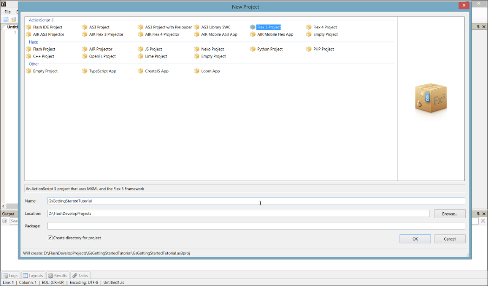
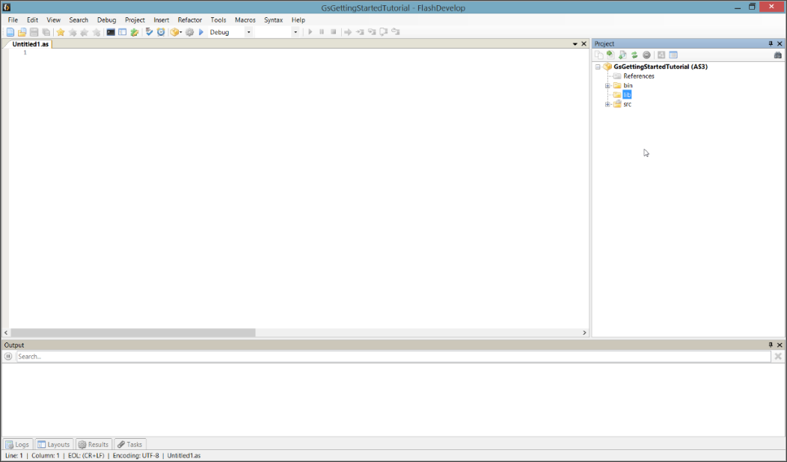
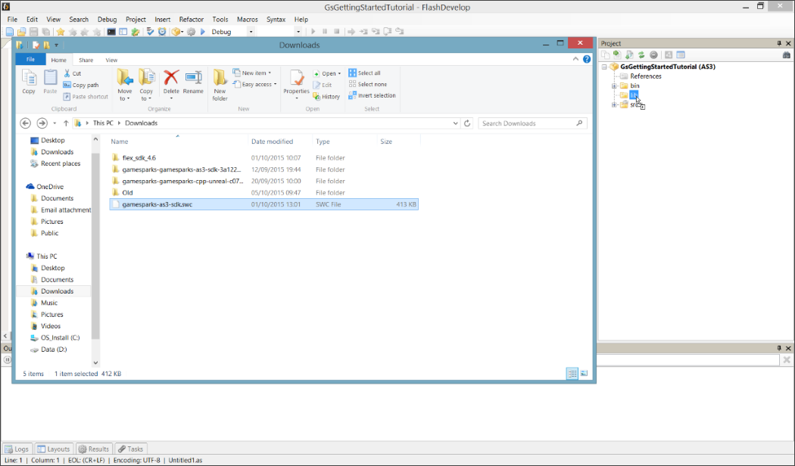
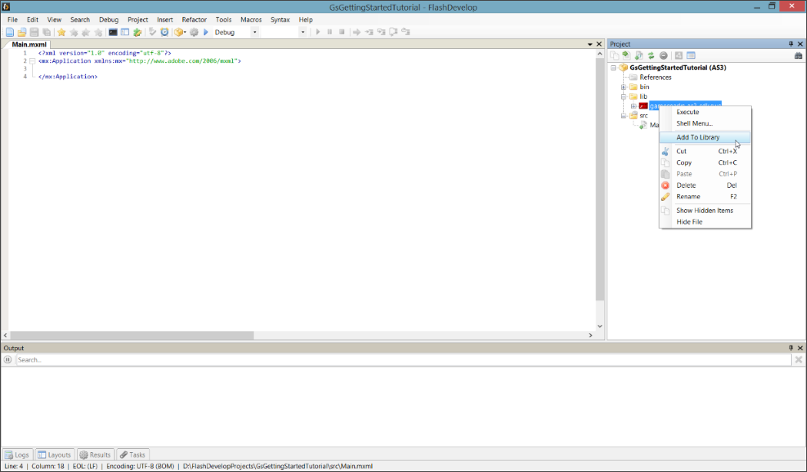
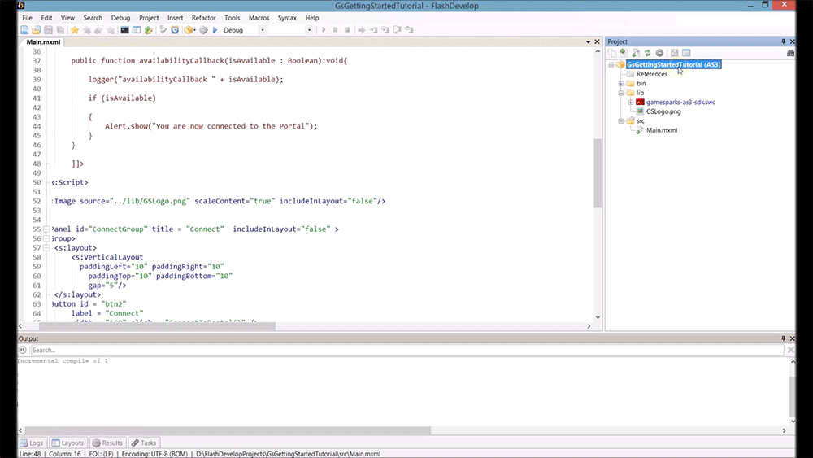
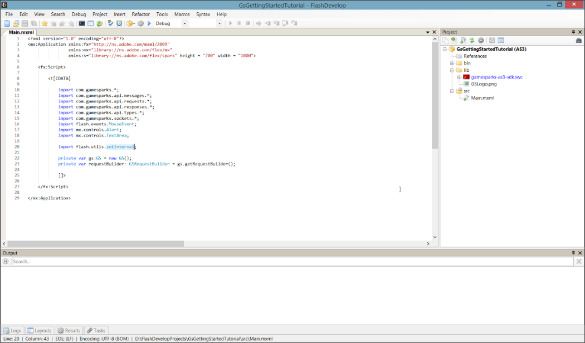
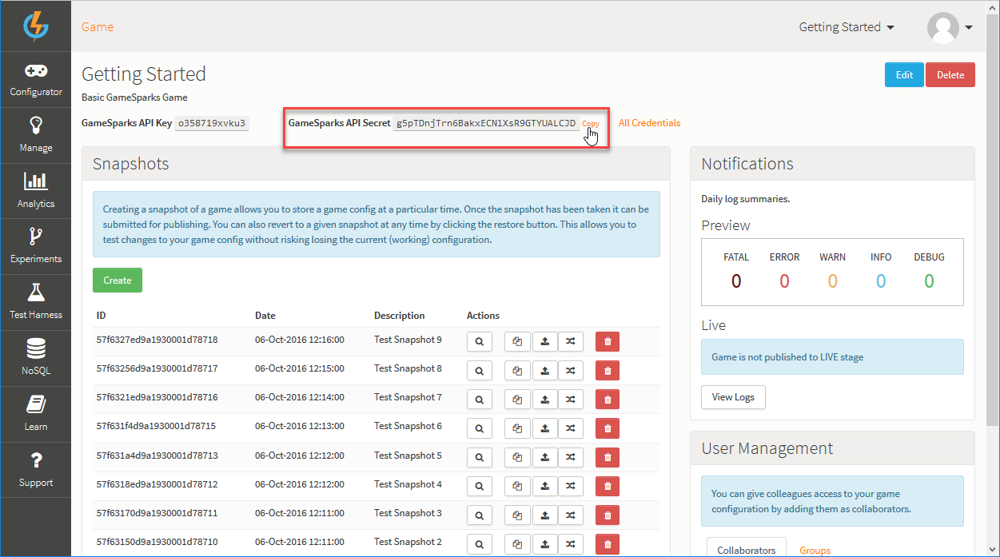
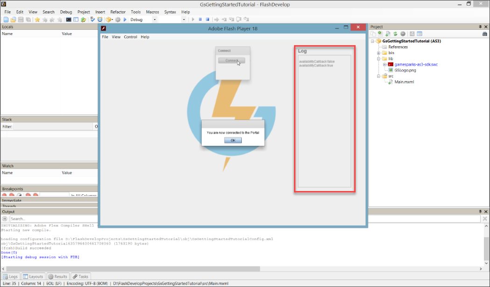
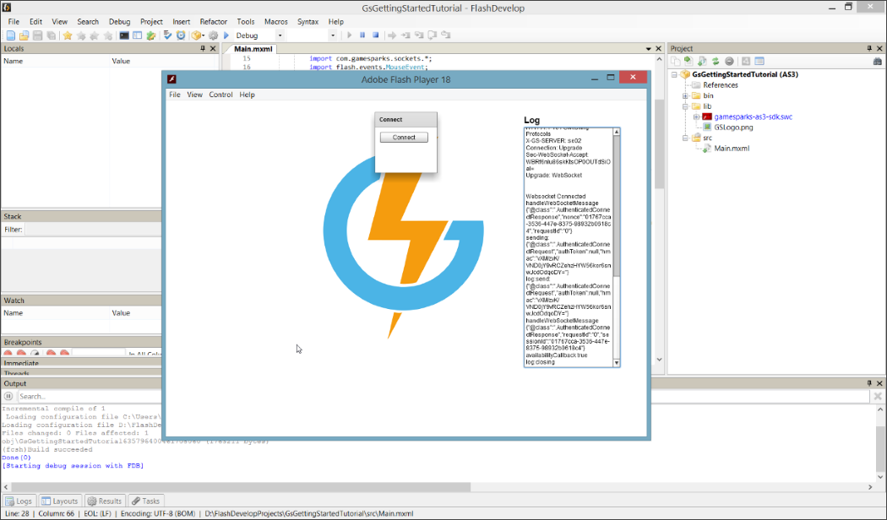

# ActionScript Setup

## Introduction

The previous tutorial [Creating a Game](./README.md), took you through some initial tasks to start working with the GameSparks platform. Now you can move forward and link your GameSparks game with your developing ActionScript project.

This tutorial shows you how to set up your ActionScript project and establish a connection between the GS module and the Portal.

**Setting up Your ActionScript Project**

  * Create an ActionScript project.
  * Create a new folder for your project and name it 'lib'.
  * Download the GameSparks SWC file, drop it in the _'lib'_ folder, right click it, and then Add to library.
  * Make sure you're using the latest [Adobe Flash](https://get.adobe.com/flashplayer) version.

**Using GameSparks API**

  * Import the GameSparks API.
  * Find your API Key in the Test Harness and the Secret key in the Overview page of the Portal.
  * Make your first function which establishes a connection between the GS module and the Portal.
  * Create the Logger and Availability call back functions. These functions are necessary for debugging.
  * Build your ActionScript interface with a button to make the connection work correctly and a Logger to debug what's happening in the background.
  * Play your game and attempt to make a connection.

</br>
**Example ActionScript Setup MXML** code can be downloaded [here](http://repo.gamesparks.net/docs/tutorial-assets/ActionscriptSetupMXML.zip)

## Setting up Your ActionScript Project

*1.* Start by creating a project for ActionScript. Here we'll be developing a Flex 3 project:



*2.* Create a new folder and name it *'lib'*:



*3.* Download and find the* gamesparks-as3-sdk .SWC* file. Then, drop the SWC file into the *'lib'* folder:



*4.* Make sure you add the *.SWC* file to the library by right-clicking it and selecting the '*Add To Library'* option. This allows you to use the GameSparks library for your game:



*5.* Right-click on your game and from the context menu click on *Properties* and make sure you're using the latest Flash player:


 

## Using GameSparks API

 
*1.* Import the GameSparks API as well as other libraries using:

```
import com.gamesparks.*;  
import com.gamesparks.api.messages.*;  
import com.gamesparks.api.requests.*;  
import com.gamesparks.api.responses.*;  
import com.gamesparks.api.types.*;  
import com.gamesparks.sockets.*;  
import flash.events.MouseEvent;  
import mx.controls.Alert;  
import mx.controls.TextArea;    
import flash.utils.setInterval;

```



*2.* The first function you will need to make allows you to connect your game to the Portal. To do this, you must connect using the *API Secret* and *service Key*:

* You can find the *API Secret* and *API Key* on the *Game Overview* page. When you first open the page the *API Secret* is hidden. Click on the field or click *Show* to reveal the value and then use *Copy*:



*3.* Now you can make your first function. This uses the Key and Secret to connect to the Portal. Name this function *ConnectToPortal* and initiate the connection using:

*gs.setAvailabilityCallback().setLogger().setApiKey("").setApiSecret("")setApiCredential("").connect();*

  * *setAvailabilityCallback(FunctionNameHere)* calls the given function when the GS module sends feedback from the connection or disconnection to the Portal.
  * *setLogger(FunctionNameHere)* calls the given function when the GS module sends general feedback.
  * *setApiKey("Key")* and *setApiSeret("Secret")* connects the GS module to the given API Key using the given Secret key.
  * *setApiCredential("Credential")* ensures that the device can only call the requests it's allowed to.
  * *connect()* fires the request to connect the GS module to the Portal as well as calling the Availability call back function set and logging it.

```
    		private function ConnectToPortal():void
    			{
    				gs.setAvailabilityCallback(availabilityCallback).setApiKey("API KEY").setApiSecret("API SECRET").setApiCredential("device").connect();
    			}
```

*4.* The second function, *Logger* will be used to debug the GameSparks logic and then check the availability of the connection to the Portal. After making them, set them for use as the Logger and *setAvailabilityCallback*.

```
    	public function logger(text:String):void
    			{
    				 logArea.text += "n" + text;
    				 logArea.scroller.verticalScrollBar.value = logArea.scroller.verticalScrollBar.maximum;
    			}

    			public function availabilityCallback(isAvailable : Boolean):void{

    				logger("availabilityCallback " + isAvailable);

    				if (isAvailable)

    				{

    				}					
    				else
    				{

    				}
    			}
```

For the *Logger*, you will need to set up a text area which will receive the log strings and display them. To do that we use:

*< s:Group id=”LogSlot” includeInLayout = “false” >< s:layout >< s:VerticalLayoutpaddingLeft=”700″ paddingRight=”10″paddingTop=”10″ paddingBottom=”10″gap=”5″/ >< /s:layout >< s:Label text=”Log” fontSize=”18″ fontWeight=”bold” / >< s:TextArea width=”200″ height=”500″ id=”logArea” / >< /s:Group >*

For the *availabilityCallback* function, after checking if *isAvailable* is set to true, some feedback can be set up. We’re going to set up an alert that pops up once the GS module is connected. In this case, we've chosen not to set the Logger for the *module*. This means you only see what you have logged to it, not what the module logs to it. Selecting this option prevents the log from being spammed:

```
public function availabilityCallback(isAvailable : Boolean):void{

      logger("availabilityCallback " + isAvailable);

      if (isAvailable)

      {
        Alert.show("You are now connected!");
      }					
      else
      {

      }
    }

```

A button has already been created to call the *ConnectToPortal* function. Once the GS module is connected to the Portal, the alert message will pop up as feedback. In the log you should see *'availabilityCallback.true'*:



*5.* If you set the logger using *gs.setLogger()* the log will look like this. This shows you more feedback, but it also sends a high amount of spam to the Logger:  


