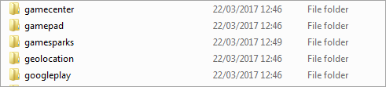
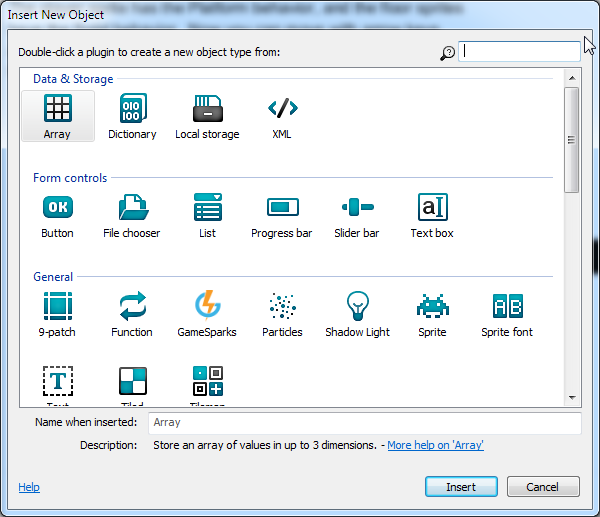
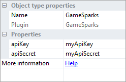
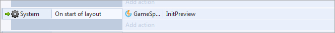

# Construct 2 Setup

## Adding the SDK to Construct 2 Plugins

Once you’ve downloaded the SDK, unzip the gamesparks folder into the plugins folder of your Construct 2 Installation:

* *.../Construct 2/exporters/html5/plugins*

Make sure that the plugins folder contains only file folders, which includes a gamesparks .js files folder, but *not the top-level gamesparks folder*:

You should now be able to insert a GameSparks object into any projects you create in Construct 2:

## Initializing the SDK

When the GameSparks object has been added to your project, you can edit the properties on the Properties pane. Here you can insert the API Key and Secret for your game configuration on the portal:

<q>**Where do I get the API Key and Secret?** You can copy the API Key and API Secret from the [Game Overview](/Documentation/Game Overview/README.md) page of your game in the GameSparks portal.

When you've entered your game's API Key and Secret, you can initialize the SDK. Before we can make any requests to the GameSparks platform, we first have to initialize for the stage we are at. There are 2 actions for this: *initPreview* and *initLive*.

An example of initializing the SDK is to initialize at the start of the layout. In the event sheet this would look like this:

