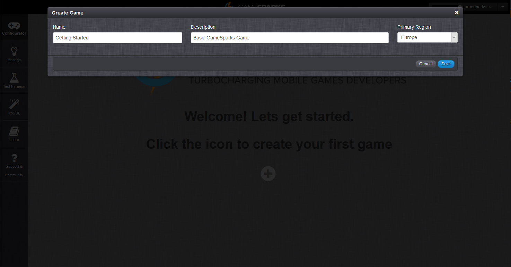

# Creating a Game

The GameSparks platform delivers a broad range of capabilities, making it a little difficult to know where to start! This section walks you through some of the initial key tasks required to start working with the platform and create a game, helping you to understand how the various pieces fit together.

## Registering an Account

Before getting started as a new user, you'll need to create an account on the Developer Portal. To register, click **+ Register** on the login screen or at top-right from here. You are taken to the [Register](https://portal.gamesparks.net/register.htm) screen, where you can enter your account details.

## Creating the Game

 When registered, you can login:
 * If this is your first time using the Portal, you'll be greeted by the *Welcome!* screen. Click the  icon in the middle of the screen to create your first game.
 * If you've used GameSparks before, click *Add Game* from the drop-down menu in the top-left of the screen.

Give your game a *Name* and a *Description* and select the *Primary Region* you want for your game and then hit *Save*. You can use the name and description to identify the game in the portal and you can edit and change them at any time.

After hitting *Save* you'll be taken to the [Game Overview](/Documentation/Game Overview/README.md) page, where your game is now ready to be configured.

When you create a game, two things happen:
* Your game is assigned a unique *Key* and *Secret*. You'll need these to set up your SDK.
* Your game is put into *Preview* stage. This is the stage where you build your game. When you are ready to publish your game, you can push it to the *Live* stage.

## Remembering Keys and Secrets

 You should take note of your game's *GameSparks API Key* and *GameSparks API Secret*, because you'll need these when you set up your chosen SDK.

## Working in Preview and Publishing for Launch

### Preview and Live Stages

When you create a game, the game is put into *Preview* stage.  There are two stages - *Preview* and *Live*:
* *Preview* is the stage where you develop your game - build up your game configuration, add required Cloud Code, and test out the game using a small number of test players in the Test Harness.
* *Live* is the stage for a published game and you should only move a game to this stage when it is ready to launch.

### Publishing via Snapshots

You should remain in *Preview* as you develop and test your game. When you are happy with the state of your game, you can create a *Snapshot*.  A game *Snapshot* takes a copy of everything you've created up to that point in the game's development.  You can then publish the *Snapshot*.  Publishing the *Snapshot* will copy the game as it was when the *Snapshot* was taken and moves the game from *Preview* stage into *Live* stage.

### Managing the Game's Life Cycle

Publishing your game via the use of a *Snapshot* allows you to easily manage your game's life cycle. You can continue development of your game in *Preview* while your customers can safely play on the *Live* stage and you know exactly what state the *Live* game is in.  When you are ready to upgrade your game and publish it with any new features, you can create another *Snapshot*, publish the new *Snapshot*, and the whole process repeats again.  Simple!

<q>**Really Important!** Use the *Live* stage when you are ready to release your game to the public - this should be the **ONLY** stage your players use, because the number of concurrent users that can connect to the *Preview* stage at any given time is limited to 100. If your game was left in *Preview* and more than 100 concurrent players try to access your game, they won't all be able to connect successfully.  Obviously, this is not what you want, so remember to take a *Snapshot* then publish through to *Live*!</q>

## SDK Instructions

* [Unity](/Getting Started/Creating a Game/Unity Setup.md)
* [Unreal](/Getting Started/Creating a Game/Unreal Setup.md)
* [ActionScript](/Getting Started/Creating a Game/ActionScript Setup.md)
* [Android](/Getting Started/Creating a Game/AndroidSDK Setup.md)
