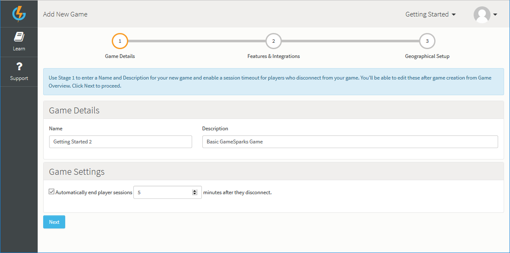
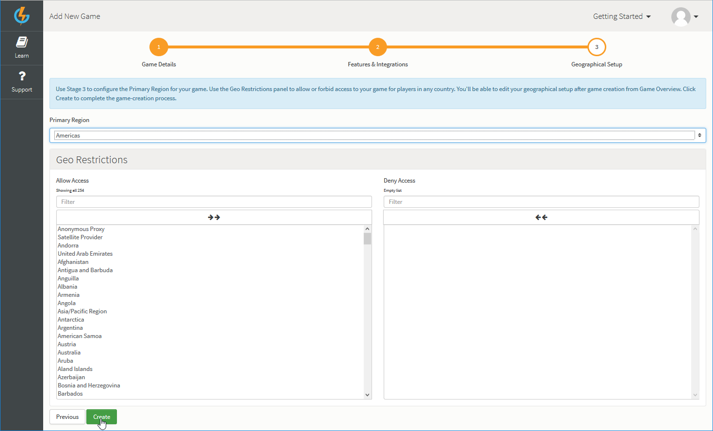
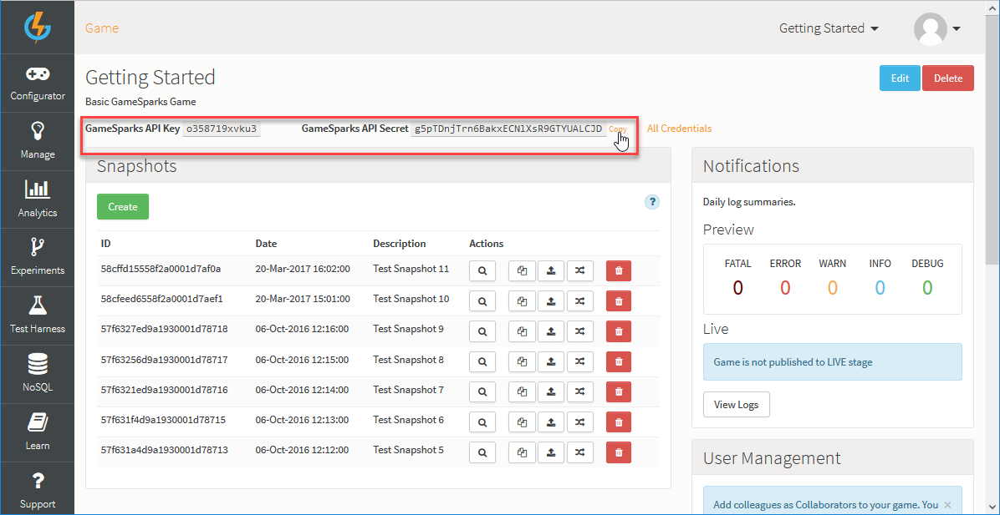

# Creating a Game

The GameSparks platform delivers a broad range of capabilities, making it a little difficult to know where to start! This section walks you through some of the initial key tasks required to start working with the platform and create a game, helping you to understand how the various pieces fit together.

## Registering an Account

Before getting started as a new user, you'll need to create an account on the Developer Portal. To register, click *Register* on the login screen:

You are taken to the [Register](https://auth.gamesparks.net/register.htm) screen, where you can enter your account details:

## Creating the Game

 When registered, you can login:
 * If this is your first time using the Portal, you'll be taken straight to the first stage of the game-creation process to create your first game.
 * If you've used GameSparks before, click *Add Game* from the drop-down menu in the top-right of the screen.

Adding a game is a 3-stage process:
* *Step 1. Game Details* - Enter a name and description for your game. Set a timeout to end player sessions after they disconnect from your game.
* *Step 2. Features & Integrations* - Select the currencies, platform features, and 3rd-party integrations you want for your game.
* *Step 3. Geographical Setup* - Configure the Geographical Setup for your game.

<q>**Note!** In this section, we'll assume you've used Gamesparks before and have already created a game.</q>

*1.* Log in to the portal. You'll be taken to the last game you had open.

*2.* Using the *Games Menu* at top-right, select *Add New Game*. The *Add New Game* page opens at **Stage 1** of the game-creation process.

*3.* Enter a *Name* and *Description* for your new game.

*4.* If you want to set a timeout to end a player's session after they disconnect, under *Game Settings* select the *Automatically end player sessions* check box and enter the timeout period in minutes.

*5.* Click *Next*. The *Add New Game* page moves you to **Stage 2** of the game-creation process.

*6.* Use this second stage to define some baseline settings for your new game:

* Set *Signup Bonuses* for any of six currencies. Each new player will be credited with the currency amounts when they first register for your game.
* Select the *Platform Features* you want for your game - by default, all are selected.
* Under *Integrations*, select the 3rd-party providers you want to integrate your game with - by default, none are selected.

<q>**Selections are not Final!** You'll be able to edit these settings later after you have created your game. See [Game Overview](/Documentation/Game Overview/README.md)</q>

*7.* Click *Next*. The *Add New Game* page moves you to **Stage 3** of the game-creation process.

*8.* You can use this third stage for the *Geographical Setup* of your new game:

* Select the *Primary Region* you want for your game. In this example, we've chosen the Americas as the game's *Primary Region*.
* Define the *Geo Restrictions* you want to impose on players of your game:
  * Select which countries where you want to players to be allowed access to your game - the default is to allow players in all countries to have access.
  * To block access for players in a country, select the country in the *Allow Access* list and use the arrows to move the country into the *Deny Access* list.

*9.* When you have completed **Stage 3** of the game creation process, click *Create*. You are taken to the *Game Overview* page of your new game:
* Your game is assigned a unique *GameSparks API Key* and *GameSparks API Secret*. You'll need these to set up your SDK.
* Your game is put into *Preview* stage. This is the stage where you build your game. When you are ready to publish your game, you can push it to the *Live* stage.

<q>**Working with Game Overview?** For more details of how to work with the *Game Overview* page, you can review this [page](/Documentation/Game Overview/README.md).</q>

## Remembering Keys and Secrets

 You should take note of your game's *GameSparks API Key* and *GameSparks API Secret*, because you'll need these when you set up your chosen SDK. Click *Show* at the right-hand side of the *API Secret* field to reveal it.

## Working in Preview and Publishing for Launch

### Preview and Live Stages

When you create a game, the game is put into *Preview* stage.  There are two stages - *Preview* and *Live*:
* *Preview* is the stage where you develop your game - build up your game configuration, add required Cloud Code, and test out the game using a small number of test players in the Test Harness.
* *Live* is the stage for a published game and you should only move a game to this stage when it is ready to launch.

<q>**Switching to Live?** As you develop your game in Preview, publish to Live at some point, and then continue to develop the game in Preview, there are several places in the portal where you can switch between the Preview and Live stages of your game. See [below](#Switching between Preview and Live). </q>

### Publishing via Snapshots

You should remain in *Preview* as you develop and test your game. When you are happy with the state of your game, you can create a *Snapshot*.  A game *Snapshot* takes a copy of everything you've created up to that point in developing the game's configuration.  You can then publish the *Snapshot*.  Publishing the *Snapshot* will copy the game as it was when the *Snapshot* was taken and moves the game from *Preview* stage into *Live* stage.

<q>**IMPORTANT!** Here are a few important things to note when working with game Snapshots:</q>
* **Not Included in Game Snapshots** - Two areas of your game are *not included* in a game Snapshot. A game Snapshot does not include anything you set up in the [Manage](/Documentation/Manage/README.md) section for your *Admin Screens* - these are published to Live separately as *Screen Snapshots*. Secondly, [Experiments](/Documentation/Experiments/README.md) are also published to the game's Live stage separately.
* **Finalizing Game Region** - When you publish one of your game's Snapshots from *Preview* to *Live* for the *first time*, a confirmation dialog appears. This acts as a reminder, which you can use to finally decide on the *Primary Region* for your game.
* **Unpublishing Snapshots** - You can quickly *unpublish* a game Snapshot - this is particularly useful if you have inadvertently published your game into the Live stage before it is ready.
* **More Details?** For more details on working with game Snapshots, see [here](/Documentation/Key Concepts/Snapshots.md).

<q>**Going Live Checklist!** Before you attempt to create a Snapshot of your game and publish it to Live, please review the [Going Live Checklist](/Getting Started/Going Live Checklist/README.md) to ensure everything runs smoothly.</q>

### Managing the Game's Life Cycle

Publishing your game via the use of a *Snapshot* allows you to easily manage your game's life cycle. You can continue development of your game in *Preview* while your customers can safely play on the *Live* stage and you know exactly what state the *Live* game is in.  When you are ready to upgrade your game and publish it with any new features, you can create another *Snapshot*, publish the new *Snapshot*, and the whole process repeats again.  Simple!

<q>**Really Important!** Use the *Live* stage when you are ready to release your game to the public - this should be the **ONLY** stage your players use, because the number of concurrent users that can connect to the *Preview* stage at any given time is limited to 100. If your game was left in *Preview* and more than 100 concurrent players try to access your game, they won't all be able to connect successfully.  Obviously, this is not what you want, so remember to take a *Snapshot* then publish through to *Live*!</q>

### Switching between Preview and Live

Several pages in the portal provide a *Preview/Live* switch for areas where it's useful to be able to view Preview or Live data as you continue to develop your game beyond its publication to Live. On most of these pages, the *Preview/Live* switch will be enabled only if you've already published a game configuration Snapshot to Live:

Page  | Enabled
-----  | -----------
NoSQL Explorer   | Only if a game configuration Snapshot has been published.
Manage Screens    | Only if a game configuration Snapshot has been published.
Experiment Results    | Only if the Experiment has been published.
Analytics Overview    | Always.
Analytics API Stream    | Only if a game configuration Snapshot has been published.
Test Harness    | Always.

## SDK Instructions

* [Unity](/Getting Started/Creating a Game/Unity Setup.md)
* [Unreal](/Getting Started/Creating a Game/Unreal Setup.md)
* [ActionScript](/Getting Started/Creating a Game/ActionScript Setup.md)
* [Android](/Getting Started/Creating a Game/AndroidSDK Setup.md)
* [Corona](/Getting Started/Creating a Game/Corona Setup.md)
